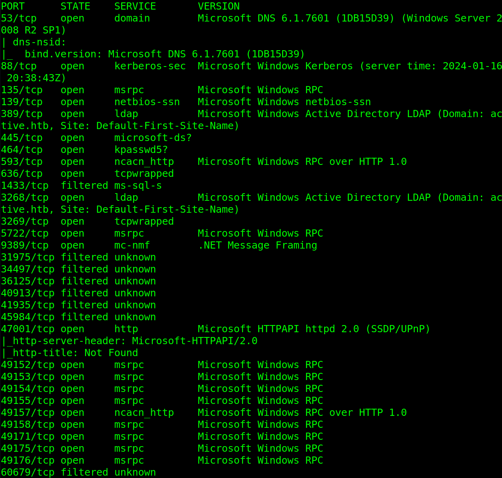
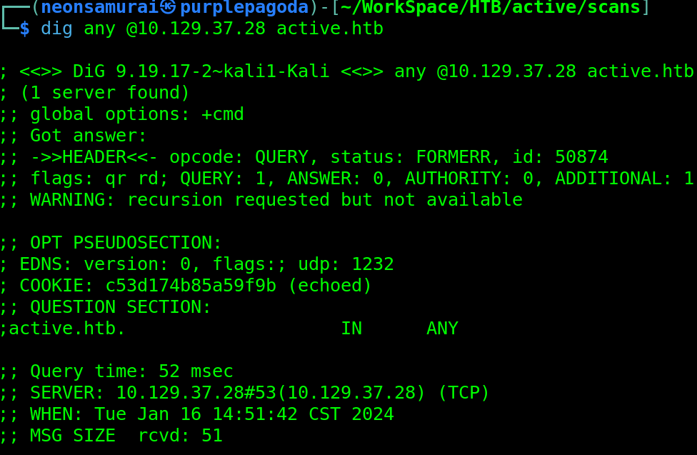
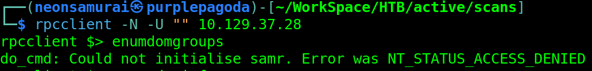
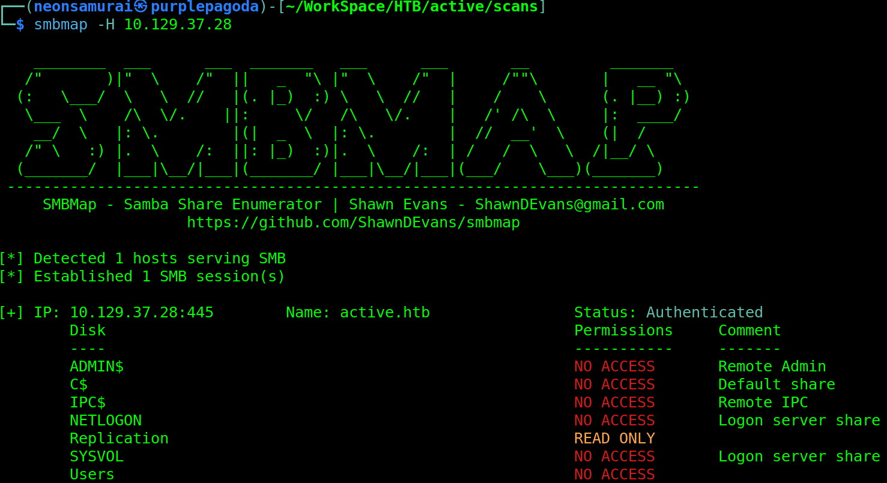
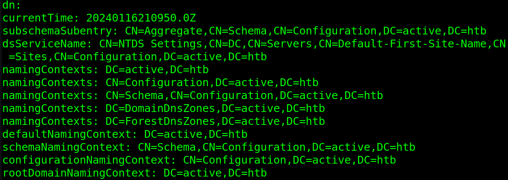
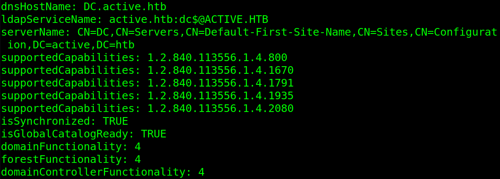
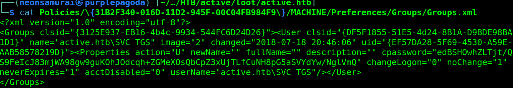
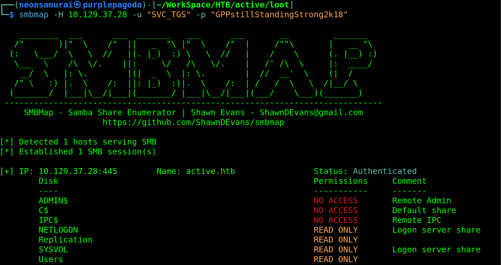
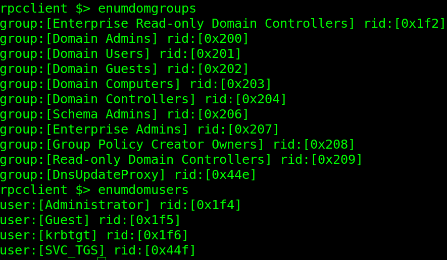

---
tags:
  - box
platform: HTB
os: Windows
difficulty:
date_completed:
mitre_attack: T1135, T1552.006, T1087.002
status: in-progress
---

## Target

**IP Address:** 10.129.37.28

## Recon

### Port Scan

```bash
sudo nmap -T4 -O -sV -sC -p- -oA active 10.129.37.28
```

#### Findings



## Enumeration

### DNS

Domain Name: active.htb



### RPC

#RPCclient



### SMB

SMB Map returned a share that I have read only access to without a user account.



### LDAP

```bash
ldapsearch -b "" -s base '(objectClass=*)' -x -H ldap://10.129.37.28
```





After getting the user SMB share I found a groups.xml file that held a username to a service account as well as a possible password for that account.



#cpassword is a Group Policy password that uses very weak and crackable encryption.

```bash
gpp-decrypt edBSHOwhZLTjt/QS9FeIcJ83mjWA98gw9guKOhJOdcqh+ZGMeXOsQbCpZ3xUjTLfCuNH8pG5aSVYdYw/NglVmQ
```

Password decrypted to `GPPstillStandingStrong2k18`

Using the credentials found, I was able to authenticate to the system and scan the SMB shares further.



## Exploitation

I was then able to pull the user flag from the system using smbclient from the user share.

```bash
smbclient -U "active.htb/SVC_TGS" //10.129.37.28/Users
```

Flag was in `Users\SVC_TGS\Desktop\user.txt`

Now that I have a user account I was able to log in using RPC and get more information on the system.



## Privilege Escalation

<!-- Not reached yet in these notes - next steps to pick back up: -->
- Go through the new shares
- Test Kerberos (SVC_TGS is a strong hint towards Kerberoasting)
- Test LDAP
- Test RPC

## Flags

**User:** captured (see `Users\SVC_TGS\Desktop\user.txt` above)

**Root/System:** not yet captured

## Lessons Learned

GPP cpassword values are trivially decryptable once you have the encryption key (which Microsoft published) - `groups.xml` left over from Group Policy Preferences is always worth grabbing from an SMB share if it's readable.
