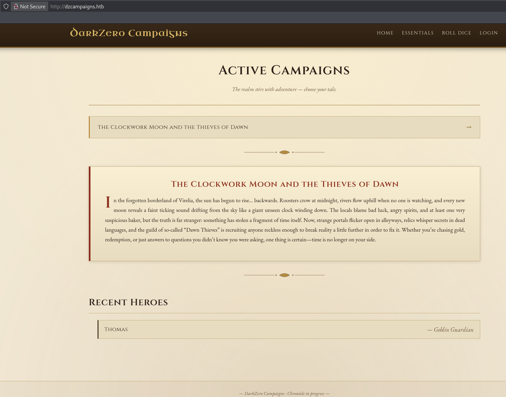

---
tags:
  - box
  - Nmap
platform: HTB
os: Windows
difficulty: hard
date_completed:
mitre_attack:
status: in-progress
---

## Target

**IP Address:** 10.129.74.197

**Platform / OS:** Windows

## Recon

### Port Scan

```bash
nmap -T4 -v -Pn -O -sV -sC -p- -oA targetScan 10.129.74.197
```

#### Findings

| Port | Service | Notes                                  |
| ---- | ------- | -------------------------------------- |
| 22   | SSH     | OpenSSH 9.6p1                          |
| 80   | HTTP    | nginx/1.24.0 - http://dzcampaigns.htb/ |

## Enumeration

Added the IP address to the hosts list as `dzcampaigns.htb`




## Exploitation

<!-- What got initial access, and why it worked -->

## Privilege Escalation

<!-- Path from initial foothold to full admin/root/system -->

## Flags

**User:**

**Root/System:**

## Lessons Learned

<!-- Anything worth remembering for next time - technique, gotcha, tool quirk -->
