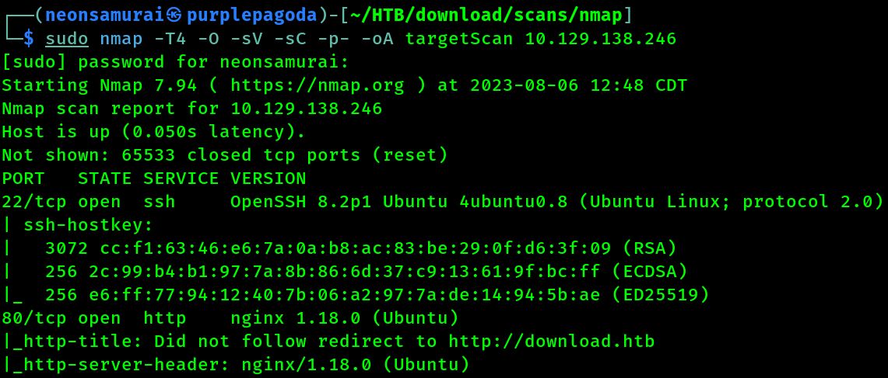
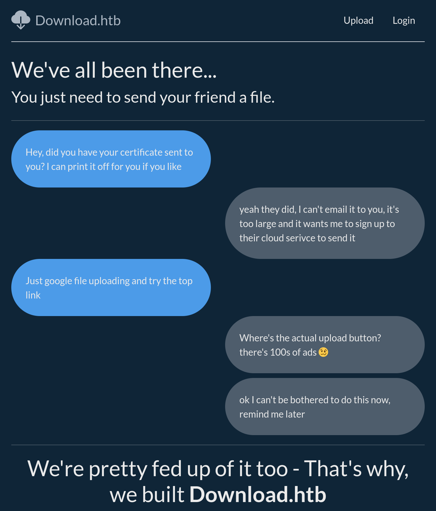

---
tags:
  - box
platform: HTB
os: Linux
difficulty:
date_completed:
mitre_attack:
status: in-progress
---

## Target

**IP Address:** 10.129.138.246

## Recon

### Port Scan

#Nmap

```bash
sudo nmap -T4 -O -sV -sC -p- -oA targetScan 10.129.138.246
```



#### Findings

| Port | Service | Version |
|---|---|---|
| 22 | SSH | OpenSSH 8.2p1 |
| 80 | HTTP | nginx 1.18.0 |

OS: Linux

**SSH:** I believe this version of SSH might be vulnerable to the new exploit, but I do not think this is the intended path.

**HTTP:** This takes you to a page that is for uploading and downloading files. There is a place that you can login and register an account as well.



## Enumeration

<!-- Not reached yet in these notes -->

## Exploitation

<!-- Not reached yet in these notes -->

## Privilege Escalation

<!-- Not reached yet in these notes -->

## Flags

**User/Root:** not yet captured in these notes

## Lessons Learned

<!-- Add once further along - upload/download functionality on the web app is the most likely next lead (arbitrary file upload, path traversal on download) -->
