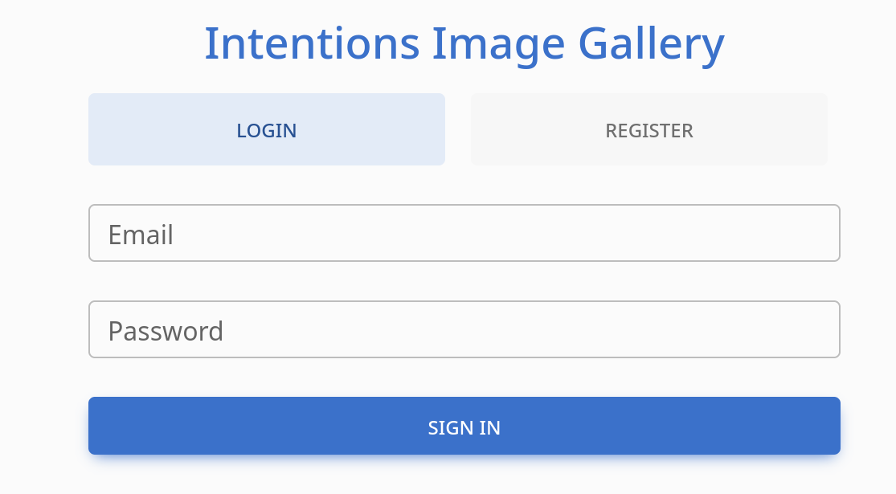
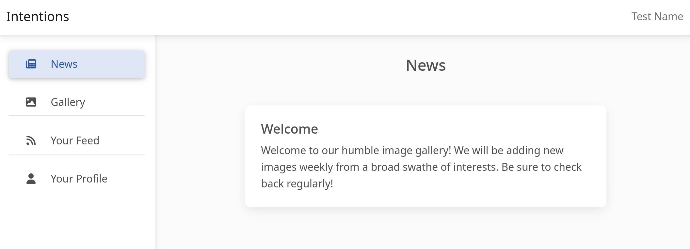

---
tags:
  - box
platform: HTB
os: Linux
difficulty:
date_completed:
mitre_attack: T1190
status: in-progress
---

## Target

**IP Address:**

## Recon

### Port Scan

#Nmap

```bash
sudo nmap -T4 -O -sV -sC -p- -oA targetScan $ipAddress
```

#### Findings

| Port | Service | Version |
|---|---|---|
| 22 | SSH | OpenSSH 8.9p1 |
| 80 | HTTP | nginx 1.18.0 |

## Enumeration

#Browser

I went to the web page and got a page to sign in or register an account to the website that seems to be an image gallery.



I created a user account with the following:
- Name: Test Name
- Email: test@email.com
- Password: password

Once logged in I have 4 tabs: News, Gallery, Your Feed, Your Profile.



The News has a welcome message. The Gallery has a lot of pictures in it. Your Feed has a lot of pictures in it. Your Profile just has my user info.

I downloaded one of the images and the name of the file is `ashlee-w-wv36v9TGNBw-unsplash.jpg`. This could be a user in the system, but I am not sure yet.

Looking at the file names of the other images I see a lot of different random names that seem to be in the format first-last. I am not sure yet if I can do anything with this since I don't have a way to get a password yet.

When looking at the "Your Profile" page I was able to change my "Favorite Genres" to a single quote to test for SQL injection. After going to the "Your Feed" page and looking at the request in Burp I was able to see that the injection sort of worked because it gave me an error.

## Exploitation

I was able to capture the POST request in Burp and use it in sqlmap but it gave me an error saying that it is not injectable because it is not looking at the right place. I am going to look into using a "Second Order Attack" to see if I can get this to work.

## Privilege Escalation

<!-- Not reached yet in these notes -->

## Flags

**User/Root:** not yet captured - the original notes had a "Root Access Obtained" header here with nothing underneath it, so leaving this unconfirmed rather than marking it rooted.

## Lessons Learned

The "Favorite Genres" field reflecting into the "Your Feed" page's query on a different request than where it's set is a strong second-order SQLi signal - worth confirming with a manual payload (time-based or boolean) directly rather than relying on sqlmap against the wrong request/parameter.
