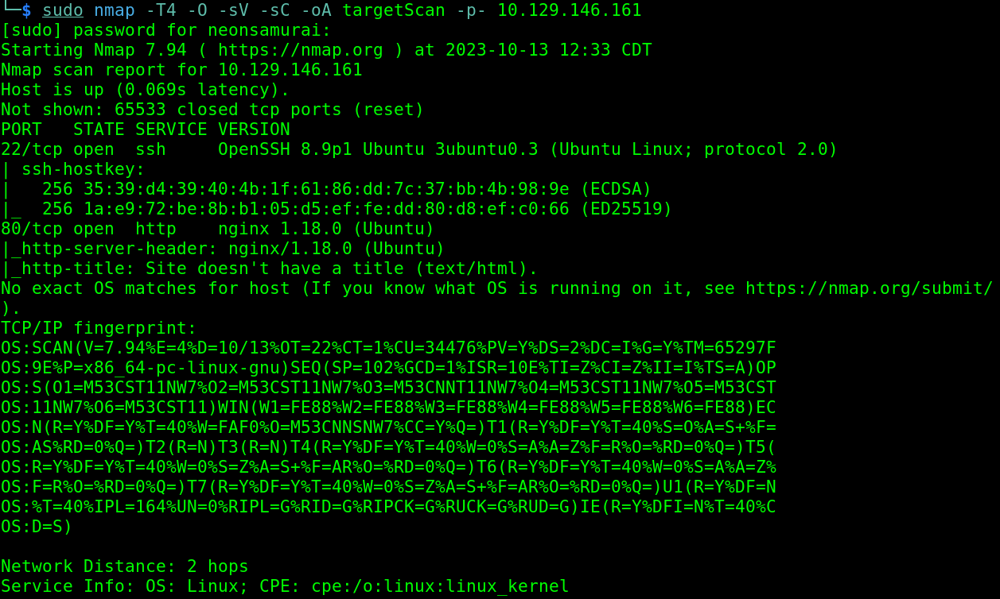
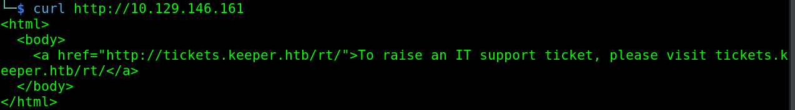
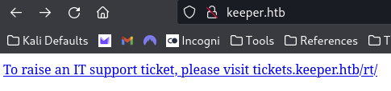
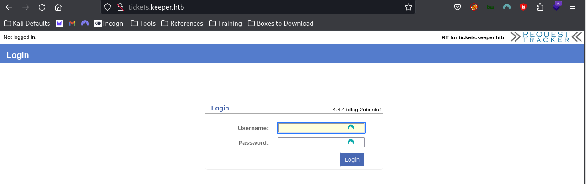
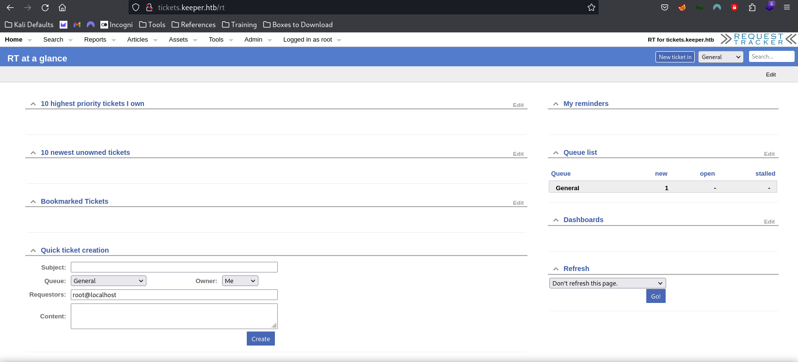
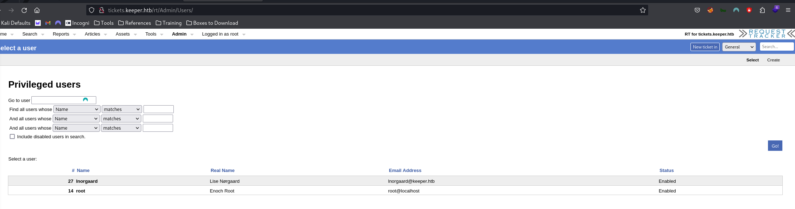
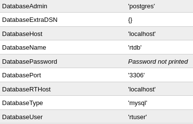
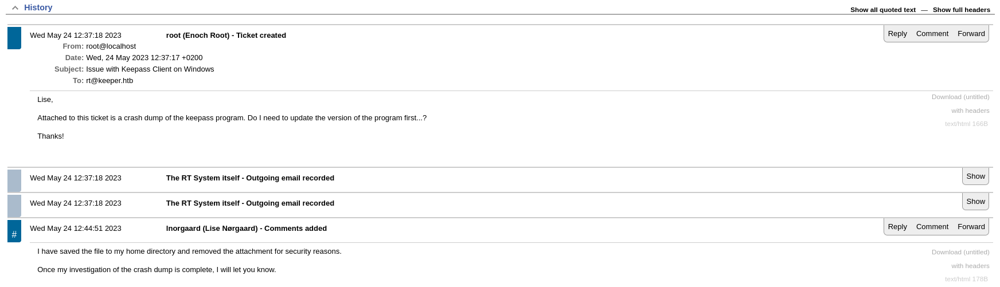
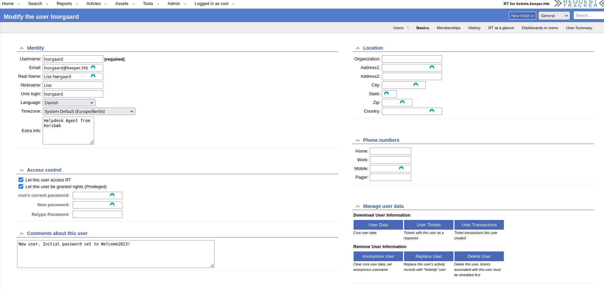
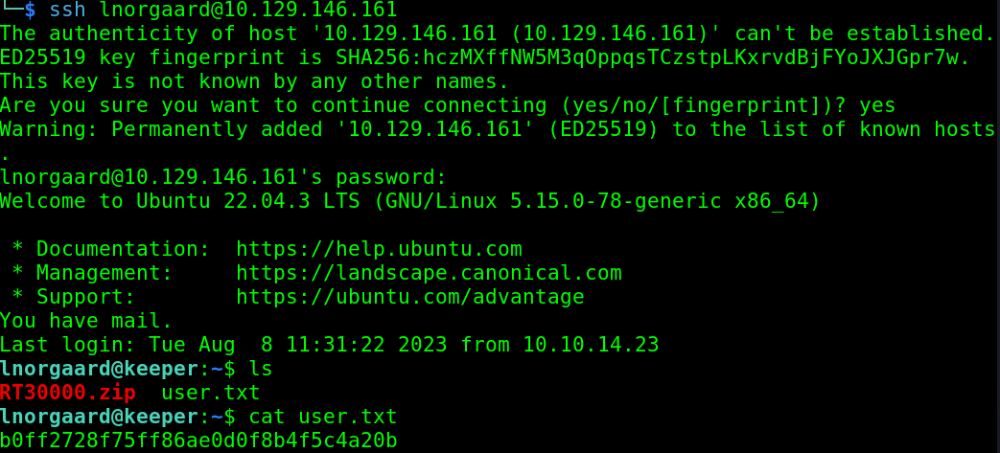

---
tags:
  - box
platform: HTB
os: Linux
difficulty:
date_completed:
mitre_attack: T1190, T1078, T1552.001, T1110.002
status: in-progress
---

## Target

**IP Address:** 10.129.146.161

## Recon

#Nmap

```bash
sudo nmap -T4 -O -sV -sC -oA targetScan -p- 10.129.146.161
```

#### Findings

After scanning the machine, I found that the machine has port 22 and port 80 open. It is running an SSH server and HTTP server. The machine is also running Ubuntu as the OS.

| Port | Service | Version |
|---|---|---|
| 22 | SSH | OpenSSH 8.9p1 |
| 80 | HTTP | nginx 1.18.0 |



## Enumeration

#Curl

```bash
curl http://10.129.146.161
```

I ran a curl on the IP address to see what it would return over port 80 and got a message saying to go to tickets.keeper.htb to raise an IT support ticket.



I added keeper.htb to my /etc/hosts file and got the following on the homepage:



I added tickets.keeper.htb to my /etc/hosts file and then was greeted with a login page when I navigated there.



At the top of the homepage it says that the page is using something called "Request Tracker," and when I look at the source code of the page I am able to see the script that is running that portion of the site. This could be an avenue of attack if this is vulnerable.

I searched for the request tracker in searchsploit and found a SQL injection exploit that I may be able to use for this target:

CVE-2013-3525: https://www.exploit-db.com/exploits/38459

#Sqlmap

```bash
sqlmap -r loginPacket --level=5 --risk=3
```

I captured the packet that is sent when trying to login to the system and ran it through sqlmap to see if it could find an injection path. Since this is an HTB box, I ran it at the highest level and risk.

## Exploitation

After looking through the exploit again, I realized that the SQL injection is for a specific parameter that you have to be logged in to access.

I then looked up if there are any default credentials for the Request Tracker application and found that the default admin is:
- user: `root`
- password: `password`

I tried logging in with this and was able to successfully authenticate.



Looking through the webpage settings I found another user: `lnorgaard`.



Continuing through the settings, I found the database configuration that the site is using on the host - unfortunately the password is not printed there.



I found that the log files are stored on the system at `/var/log/request-tracker4`, and that the system is running Perl to power the Request Tracker software.

Looking at the tickets, I was able to find that there was an issue with the "KeePass" program and that a crash dump was added to the ticket at one point. In the ticket, the user lnorgaard said that she removed the attachment from the ticket but saved it to her home directory - if I can get this file I can possibly use it to crack some passwords on the system.



I went back to look at the user lnorgaard to see if I missed something and found that there are notes on her profile that the admin left, which may give away her password.



Using the username and password worked to SSH into the system:
- User: `lnorgaard`
- Password: `Welcome2023!`



Doing an `ls` on the user folder I was able to find the crash dump that was mentioned earlier in the ticket and download it to my local machine with SCP.

```bash
scp lnorgaard@10.129.146.161:RT30000.zip ../loot
```

Now that I have the file I was able to unzip it and get the two files that were in the archive:
- `KeePassDumpFull.dmp`
- `passcodes.kdbx`

Using the program keepass2john I can convert the passcodes file to a crackable format to get the cleartext password.

```bash
keepass2john passcodes.kdbx | grep -o "$keepass$.*" > CrackThis.hash
```

Now I have a file that I can send to John or Hashcat and attempt to crack the hash of the password.

```bash
hashcat -m 13400 -a 0 CrackThis.hash /usr/share/wordlists/rockyou.txt
```

## Privilege Escalation

<!-- Not reached yet in these notes - waiting on the KeePass database crack above -->

## Flags

**User:** captured via SSH as lnorgaard (see above)

**Root/System:** not yet captured

## Lessons Learned

Support-ticket systems (Request Tracker here) are a goldmine for credentials and internal context that users think they've cleaned up - "removed" attachments and admin notes left on user profiles both led directly to a foothold here. Default creds are always worth trying first on any self-hosted ticketing/CMS software before looking for exploits.
