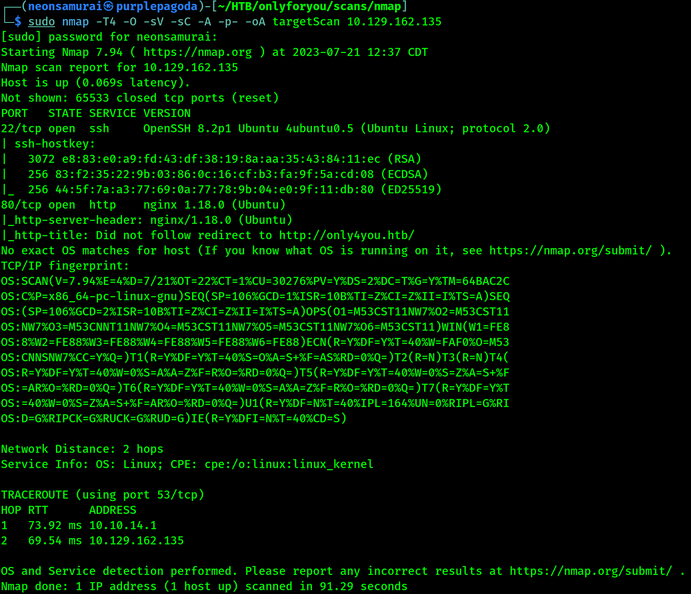
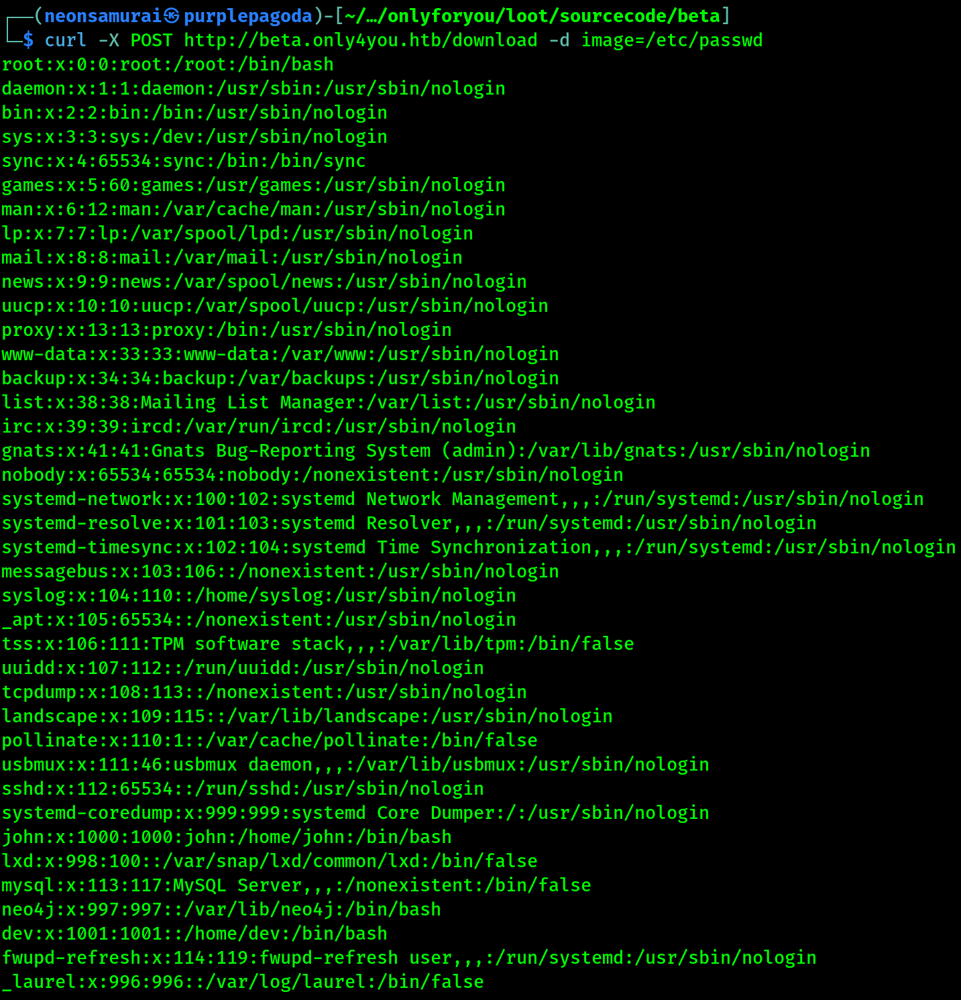

---
tags:
  - box
platform: HTB
os: Linux
difficulty:
date_completed:
mitre_attack: T1190
status: in-progress
---

## Target

**IP Address:**

## Recon

### Port Scan

#Nmap

```bash
sudo nmap -T4 -O -sV -sC -A -p- -oA targetScan 10.129.162.135
```

#### Findings

| Port | Service | Version |
|---|---|---|
| 22 | SSH | OpenSSH 8.2p1 |
| 80 | HTTP | nginx 1.18.0 |



#Curl

```bash
curl http://only4you.htb
```

I ran a curl on the address and got back the page - it is a very large web page.

## Enumeration

#Browser

Going into the FAQs you can see that there is a subdomain of beta.only4you.htb. Adding this to the hosts file I was able to get to this page.

On here you can get the source code for some tools that are on this page. There are two tools for images on this page, and one of them is for resizing a PNG or JPG.

After uploading the image it takes you to a list page where you can download the image you are resizing.

## Exploitation

When looking at the source code for this, you can see that they are not doing input validation properly - it is only checking for `../` and `..`.

In the POST request on the download, you are able to change the image name and get LFI:

```bash
curl -X http://beta.only4you.htb -d image=/etc/passwd
```



## Privilege Escalation

<!-- Not reached yet in these notes -->

## Flags

**User/Root:** not yet captured in these notes

## Lessons Learned

Blocklist-based path traversal filtering (checking only for the literal strings `../` or `..`) is almost always bypassable - encoding, double-encoding, or absolute paths (as worked here) will slip past a filter that isn't using an allowlist or proper path normalization.
