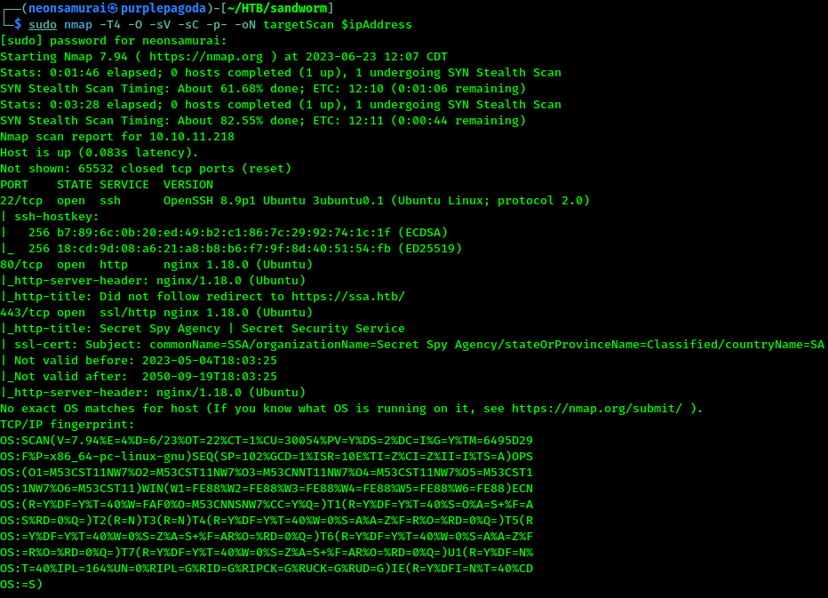

---
tags:
  - box
platform: HTB
os: Linux
difficulty:
date_completed:
mitre_attack:
status: in-progress
---

## Target

**IP Address:** 10.10.11.218

## Recon

#Nmap #Dirb #Sniper #Browser

```bash
sudo nmap -T4 -O -sV -sC -p- -oN targetScan $ipAddress
```



#### Findings

Nmap scan shows us the following:
- Port 22 - Open - OpenSSH 8.9p1
- Port 80 - Open - http nginx 1.18.0
- Port 443 - Open - ssl/http nginx 1.18.0

```bash
dirb http://10.10.11.218
```

#HTTP

I went to the website and saw that the website is powered by "Flask." Flask is a micro web framework for creating web APIs in Python.

```bash
sudo sniper -t ssa.htb
```

## Enumeration

<!-- Not reached yet in these notes -->

## Exploitation

<!-- Not reached yet in these notes -->

## Privilege Escalation

<!-- Not reached yet in these notes -->

## Flags

**User/Root:** not yet captured - the original notes had a "Root Access Obtained" header here with nothing underneath it, so leaving this unconfirmed rather than marking it rooted.

## Lessons Learned

<!-- Fill in once further along -->
