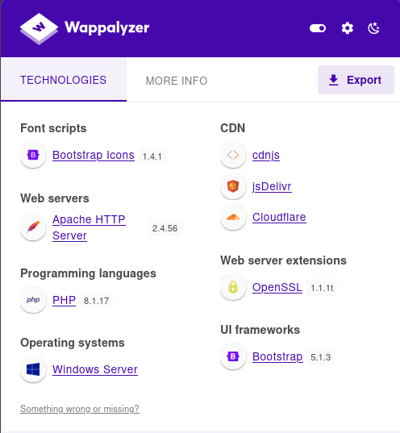
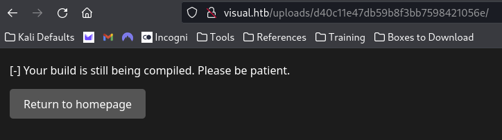

---
tags:
  - box
platform: HTB
os: Windows
difficulty:
date_completed:
mitre_attack:
status: in-progress
---

## Target

**IP Address:** 10.129.237.101

## Recon

#Nmap

```bash
sudo nmap -T4 -sV -O -sC -p- -oA targetScan 10.129.237.101
```

#### Findings

| Port | Service | Version |
|---|---|---|
| 80 | http | Apache httpd 2.4.56 |

Nmap identified this as a Windows Server 2019 host. Only port 80 is open, running Apache.


Navigating to the IP in the browser brought up the homepage for the site. This server says it will compile your programs for you if you send it a git repo URL, then gives you the executables and DLLs you need.

Interesting things on the homepage: a text box to enter a git repo URL.

#wappalyzer



Using Wappalyzer, found the box is running: Bootstrap, Apache, PHP, OpenSSL. Since the server runs PHP, there might be a route to a webshell or reverse shell via PHP.

## Enumeration

Tried entering the word "test" into the text box - was told it had to be a URL. Formatting it as `http://test.com` was accepted.



## Exploitation

<!-- Not reached yet in these notes - next step is likely standing up a malicious git repo (e.g. a project file with a build event / pre-build command) since the server clones and compiles arbitrary git repos -->

## Privilege Escalation

<!-- Not reached yet in these notes -->

## Flags

**User/Root:** not yet captured in these notes

## Lessons Learned

<!-- Fill in once further along - "compile my git repo for me" services are a strong signal to look at MSBuild/csproj pre-build events or similar build-time code execution rather than the compiled output itself -->
