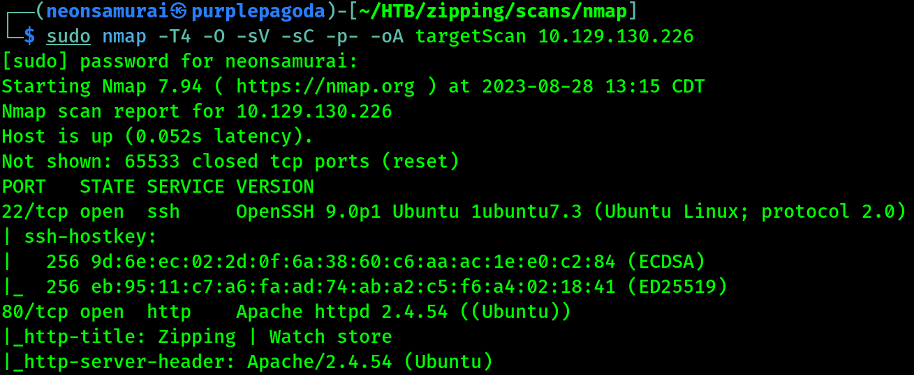

---
tags:
  - box
platform: HTB
os: Linux
difficulty:
date_completed:
mitre_attack:
status: in-progress
---

## Target

**IP Address:** 10.129.130.226

## Recon

#Nmap

```bash
sudo nmap -T4 -O -sV -sC -p- -oA targetScan 10.129.130.226
```



#### Findings

| Port | Service | Version |
|---|---|---|
| 22 | SSH | OpenSSH 9.0p1 |
| 80 | HTTP | Apache httpd 2.4.54 |

Going to the page on port 80 returns a page saying it's a watch store.


## Enumeration

#Ffuf

```bash
sudo ffuf -v -w /usr/share/wordlists/seclists/Discovery/DNS/subdomains-top1million-5000.txt -u http://zipping.htb -H "Host: FUZZ.zipping.htb" -fs 16738
```

This returned no other domains.

The page has two working links: `zipping.htb/shop` and `zipping.htb/upload.php`. The shop page doesn't seem to have anything interesting, but the upload page has a way to upload files - the file has to be a zip file and also has to contain a PDF.


If you upload something that isn't a PDF in the zip, or isn't a real zip, you get an error.


## Exploitation

Once a file uploads successfully, it returns a link to view the PDF that was uploaded.


<!-- Not reached yet in these notes - a zip-file-containing-a-PDF upload flow is a strong signal to test zip-slip (path traversal in the zip entry names) and symlink-in-zip tricks next -->

## Privilege Escalation

<!-- Not reached yet in these notes -->

## Flags

**User/Root:** not yet captured in these notes

## Lessons Learned

<!-- Fill in once further along -->
