---
tags:
  - box
platform: VulnHub
os: Linux
difficulty:
date_completed:
mitre_attack: T1190, T1552.001, T1110.002, T1053.003
status: rooted
---

## Target

**IP Address:** 192.168.1.101

There are 2 horcruxes to find on this machine - 8 in total across all three Harry Potter machines.

## Recon

```bash
sudo nmap -T4 -O -sV -sC -p- -oA aragogMapping 192.168.1.101
```

#### Findings

| Port | Service | Version |
|---|---|---|
| 22 | SSH | OpenSSH 7.9p1 |
| 80 | HTTP | Apache httpd 2.4.38 |

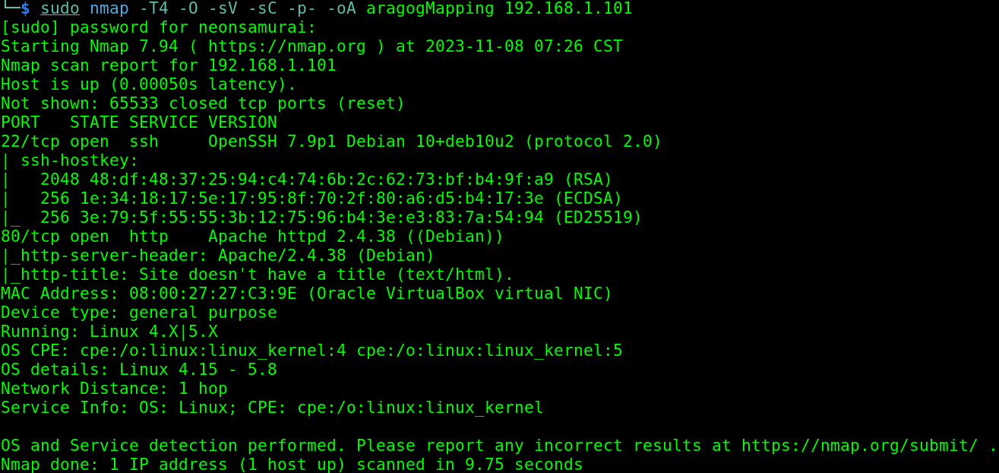

Checked searchsploit for these versions - no results.

Navigated to the HTTP page in Firefox - a Harry Potter themed image.


No robots.txt (404). Ran dirb and found: `blog`, `javascript`, `wp-admin`, `wp-content`, `wp-includes`.

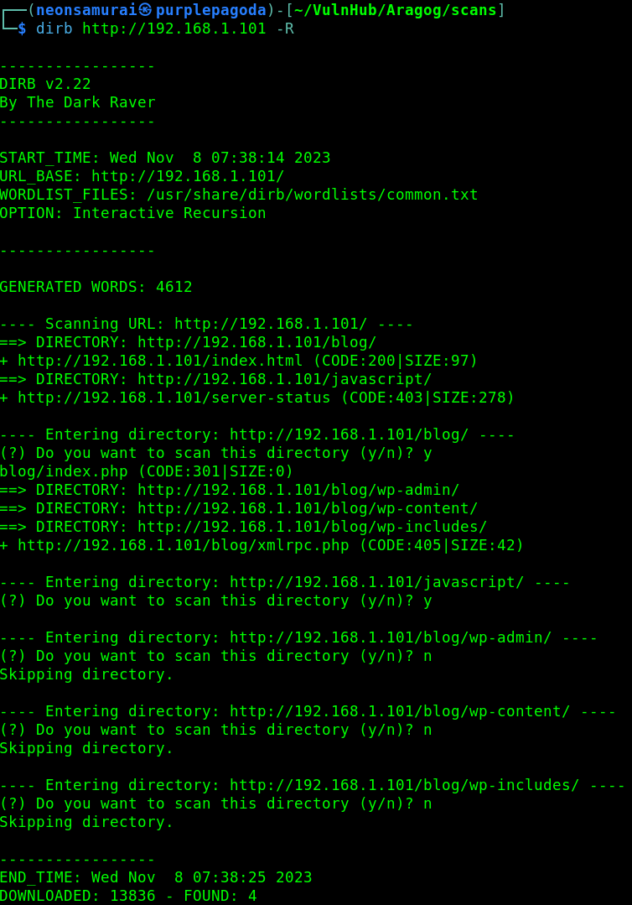

The wp-* directories indicate a WordPress site. `/javascript` is Forbidden.

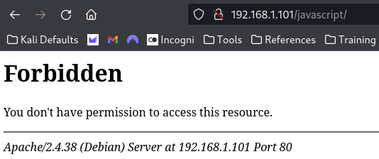

`/blog` loads a basic, slightly broken WordPress site.

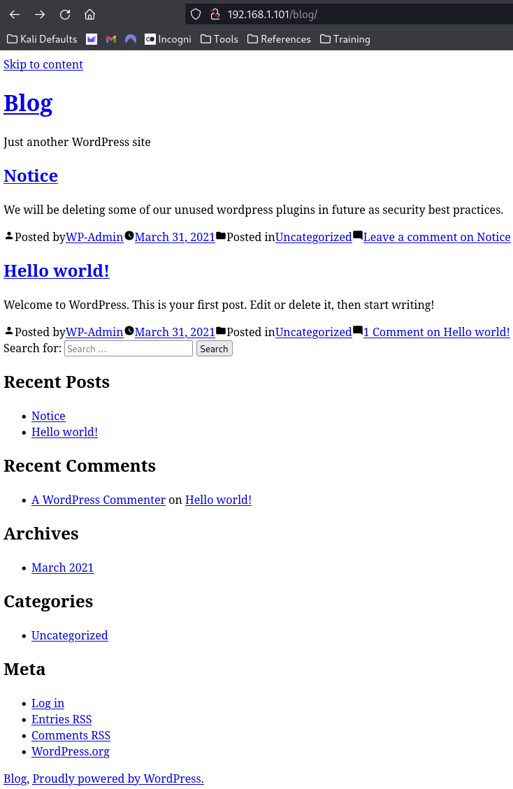

## Enumeration

A link pointed to `aragog.hogwarts` and `wordpress.aragog.hogwarts` - added both to `/etc/hosts` and the site fully loaded.

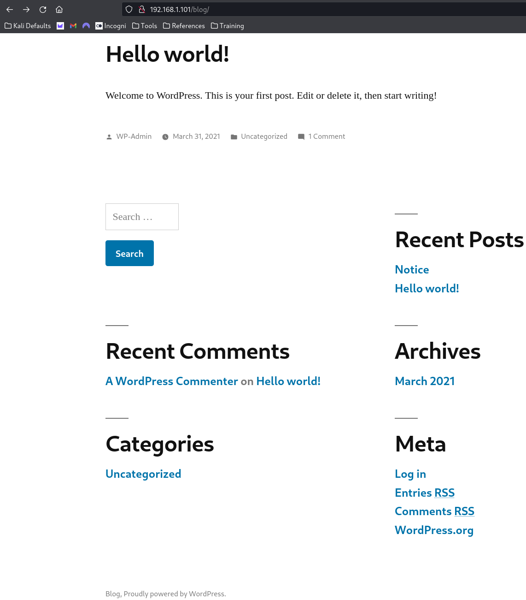

A post titled "notice" mentions unused WordPress plugins are going to be deleted - a hint that they may still be present (and vulnerable) for now.

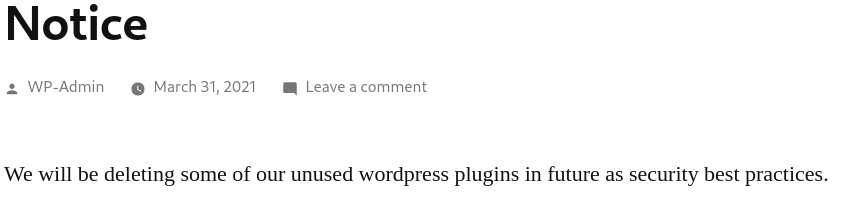

Found the WordPress version in the page source: 5.0.12.

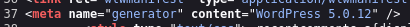

```bash
wpscan --url http://wordpress.aragog.hogwarts/blog
```

WPScan found XML-RPC enabled (possible foothold avenue).

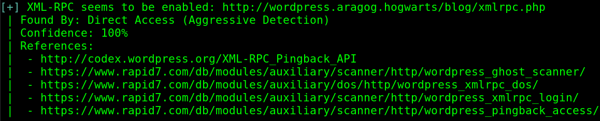
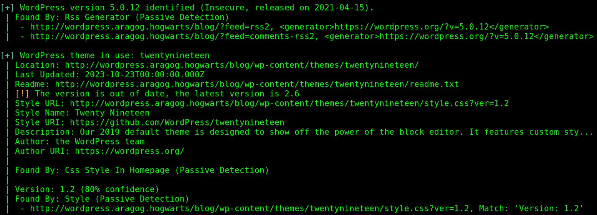

Passive mode couldn't detect plugins - switched to aggressive mode and found them.

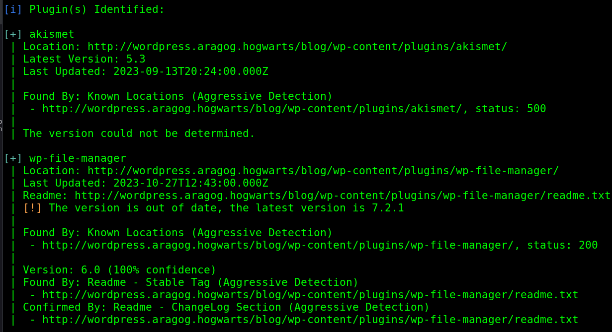

Searchsploit shows `wp-file-manager` has multiple exploits, and the installed version appears vulnerable. There are also two exploits for Akismet, but WPScan couldn't confirm its version.

Tried default admin login - invalid username error. Tried the lost-password field with common usernames (`admin`, `wp-admin`, `username`) - all invalid.

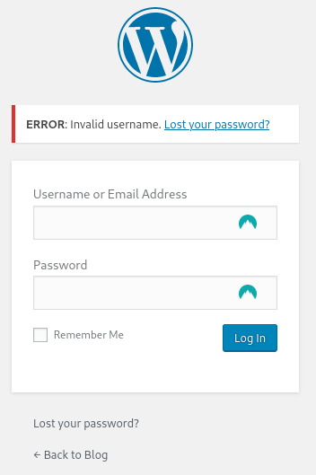

## Exploitation

Got a foothold via the out-of-date `wp-file-manager` plugin - a vulnerability allows file upload and RCE by moving an arbitrary file onto the system and executing it. Used this in Metasploit and got a Meterpreter shell back as www-data.

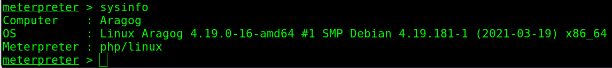

Reading `/etc/passwd` revealed two more users: `hagrid98` and `ginny`, plus a mysql account that might hold credentials somewhere.

Listed both users' home directories and found the first horcrux inside Hagrid's home directory.

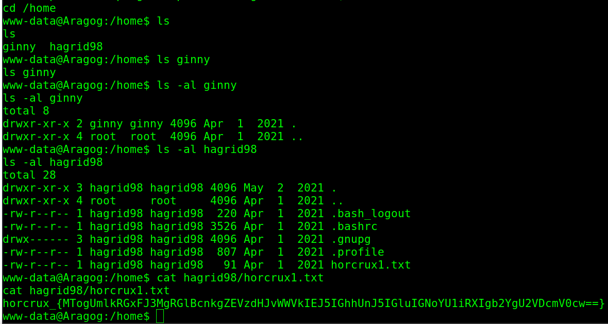

Using LinPEAS, found what look like database credentials.

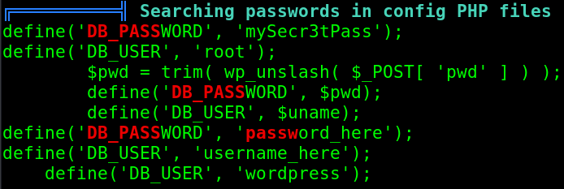

Logged in to MySQL with them.

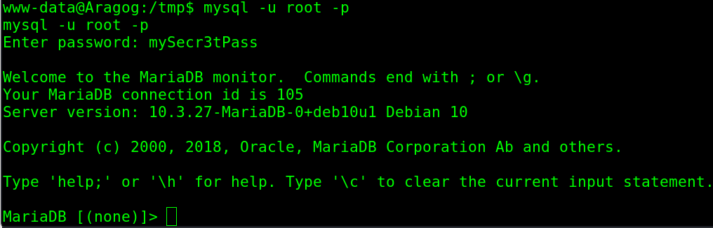

Pulled the WordPress user list from the database, including Hagrid's entry and hashed password.

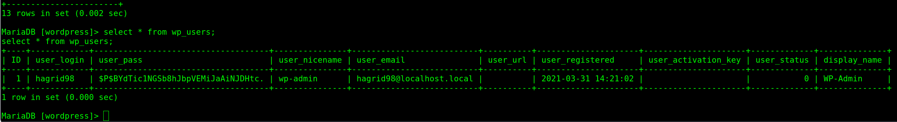

```
$P$BYdTic1NGSb8hJbpVEMiJaAiNJDHtc.
```

Cracked with Hashcat: `password123`.


Logged in as Hagrid over SSH.

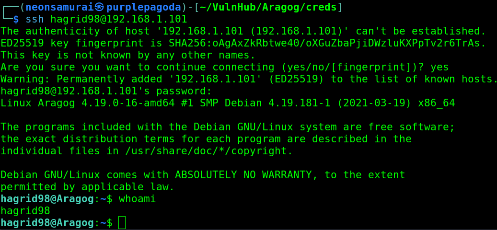

## Privilege Escalation

`sudo -l` failed - sudo isn't installed on this machine.

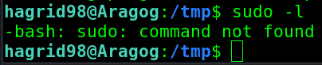

Uploaded pspy64 to check what's running that isn't visible from static enumeration. Found UID 0 running a script that Hagrid owns.

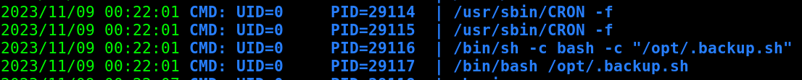

Opened `.backup.sh` (writable by Hagrid) and added a reverse shell line, then started a listener.

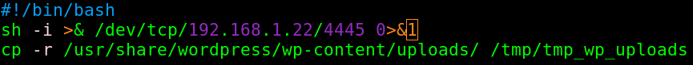

When root ran the script again, got a connection on the listener as root.

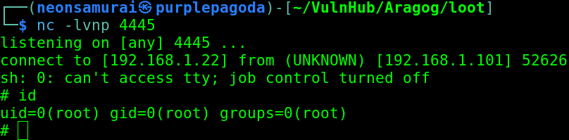

## Flags

**User (Horcrux 1):** found in Hagrid's home directory (see above)

**Root/System (Horcrux 2):** captured in `/root` after the cron/backup-script privesc

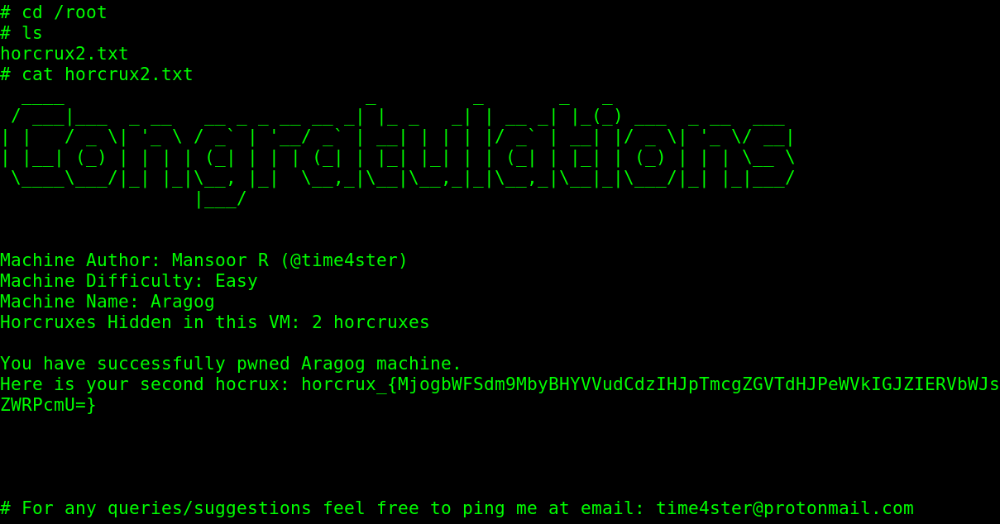

## Lessons Learned

Outdated WordPress plugins (`wp-file-manager` here) are consistently one of the fastest paths to a foothold on any WordPress-based box - check plugin versions against known CVEs before touching WordPress core itself. On the privesc side: a root-owned cron job that shells out to a script writable by an unprivileged user is an immediate win the moment `pspy` reveals it - always check ownership vs. writability of anything root touches periodically.
