---
tags:
  - box
platform: VulnHub
os: Linux
difficulty:
date_completed:
mitre_attack: T1552.004, T1110.002, T1574, T1068
status: rooted
---

## Target

**IP Address:** 192.168.56.3

No host discovery needed - the IP is provided.

## Recon

#Nmap

```bash
sudo nmap -T4 -O -sV -sC -A -p- -oA targetScan 192.168.56.3
```

#### Findings

| Port | Service | Version |
|---|---|---|
| 22 | SSH | OpenSSH 8.4p1 |
| 80 | HTTP | Apache httpd 2.4.48 |

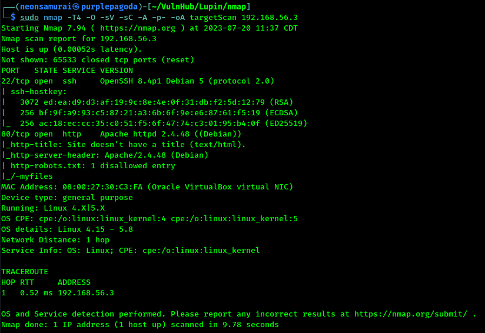

Robots.txt has an entry for `/~myfiles`. Several low-severity CVEs listed for this SSH version (CVE-2021-28041, CVE-2021-41617, CVE-2020-14145, CVE-2016-20012, CVE-2021-36368) plus a number for this Apache version, though pages on the site are limited enough that they may not apply.

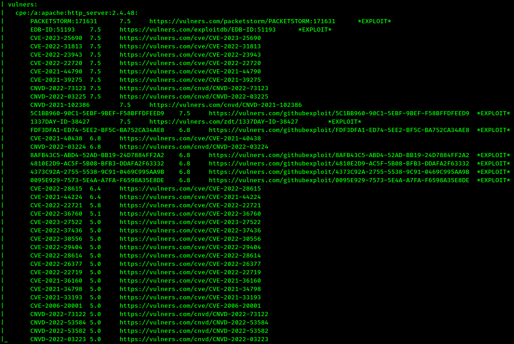

## Enumeration

#Curl

```bash
curl http://192.168.56.3
```

A single image and a comment saying it's an easy box.

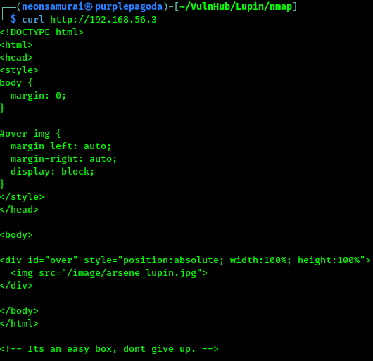

#Browser

Downloaded the image from the homepage for later.


`/~myfiles` returns a 404, but with a comment: "You can do it, keep trying."

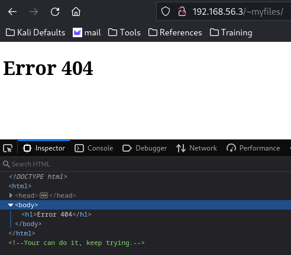

#Ffuf

A directory scan on the base path came back empty, so tried fuzzing with the `~` prefix:

```bash
sudo ffuf -w /usr/share/wordlists/dirb/big.txt -u http://192.168.56.3/~FUZZ
```

Found two results: `myfiles`, `secret`.

`/~secret` gives a page saying there's an SSH key somewhere, with a possible username hint and a nudge toward fasttrack wordlists.

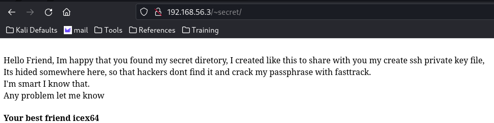

```bash
sudo ffuf -w /usr/share/wordlists/dirbuster/directory-list-2.3-medium.txt -u http://192.168.56.3/~secret/.FUZZ -e .pem,.txt -fs 277
```

Found a hidden file: `.mysecret.txt`.

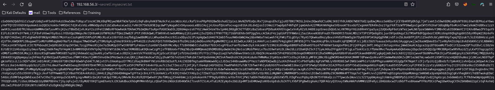

Looked like an SSH key but the format was off - encoded somehow.

#Dcode

Identified the cipher as Base58. Decoded it back to a real SSH key (potentially passphrase-protected).

## Exploitation

#John

```bash
ssh2john ssh_key.pem > ssh_key.hash
john --wordlist=/usr/share/wordlists/fasttrack.txt ssh_key.hash
```

Cracked the key's passphrase.

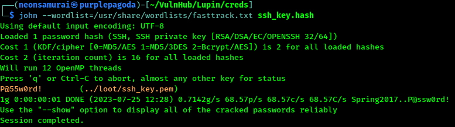

Logged in with the key and passphrase, captured the user flag.

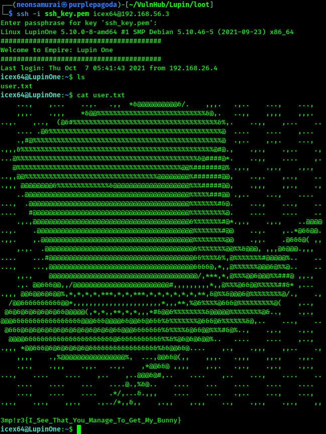

## Privilege Escalation

`sudo -l` showed this user can run Python and a script called `heist.py` as user `arsene`.

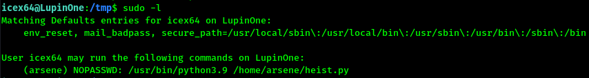

Reviewed `heist.py` - it tries to open a web browser but doesn't actually work, and I don't have write permission on the file itself (read/execute only).

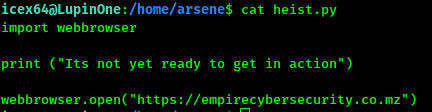

The script imports Python's `webbrowser` module though, and that module *is* editable - rewrote its `open()` function so that instead of opening a browser it reads and prints a hidden secret file.

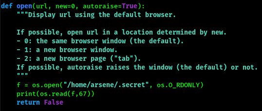

This surfaced arsene's password:
```
rQ8EE"UK,eV)weg~*nd-`5:{*"j7*Q
```

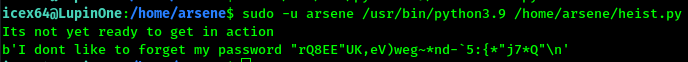

Logged in as arsene and checked permissions - arsene can run `pip` as root.

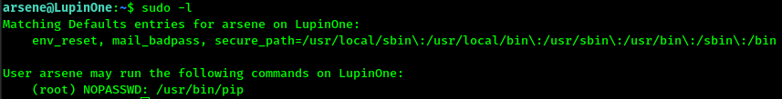

Found a well-known privesc technique for root-run pip: a malicious `setup.py` that gets executed during `pip install`.

```bash
TF=$(mktemp -d)
echo "import os; os.execl('/bin/sh', 'sh', '-c', 'sh <$(tty) >$(tty) 2>$(tty)')" > $TF/setup.py
sudo -u root /usr/bin/pip install $TF
```

Got a blank shell back - confirmed root with `id`.

## Flags

**Root/System:** captured.

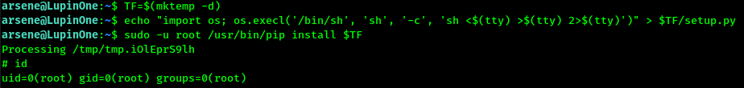
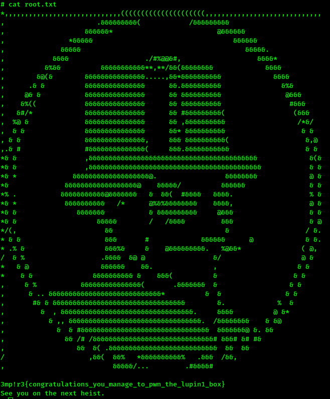

## Lessons Learned

Even when a script itself is read-only, its imported modules may not be - hijacking a stdlib module (`webbrowser` here) that a restricted sudo script imports is a neat way around "you can only read/execute this one file." `pip install` running as root via sudo is a textbook GTFOBins privesc: any `setup.py` in the target directory runs arbitrary code during install.
