---
tags:
  - box
platform: VulnHub
os: Linux
difficulty:
date_completed:
mitre_attack: T1110, T1078, T1548.003, T1090, T1190, T1574.007, T1068, T1552.001
status: rooted
---

## Target

**IP Address:** 192.168.1.20 (mail server, external)

Rules of engagement: stay away from attacking port 80/8000/9000 directly on the mail server. Three servers in total: mail, web, database.

## Recon

### Discovery

#Nmap

```bash
sudo nmap -oN discoveryScan -sn 192.168.1.0/24
```

#### Findings

IP Address: 192.168.1.20

### Port Scan

#Nmap

```bash
sudo nmap -T4 -sV -sC -p- -oA targetScan 192.168.1.20
```

#### Findings

| Port | Service | Version |
|---|---|---|
| 80 | http | Apache httpd 2.4.29 |
| 110 | pop3 | Dovecot pop3d |
| 2222 | ssh | OpenSSH 8.2p1 |
| 8000 | nagios-nsca | Nagios NSCA |
| 9000 | cslistener? | none |

Linux OS. SSH on a non-default port - security through obscurity? A POP3 server is running. Need to research Nagios NSCA and the cslistener service further.

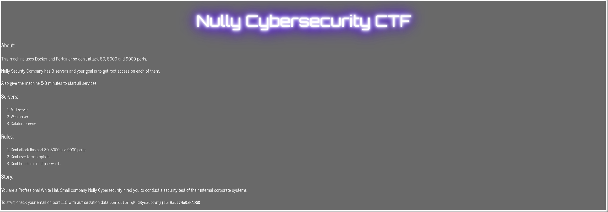

Was given credentials for the POP3 server ahead of time: `pentester:qKnGByeaeQJWTjj2efHxst7Hu0xHADGO`

## Enumeration

### Mail Server

#Telnet

```bash
telnet 192.168.1.20 110
```

Logged into POP3 with the provided creds. Found an email from "Bob Smith" (the mail server admin) saying he forgot his password but remembers it was simple.

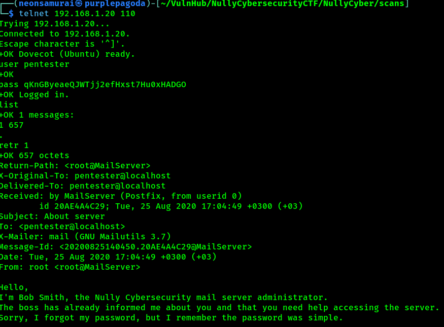

Tried SSH with my own creds - account not available. Tried a wrong password - got an "incorrect password" message, confirming the username/password combo format is valid and brute-forceable.

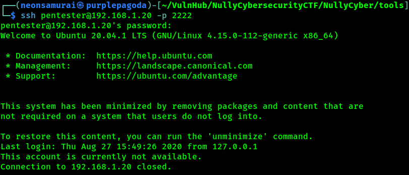

#username-anarchy

```bash
username-anarchy -i name > usernames
```

Built a username list from "bob smith," and (per a VulnHub page hint) grepped "bobby" out of rockyou to build a targeted password list.

#Hydra

```bash
hydra -L usernames -P bobby.list -f 192.168.1.20 pop3 -V
```

Cracked it: `bob:bobby1985`.

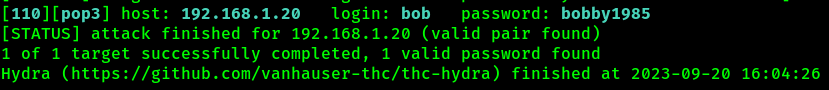

Telnet'd in as bob via POP3 - empty inbox, nothing useful. Tried the same creds against SSH (port 2222) - worked.

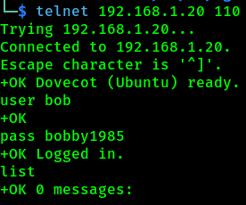
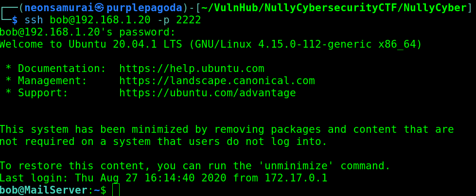

## Exploitation

#MetaSploit

Used the ssh-exec exploit in Metasploit to log in with Bob's creds and get a Meterpreter shell.

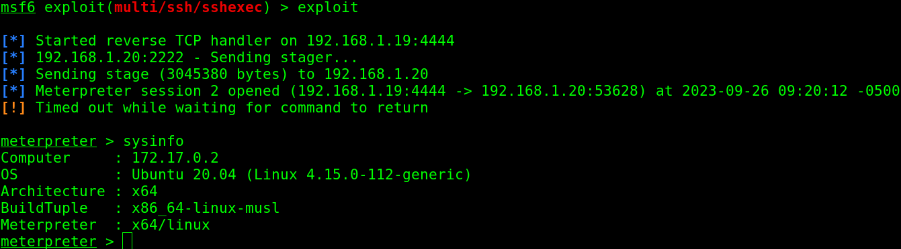

Found a `todo` file in Bob's home directory - mentions creating a second user (`my2user`) to run backups so it isn't Bob's own account doing it.

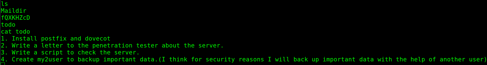

`sudo -l` as Bob showed he can run a backup-check script as `my2user`.

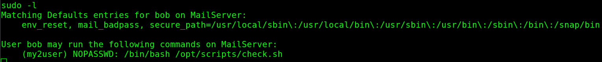

The script runs a lot of health checks - appended commands to the end to probe what `my2user` can do.

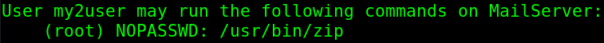

Added `sudo -l` to the script - found `my2user` can run `/usr/bin/zip` as root. GTFOBins has a known technique to keep elevated privileges via zip - appended the documented commands to the script and re-ran it, landing a root shell.

## Privilege Escalation

Root shell obtained on the mail server via the zip GTFOBins technique above.

## Flags

**Root (Mail Server):** captured.

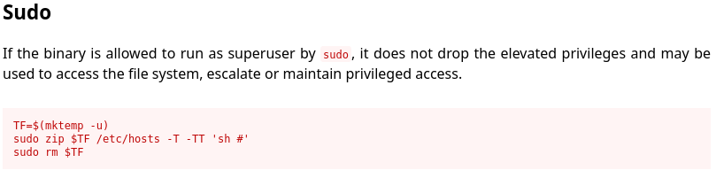
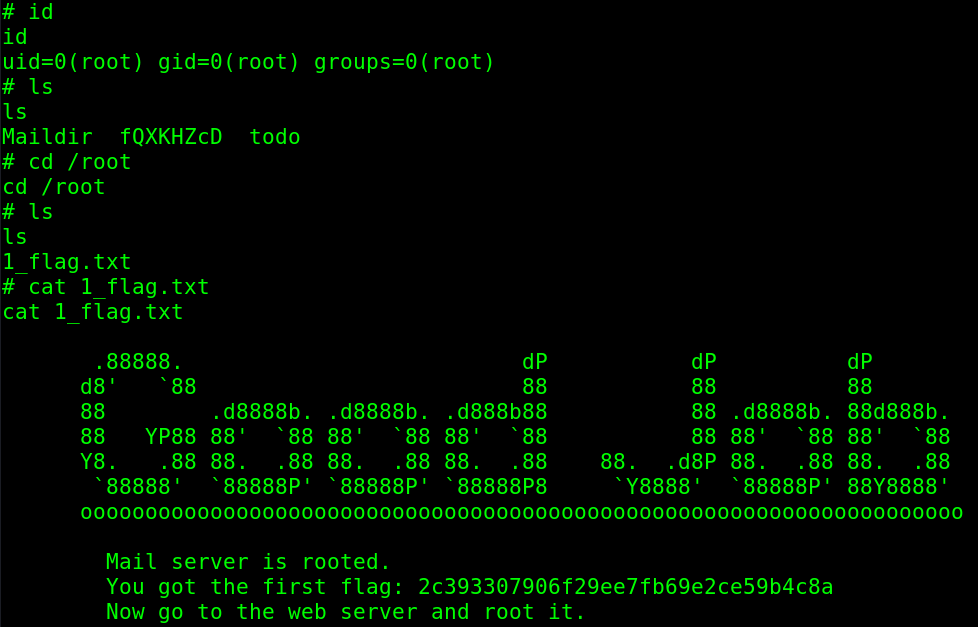

---

## Pivot: Internal Subnet

Using the Meterpreter session on the mail server, found a network interface connected to a 172.x subnet (172.17.0.2). Set up a route through Meterpreter to reach it.

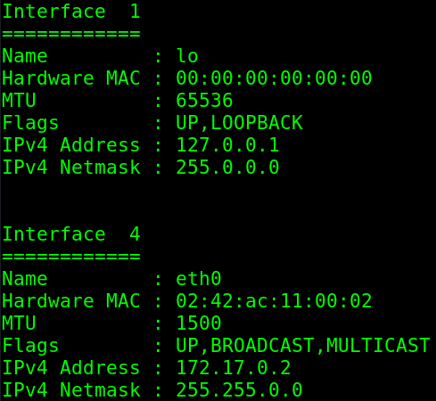
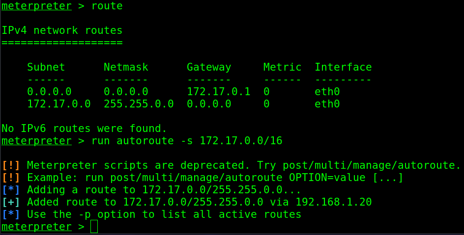

The mail server had nmap available - used it locally to sweep the internal subnet:

```bash
nmap -sn 172.17.0.0/16
```

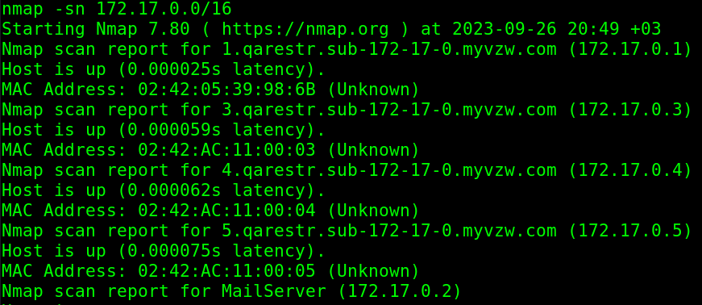

Hosts found: 172.17.0.1 - 172.17.0.5 (172.17.0.1/.2 are both the mail server, duplicated).

```bash
nmap -T4 172.17.0.3-5
```

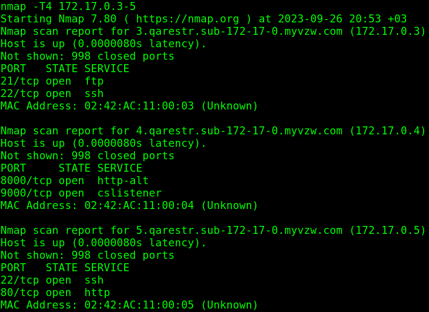

- 172.17.0.3 - likely database server (FTP + SSH)
- 172.17.0.4 - container host, out of scope per ROE
- 172.17.0.5 - likely web server (HTTP + SSH)

## Web Server (172.17.0.5)

```bash
nmap -T4 -sV -oX webServer.xml -p- 172.17.0.5
```

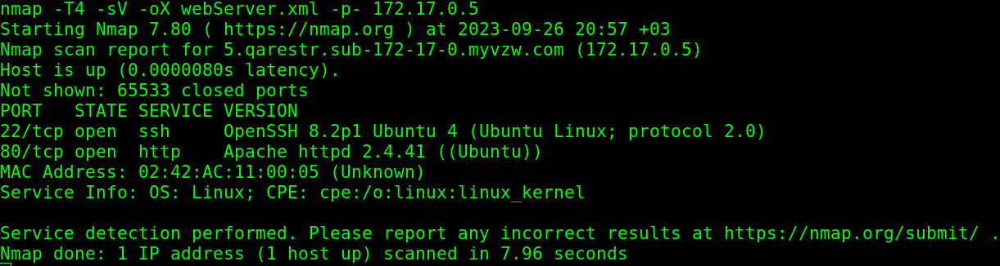

| Port | Service | Version |
|---|---|---|
| 22 | SSH | OpenSSH 8.2p1 |
| 80 | HTTP | Apache httpd 2.4.41 |

Port-forwarded via Meterpreter:

```msfconsole
portfwd add -l 1234 -p 80 -r 172.17.0.5
```

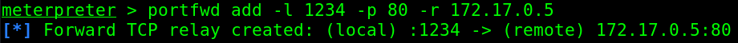

Site is "under construction," mentions a name to try for brute forcing: "Oliver."

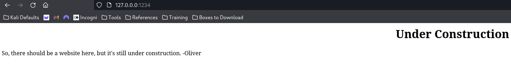

Robots.txt had a `/ping` entry - directory listing with a file "For Oscar," mentioning a second user, Oscar.

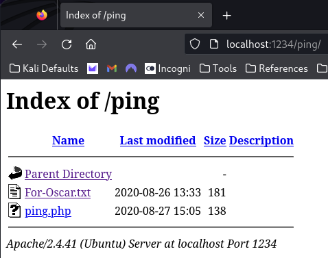
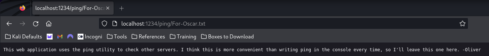

`ping.php` takes a `host` parameter - confirmed it shells out to the system `ping` command. `&`/`&&` didn't work, but `;` broke out of the ping command and executed a follow-on command.

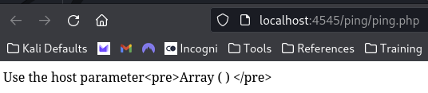
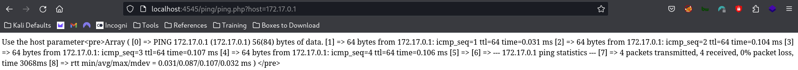
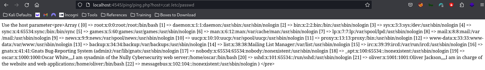

Uploaded a static `nc` binary to the mail server, `wget`'d it onto the web server, set up a listener on the mail server, and got a reverse shell from the web server back to the mail server.

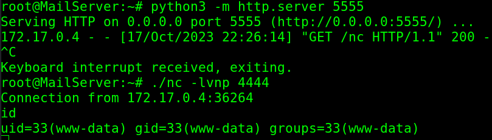

Two non-system users on this box: Oscar (1000), Oliver (1001). Nothing usable in Oscar's files without a password. Found `/var/backups/.secret` owned by Oliver, containing his password in plaintext.

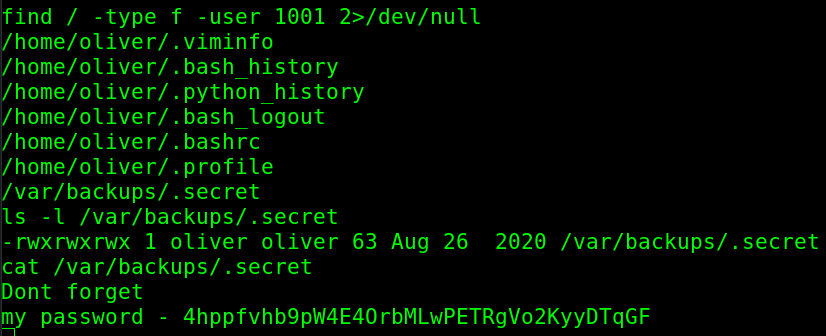

Set up a local port forward from the mail server to the web server's SSH port and logged in as Oliver.

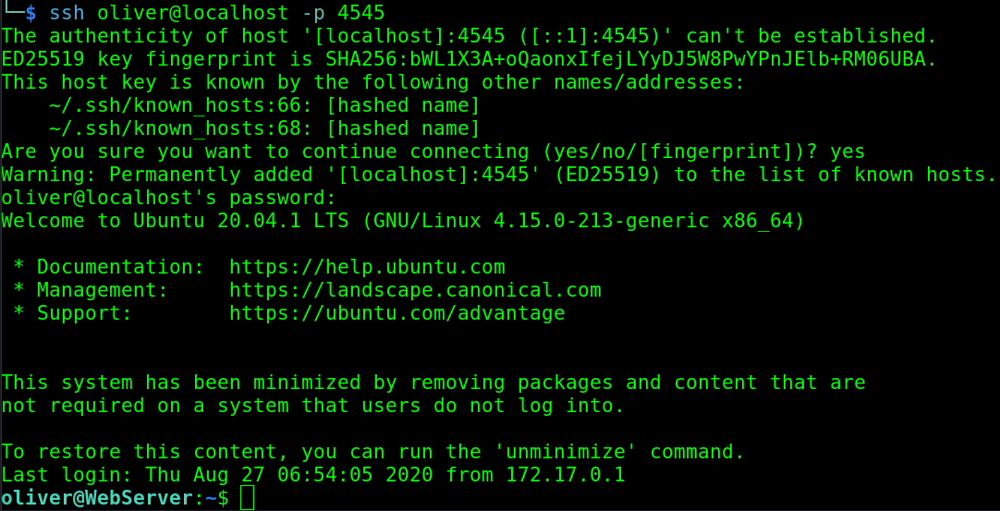

Found python3 has the sticky bit set and runs as Oscar - used it to switch to Oscar.

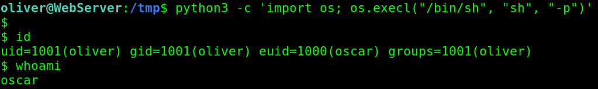

Found `my_password` in Oscar's home directory with his password.

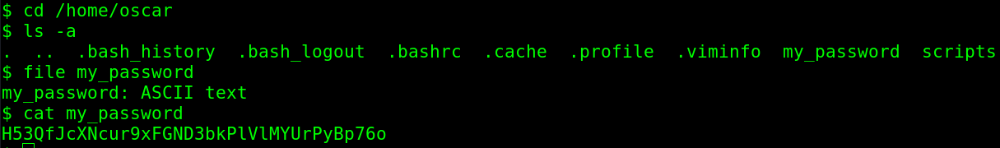

Found a `scripts/current_date` binary in Oscar's home, run by root, using setuid and shelling out to the `date` binary by name (not full path) - a classic PATH hijack. Wrote a malicious `date` script (just `su`) and placed it earlier in the PATH, then ran `current_date` again.

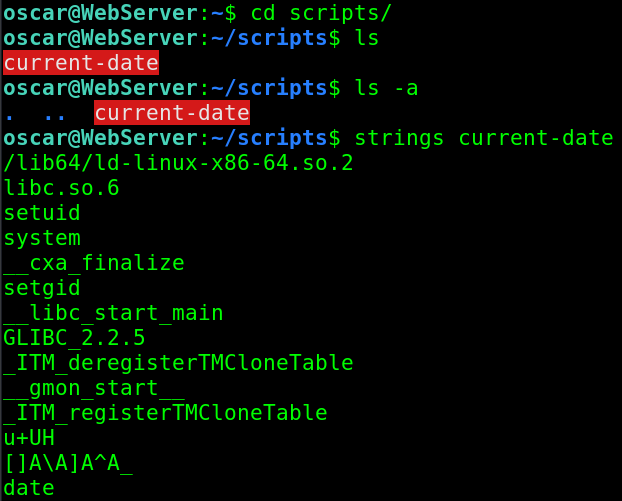

## Flags

**Root (Web Server):** captured via the PATH-hijacked `date` binary.

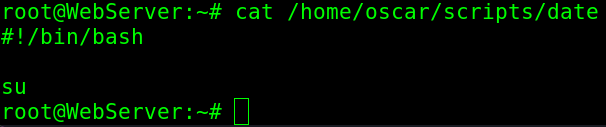
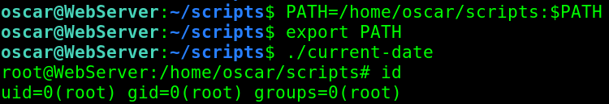
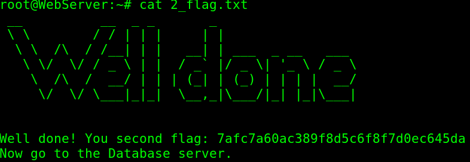

---

## File/Database Server (172.17.0.3)

| Port | Service | Version |
|---|---|---|
| 21 | ftp | vsftpd 3.0.3 |
| 22 | ssh | OpenSSH 8.2p1 |

Anonymous FTP login worked from the web server's vantage point.

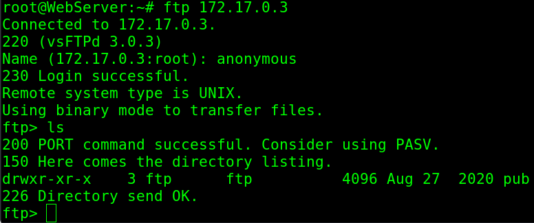

Found `pub/test` with one empty file - pulled everything down to check for anything hidden:

#Wget

```bash
wget -r -l 0 ftp://anonymous@172.17.0.3/*
```

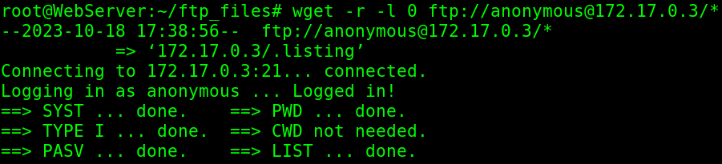

Found a hidden `.folder` in `pub`, containing a password-protected `.backup.zip`.

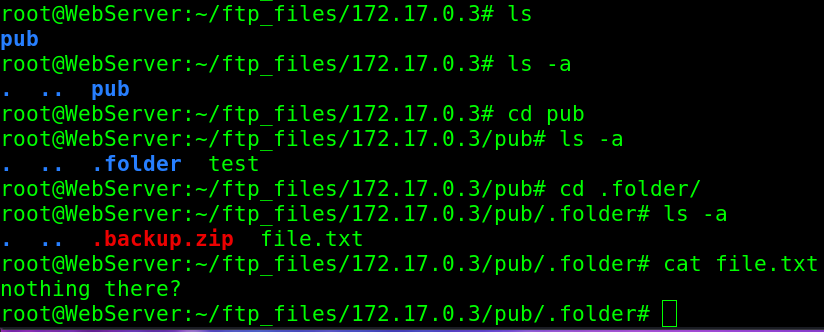
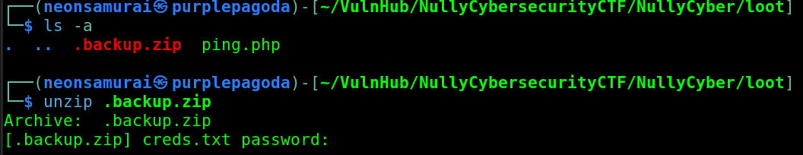

#John #Hashcat

```bash
zip2john .backup.zip > backup.hash
hashcat -m 17210 -a 0 backup.hash /usr/share/wordlists/rockyou.txt
```

Cracked the archive, found `creds.txt` inside with credentials for user `donald`.

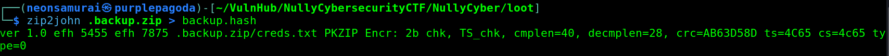
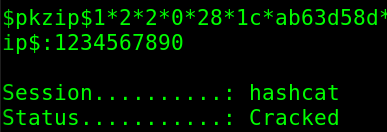
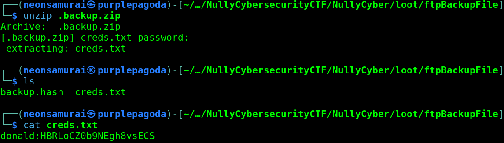

```bash
ssh -L 4546:172.17.0.3:22 root@192.168.1.16 -p 2222 -i mailServerRootKey
```

Logged in as donald via the tunnel.

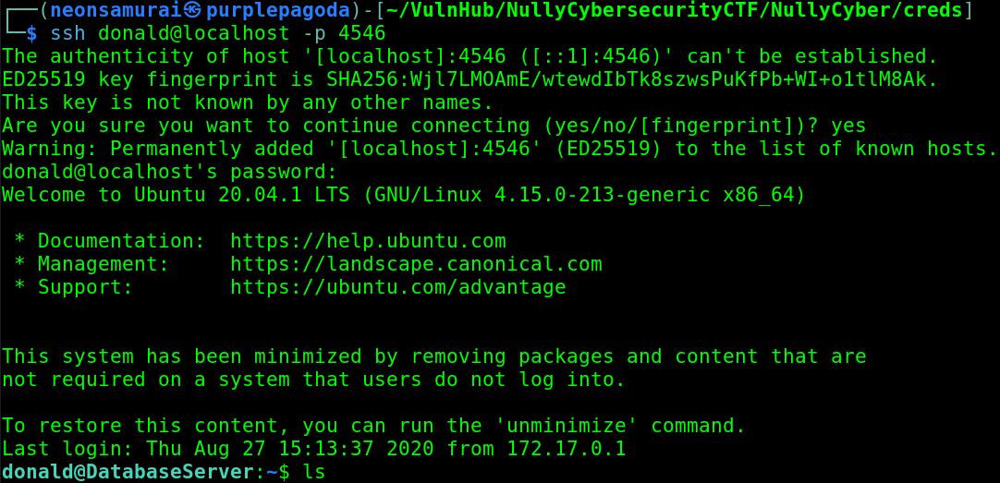

Searched for sticky-bit binaries and found `screen` (version 4.5.0) - normally requires sudo per GTFOBins, which donald doesn't have, but this version has a standalone ExploitDB exploit that abuses the sticky bit directly (creates a malicious config that `screen` loads as root).

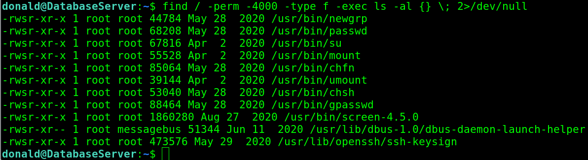

## Flags

**Root (File/Database Server):** captured via the `screen` 4.5.0 sticky-bit exploit.

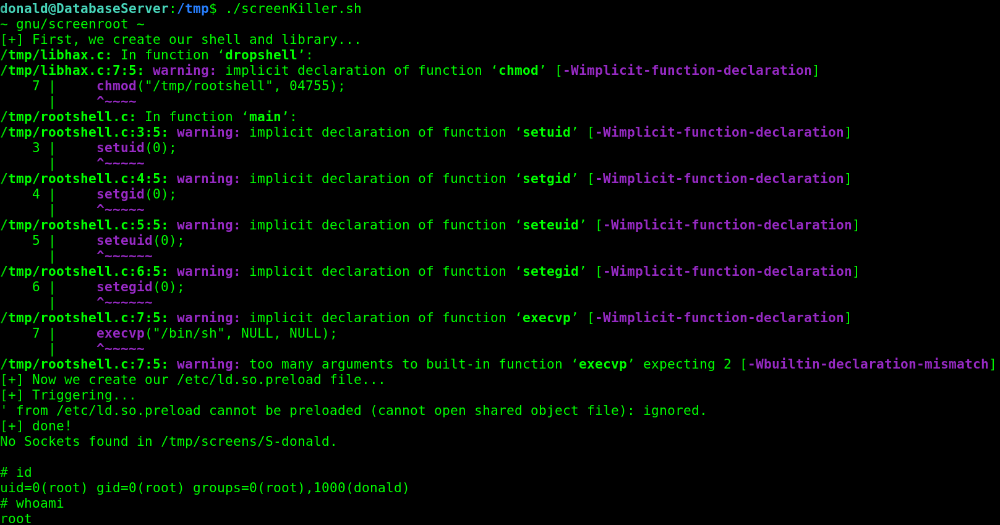
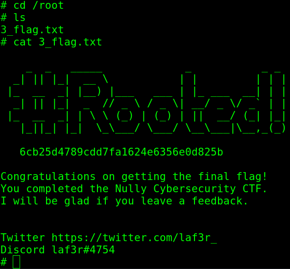

## Lessons Learned

A three-tier internal network (mail/web/database) chained entirely through pivoting from a single initial POP3/SSH foothold - Meterpreter routing + port forwarding got tools like nmap and a reverse shell listener working against hosts with no direct route from the attack box. Recurring theme across all three servers: a root-run script/binary that either shells out to a bare command name (PATH hijack) or has a known sticky-bit GTFOBins abuse (`zip`, `screen`) is worth checking before looking for anything more exotic.
