---
tags:
  - box
platform: VulnHub
os: Linux
difficulty:
date_completed:
mitre_attack: T1078, T1190, T1505.003, T1552.001
status: rooted
---

## Target

**IP Address:** 192.168.1.26

## Recon

### Host Discovery

#Nmap

```bash
sudo nmap -oN hostDiscovery -sn 192.168.1.0/24
```

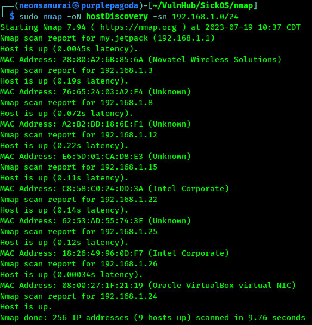

Target IP: 192.168.1.26

### Port Scan

#Nmap

```bash
sudo nmap -T4 -O -sV -sC --reason -p- -oA targetScan 192.168.1.26
```

#### Findings

| Port | Service | Version |
|---|---|---|
| 22 | SSH | OpenSSH 5.9p1 |
| 3128 | HTTP-Proxy | Squid HTTP Proxy 3.1.19 |
| 8080 | HTTP-Proxy | showing closed |

Port 8080 showing but closed - possibly related to the proxy setup.

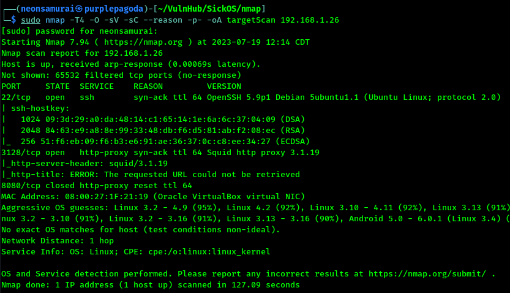

#SearchSploit

```bash
searchsploit --nmap targetscan.xml
```

User enumeration should be possible through SSH. Squid has some associated exploits - needs more digging, plus a HackTricks page on Squid confirms it's a web proxy, so curl needs `--proxy`.

#Browser

Browsed to the IP/proxy port in Firefox - error page. Cache administrator is listed as "webmaster" - a possible username, though it turned out not valid over SSH.

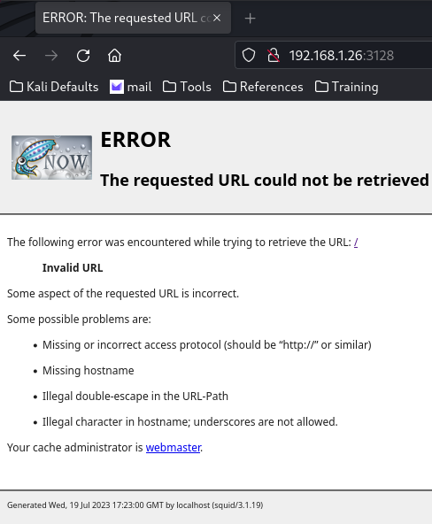

#Curl

```bash
curl --proxy http://192.168.1.26:3128 http://192.168.1.26
```

Got real output - a single H1 header saying "BLEH!!!"

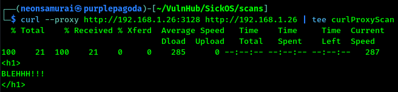

#ProxyChains

```bash
sudo vim /etc/proxychains4.conf
```
*Add: `http 192.168.1.26 3128`*
```bash
sudo proxychains nmap -T4 -O -sV -sC -p- -oA proxiedTargetScan 192.168.1.26
```

Didn't work for this scenario - got stuck in a loop regardless of settings tried.

#Spose

```bash
git clone https://github.com/aancw/spose
cd spose
sudo python spose.py --proxy http://192.168.1.26:3128 --target 192.168.1.26
```

Found two ports open through the proxy: 22 and 80.

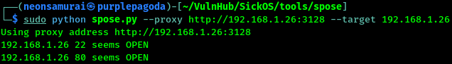

## Enumeration

Reference used for proxied enumeration: https://infosecwriteups.com/proving-grounds-practice-squid-walkthrough-f761d2da973f

#FoxyProxy

Set up a browser proxy and reached the "BLEHHH!!!" page again - nothing in comments/source, no other network resources.

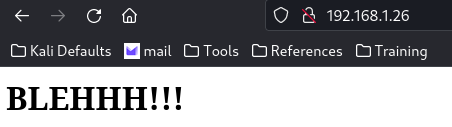

Robots.txt (through the proxy) disallows `/wolfcms`.

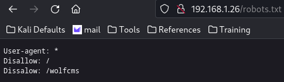

`/wolfcms` returns a small, not-fully-set-up blog. WolfCMS = "Wolf Content Management Simplified" - a real piece of software, worth checking for vulnerabilities once the version is known.

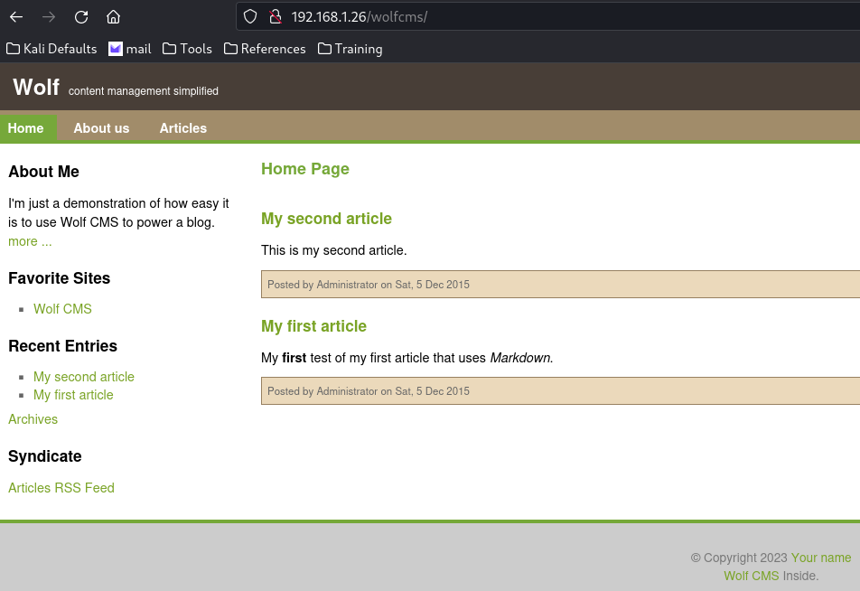

#Dirb

```bash
dirb http://192.168.1.26:80/wolfcms/ -p 192.168.1.26:3128
```

Found a `docs` folder with install instructions referencing a `?` in the URL.

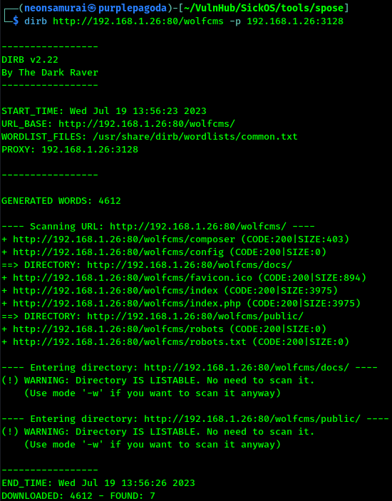

```bash
dirb http://192.168.1.26:80/wolfcms/?/ -p 192.168.1.26:3128
```

With the `?` included, dirb (proxied) revealed a hidden admin login screen.

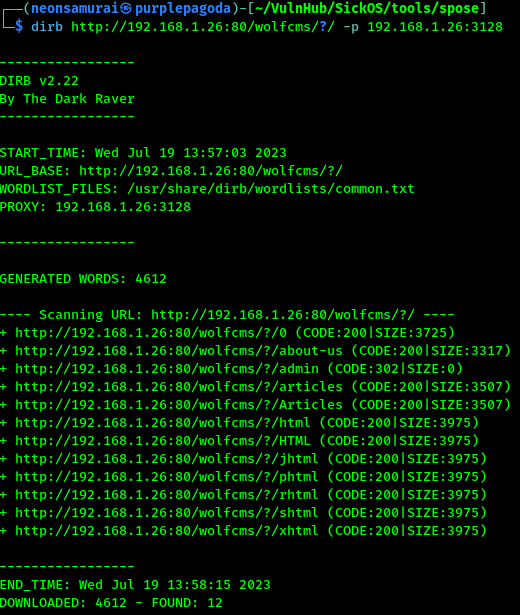

#Browser

`192.168.1.26/wolfcms/?/admin` gives an admin login. Default creds `admin:admin` worked.

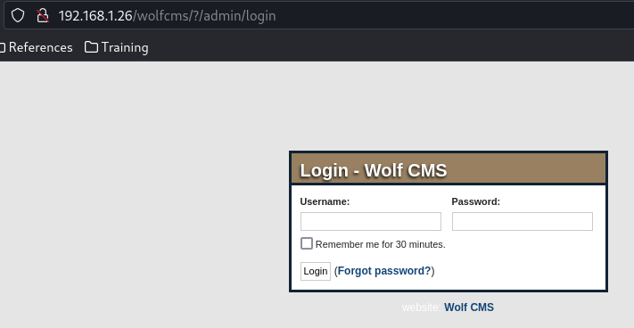

Admin home screen confirms Wolf CMS version 0.8.2.

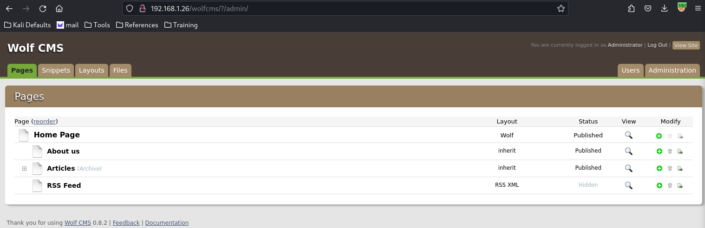

## Exploitation

Wolf CMS 0.8.2 has a known file upload + PHP RCE vulnerability. The Files tab on the admin page allows uploads with no restrictions, landing in `/wolfcms/public` - publicly accessible.

#Reverse_Shell #PHP

![[phpReverseShell.php]]

*(Note: this reference doesn't resolve to a file actually present in this repo - the PHP reverse shell used was very likely the standard pentestmonkey php-reverse-shell.php, edited with the attack box IP/port, but the file itself was never committed here. Worth re-adding it under Tool Box or a shells/ folder if you want this write-up to be reproducible.)*

Uploaded the reverse shell, set up a listener:

```bash
nc -lvnp 4444
```

Browsed to `http://192.168.1.26/wolfcms/public` and clicked the uploaded file - got a connection back. No TTY initially:

```python
python -c 'import pty; pty.spawn("/bin/bash")'
```

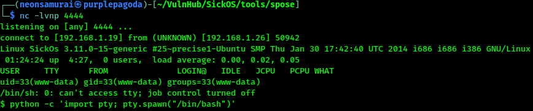

## Privilege Escalation

`sudo -l` needs a password not currently available.

#Linpeas

Kernel version is very low/vulnerable - several exploits listed, kept as a fallback option.

#Sticky_Bit

```bash
find / -perm -4000 -type f -exec ls -al {} \; 2>/dev/null
```

Found `/usr/bin/at` with the sticky bit set - unusual, and there's a known ExploitDB entry for the `at` command (https://www.exploit-db.com/exploits/281).

#www-data

Found `/var/www/wolfcms/config.php` with MySQL credentials: `root:john@123`.

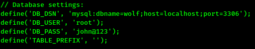

Nothing new in the databases themselves (just hashed passwords already known).

## Flags

Tried switching to the `sickos` user with every password gathered so far (admin, blank, sickos, BLEHHH!!!, john@123) - `john@123` worked (password reuse from the MySQL config).

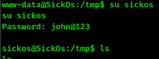

`sudo -l` as sickos showed full sudo rights - `sudo su` to root.

**Root/System:** captured.

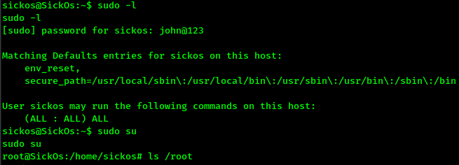
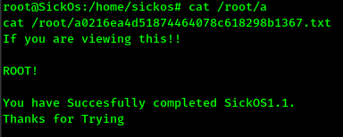

## Lessons Learned

Squid proxy in front of a target is just an extra hop to route through (`--proxy` with curl, FoxyProxy in-browser, or tools like `spose` built specifically for scanning through a proxy) - it doesn't change the underlying enumeration approach much. Password reuse (the CMS's MySQL config password also being the OS user's password) is what actually closed this one out - always try every credential found anywhere on the box against every other login prompt.
