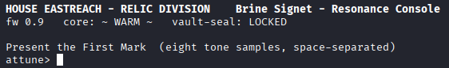
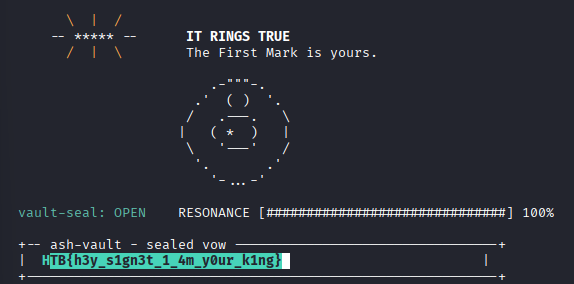

---
tags:
  - ctf
  - ghidra
  - objdump
  - nm
  - readelf
  - elf
difficulty: very easy
category: reverse engineering
---
# Challenge

House Eastreach found one of the broken Signet's shards. Instead of melting it down, they put it to work. The shard still holds a bit of the dragon Astrael's power, so Eastreach built a small device around it and taught it to listen for one voice. Play the right eight tones and the shard rings true, the vow sealed inside opens, and it can carry a king's command again. Play anything else and nothing happens. Sera can't guess the tones. There are eight of them, each can be any value, and far too many to try one by one. But Eastreach was careless and left the device open to read, with everything it was taught still written plainly inside. That carelessness is the whole opening she needs. Find the one voice it was built to obey, and the shard answers to her instead of Eastreach.

## Solution

<!-- What did you do and how did you solve it -->

### Files

A zip file with a file called ringtrue is provided. It seems to be an ELF

```bash
file ringtrue
	ringtrue: ELF 64-bit LSB pie executable, x86-64, version 1 (SYSV), dynamically linked, interpreter /lib64/ld-linux-x86-64.so.2, BuildID[sha1]=b54076cf91aa9905629c6fc738f18066189ce47b, for GNU/Linux 3.2.0, not stripped
```

### Research

I ran the binary to see what it is wanting/doing.

```bash
./ringtrue
```



It is wanting 8 space separated 'tones' that when given either tells you locked or unlocked.

I have put the ELF through Ghidra to decompile/disassemble the binary. I believe that I have found the function that does the tone check.

```C
    iVar17 = __isoc99_sscanf(local_148,"%d %d %d %d %d %d %d %d",&local_2b8,&local_2b4,local_2b0,
                             auStack_2ac,local_2a8,local_2a4,local_2a0,local_29c);
    
    if (iVar17 == 8) {
      lVar5 = 0;
      do {
        *(undefined4 *)(local_398 + lVar5) = *(undefined4 *)(local_2b0 + lVar5 + -8);
        lVar5 = lVar5 + 4;
      } while (lVar5 != 0x20);
      lVar5 = 0;
      do {
        *(long *)(local_2b0 + lVar5 * 8 + -8) = (long)*(int *)(local_398 + lVar5 * 4);
        lVar5 = lVar5 + 1;
      } while (lVar5 != 8);
      dense(L0_W,L0_B,&local_2b8,local_338);
      lVar5 = 0;
      do {
        lVar6 = *(long *)((long)local_338 + lVar5);
        if (lVar6 < 0) {
          lVar6 = lVar6 * 2;
        }
        *(long *)((long)&local_2f8 + lVar5) = lVar6;
        lVar5 = lVar5 + 8;
      } while (lVar5 != 0x40);
      dense(L1_W,L1_B,&local_2f8,local_338);
      lVar5 = 0;
      do {
        lVar6 = *(long *)((long)local_338 + lVar5);
        if (lVar6 < 0) {
          lVar6 = lVar6 * 2;
        }
        *(long *)((long)&local_2f8 + lVar5) = lVar6;
        lVar5 = lVar5 + 8;
      } while (lVar5 != 0x40);
      dense(L2_W,L2_B,&local_2f8,local_378);
      lVar5 = 0;
      bVar16 = true;
      do {
        if (*(long *)(local_378 + lVar5) != *(long *)((long)&ECHO_S + lVar5)) {
          bVar16 = false;
        }
        lVar5 = lVar5 + 8;
      } while (lVar5 != 0x40);
      iVar17 = 100;
      if (!bVar16) {
        lVar5 = 0;
        lVar30 = (longdouble)0;
        do {
          lVar29 = (longdouble)*(long *)(local_378 + lVar5) -
                   (longdouble)*(long *)((long)&ECHO_S + lVar5);
          if (lVar29 < (longdouble)0) {
            lVar29 = -lVar29;
          }
          lVar30 = lVar29 + lVar30;
          lVar5 = lVar5 + 8;
        } while (lVar5 != 0x40);
        lVar30 = (longdouble)100.0 - lVar30 / (longdouble)80000.0;
        if (lVar30 < (longdouble)0) {
          lVar30 = (longdouble)0;
        }
        else if ((longdouble)100.0 < lVar30) {
          lVar30 = (longdouble)100.0;
        }
        iVar17 = ((int)ROUND(lVar30) / 5) * 5;
      }
      clear_screen();
      banner();
      draw_ring(iVar17);
      putchar(10);
      puts("  \x1b[2mECHO OF ASTRAEL   your tone (#)   vs   the echo (.)\x1b[0m");
      puts("  +------------------------------------------------------+");
      iVar20 = 2;
      do {
        __printf_chk(2,&DAT_001030ba);
        pbVar18 = local_398;
        do {
          iVar2 = (int)((uint)*pbVar18 + (uint)*pbVar18 * 2) >> 8;
          puVar14 = &DAT_0010304c;
          if ((iVar2 != iVar20) && (puVar14 = &DAT_001030ec, iVar20 < iVar2)) {
            puVar14 = &DAT_00103059;
          }
          if (pbVar18 == local_398 + 0x1c) {
            __printf_chk(2,&DAT_001030be,puVar14,&DAT_0010310e);
            break;
          }
          __printf_chk(2,&DAT_001030be,puVar14,&DAT_001030ee);
          pbVar18 = pbVar18 + 4;
        } while (pbVar18 != local_378);
        puts(" |");
        iVar20 = iVar20 + -1;
      } while (iVar20 != -1);
      puts("  +------------------------------------------------------+");
      putchar(10);
      __printf_chk(2,&DAT_001030c3);
      uVar21 = 0;
LAB_001018b1:
      do {
        lVar30 = (longdouble)*(long *)(local_378 + uVar21 * 8) - (longdouble)(long)(&ECHO_S)[uVar21]
        ;
        if (lVar30 < (longdouble)0) {
          lVar30 = -lVar30;
LAB_0010181c:
          uVar10 = 3;
          if (((longdouble)20000.0 <= lVar30) && (uVar10 = 2, (longdouble)100000.0 <= lVar30)) {
            uVar10 = (uint)(lVar30 < (longdouble)600000.0);
          }
        }
        else {
          uVar10 = 4;
          if (lVar30 != (longdouble)0) goto LAB_0010181c;
        }
        lVar5 = 0;
        do {
          bVar12 = 0x23;
          if ((int)uVar10 <= (int)lVar5) {
            bVar12 = 0x2e;
          }
          local_148[lVar5] = bVar12;
          lVar5 = lVar5 + 1;
        } while (lVar5 != 4);
        local_148[4] = 0;
        __printf_chk(2,"h%d %s ",uVar21 & 0xffffffff,local_148);
        if ((int)uVar21 == 3) {
          __printf_chk(2,&DAT_001030e1);
          uVar21 = uVar21 + 1;
          goto LAB_001018b1;
        }
        uVar21 = uVar21 + 1;
      } while (uVar21 != 8);
      putchar(10);
      putchar(10);
      __printf_chk(2,&DAT_001030f0);
      iVar20 = 0;
      do {
        iVar2 = 0x23;
        if ((iVar17 * 0x1e) / 100 <= iVar20) {
          iVar2 = 0x2e;
        }
        putc(iVar2,stdout);
        iVar20 = iVar20 + 1;
      } while (iVar20 != 0x1e);
      __printf_chk(2,&DAT_00103106,iVar17);
      if (bVar16) {
        nap(600);
        lVar5 = 0;
        do {
          abStack_1b4[lVar5] = (byte)*(undefined4 *)(local_398 + lVar5 * 4);
          lVar5 = lVar5 + 1;
        } while (lVar5 != 8);
        if (0 < VOW_LEN) {
          uVar21 = 0;
          do {
            iVar17 = (int)uVar21;
            uVar8 = (long)((ulong)(uint)(iVar17 >> 0x1f) << 0x20 | uVar21 & 0xffffffff) / 0x20;
            abStack_1b4[8] = (char)(uVar8 & 0xffffffff);
            abStack_1b4[9] = (char)((uVar8 & 0xffffffff) >> 8);
            abStack_1b4[10] = (char)(uVar8 >> 0x10);
            abStack_1b4[0xb] = (char)(uVar8 >> 0x18);
            pbVar18 = local_148;
            pbVar7 = pbVar18;
            do {
              *pbVar7 = 0;
              pbVar7 = pbVar7 + 1;
            } while (pbVar7 != local_148 + 0x40);
            lVar5 = 0;
            do {
              local_148[lVar5] = abStack_1b4[lVar5];
              lVar5 = lVar5 + 1;
            } while (lVar5 != 0xc);
            local_148[0xc] = 0x80;
            local_148[0x3f] = 0x60;
            local_148[0x3e] = 0;
            local_148[0x3d] = 0;
            local_148[0x3c] = 0;
            local_148[0x3b] = 0;
            local_148[0x3a] = 0;
            local_148[0x39] = 0;
            local_148[0x38] = 0;
            puVar15 = &local_2b8;
            puVar23 = puVar15;
            do {
              *puVar23 = (uint)*pbVar18 << 0x18 | (uint)pbVar18[1] << 0x10 | (uint)pbVar18[3] |
                         (uint)pbVar18[2] << 8;
              pbVar18 = pbVar18 + 4;
              puVar23 = puVar23 + 1;
            } while (local_148 + 0x40 != pbVar18);
            do {
              uVar10 = puVar15[1];
              uVar11 = puVar15[0xe];
              puVar15[0x10] =
                   ((uVar10 << 0xe | uVar10 >> 0x12) ^ (uVar10 >> 7 | uVar10 << 0x19) ^ uVar10 >> 3)
                   + puVar15[9] + *puVar15 +
                   ((uVar11 << 0xd | uVar11 >> 0x13) ^ (uVar11 << 0xf | uVar11 >> 0x11) ^
                   uVar11 >> 10);
              puVar15 = puVar15 + 1;
            } while (puVar15 != local_294 + 0x27);
            lVar5 = 0;
            uVar10 = 0x510e527f;
            uVar11 = 0x9b05688c;
            uVar19 = 0x1f83d9ab;
            uVar28 = 0xa54ff53a;
            uVar13 = 0x5be0cd19;
            uVar3 = 0x6a09e667;
            uVar22 = 0xbb67ae85;
            uVar25 = 0x3c6ef372;
            do {
              uVar24 = uVar25;
              uVar25 = uVar22;
              uVar22 = uVar3;
              uVar26 = uVar19;
              uVar19 = uVar11;
              uVar11 = uVar10;
              iVar20 = ((uVar11 >> 0xb | uVar11 << 0x15) ^ (uVar11 >> 6 | uVar11 << 0x1a) ^
                       (uVar11 << 7 | uVar11 >> 0x19)) +
                       *(int *)(local_2b0 + lVar5 + -8) + *(int *)((long)&K.0 + lVar5) +
                       (~uVar11 & uVar26 ^ uVar11 & uVar19) + uVar13;
              uVar10 = iVar20 + uVar28;
              uVar3 = iVar20 + ((uVar22 >> 0xd | uVar22 << 0x13) ^ (uVar22 >> 2 | uVar22 << 0x1e) ^
                               (uVar22 << 10 | uVar22 >> 0x16)) +
                               ((uVar25 ^ uVar24) & uVar22 ^ uVar25 & uVar24);
              lVar5 = lVar5 + 4;
              uVar28 = uVar24;
              uVar13 = uVar26;
            } while (lVar5 != 0x100);
            local_2f8._0_4_ = uVar3 + 0x6a09e667;
            local_2f8._4_4_ = uVar22 + 0xbb67ae85;
            local_2f0 = uVar25 + 0x3c6ef372;
            local_2ec = uVar24 + 0xa54ff53a;
            local_2e8 = uVar10 + 0x510e527f;
            local_2e4 = uVar11 + 0x9b05688c;
            local_2e0 = uVar19 + 0x1f83d9ab;
            local_2dc = uVar26 + 0x5be0cd19;
            puVar27 = &local_2f8;
            pbVar18 = local_1a8;
            do {
              uVar1 = *(undefined4 *)puVar27;
              *pbVar18 = (byte)((uint)uVar1 >> 0x18);
              pbVar18[1] = (byte)((uint)uVar1 >> 0x10);
              pbVar18[2] = (byte)((uint)uVar1 >> 8);
              pbVar18[3] = (byte)uVar1;
              puVar27 = (undefined8 *)((long)puVar27 + 4);
              pbVar18 = pbVar18 + 4;
            } while (local_1a8 + 0x20 != pbVar18);
            if (iVar17 < VOW_LEN) {
              uVar8 = 0;
              do {
                local_1a8[uVar8 + uVar21 + 0x20] = VOW_CIPHER[uVar8 + uVar21] ^ local_1a8[uVar8];
                uVar8 = uVar8 + 1;
              } while (uVar8 != (uint)(VOW_LEN - iVar17));
            }
            uVar21 = uVar21 + 0x20;
          } while ((int)uVar21 < VOW_LEN);
        }
        local_1a8[(long)VOW_LEN + 0x20] = 0;
        clear_screen();
        putchar(10);
        __printf_chk(2,&DAT_0010310f);
        puts("\x1b[97m      -- ***** --      \x1b[0m\x1b[1mIT RINGS TRUE\x1b[0m");
        puts("\x1b[33m        /  |  \\        \x1b[0mThe First Mark is yours.\n");
        fflush(stdout);
        nap(400);
        draw_ring(100);
        __printf_chk(2,&DAT_001038d8);
        puts("  +-- ash-vault - sealed vow ---------------------------------+");
        __printf_chk(2,&DAT_00103129,local_1a8 + 0x20);
        sVar9 = strlen((char *)(local_1a8 + 0x20));
        iVar17 = 0x37 - (int)sVar9;
        if (0 < iVar17) {
          iVar20 = 0;
          do {
            putc(0x20,stdout);
            iVar20 = iVar20 + 1;
          } while (iVar17 != iVar20);
        }
        puts("|");
        puts("  +-----------------------------------------------------------+\n");
        goto LAB_0010208f;
      }
      puts("  \x1b[2mThe relic hums, but the realm does not yet answer to you.\x1b[0m");
      nap(0x44c);
      goto LAB_001019ac;
    }
```

Working with Claude it seems that this is where it is doing the checks and that it is passing it to a function called 'dense' to do the checking. It is a small 'neural net' that is doing a matrix based lookup and calculation against a constant value in the code.

```C
void dense(long param_1,long param_2,long param_3,long param_4)

{
  long lVar1;
  long lVar2;
  long lVar3;
  
  lVar3 = 0;
  do {
    lVar2 = (long)*(int *)(param_2 + lVar3 * 4);
    lVar1 = 0;
    do {
      lVar2 = lVar2 + (long)*(char *)(param_1 + lVar1) * *(long *)(param_3 + lVar1 * 8);
      lVar1 = lVar1 + 1;
    } while (lVar1 != 8);
    *(long *)(param_4 + lVar3 * 8) = lVar2;
    lVar3 = lVar3 + 1;
    param_1 = param_1 + 8;
  } while (lVar3 != 8);
  return;
}
```

So each layer is a standard affine transform:

```
out[i] = bias[i] + Σⱼ W[i][j] * in[j]      for i, j in 0..7
```

with these concrete types:

- **W** — 8×8 matrix of **`int8`**, row-major, 8 bytes per row, 64 bytes total per layer
- **bias** — 8 × `int32`, 32 bytes total per layer
- **in / out** — 8 × `int64`

This matches the flavor text in `.rodata`: `"npu: resonance_core.tflm - MLP 8-8-8-8, int8, leaky ... ok"` and `"npu: weights symmetric int8 (zp=0), per-tensor scale"` — that's literally describing this network: 8-8-8-8 MLP, symmetric int8 quantized weights, leaky activation (the `x : 2x` piecewise function you found in the previous snippet). So the architecture is now fully confirmed, not just inferred.

The constant data should be stored in the .rodata section which can be extracted with `objdump`

```bash
objdump -s -j .rodata ringtrue
```

```output
Contents of section .rodata:
 3000 01000200 0000c842 00409c47 00409c46  .......B.@.G.@.F
 3010 0050c347 007c1249 1b5b324a 1b5b4800  .P.G.|.I.[2J.[H.
 3020 1b5b3333 6d6f1b5b 306d001b 5b39376d  .[33mo.[0m..[97m
 3030 2a1b5b30 6d001b5b 33346d2e 1b5b306d  *.[0m..[34m..[0m
 3040 001b5b33 356d6f1b 5b306d00 1b5b3336  ..[35mo.[0m..[36
 3050 6d232323 1b5b306d 001b5b32 6d232323  m###.[0m..[2m###
 3060 1b5b306d 00737261 6d3a2036 34204b69  .[0m.sram: 64 Ki
 3070 42202020 70617269 7479206f 6b006472  B   parity ok.dr
 3080 616d3a20 38204d69 42202020 20747261  am: 8 MiB    tra
 3090 696e696e 67200020 20617474 756e653e  ining .  attune>
 30a0 20002564 20256420 25642025 64202564   .%d %d %d %d %d
 30b0 20256420 25642025 64002020 7c002573   %d %d %d.  |.%s
 30c0 25730020 201b5b31 6d484152 4d4f4e49  %s.  .[1mHARMONI
 30d0 43531b5b 306d2020 00682564 20257320  CS.[0m  .h%d %s 
 30e0 000a2020 20202020 20202020 20202000  ..             .
 30f0 20201b5b 316d5245 534f4e41 4e43451b    .[1mRESONANCE.
 3100 5b306d20 5b005d20 25336425 250a001b  [0m [.] %3d%%...
 3110 5b33336d 20202020 20202020 5c20207c  [33m        \  |
 3120 20202f0a 1b5b306d 0020207c 20201b5b    /..[0m.  |  .[
 3130 33326d1b 5b316d25 731b5b30 6d000000  32m.[1m%s.[0m...
 3140 20202020 20202020 20202020 20202020                  
 3150 20202020 20202020 20202e2d 2222222d            .-"""-
 3160 2e000000 00000000 20202020 20202020  ........        
 3170 20202020 20202020 20202020 20202020                  
 3180 2e272020 28202920 20272e00 00000000  .'  ( )  '......
 3190 20202020 20202020 20202020 20202020                  
 31a0 20202020 2020202f 2020202e 2d2d2d2e         /   .---.
 31b0 2020205c 00000000 20202020 20202020     \....        
 31c0 20202020 20202020 20202020 20207c20                | 
 31d0 20202820 25732020 29202020 7c0a0000    ( %s  )   |...
 31e0 20202020 20202020 20202020 20202020                  
 31f0 20202020 2020205c 20202027 2d2d2d27         \   '---'
 3200 2020202f 00000000 20202020 20202020     /....        
 3210 20202020 20202020 20202020 20202020                  
 3220 272e2020 20202020 202e2700 00000000  '.       .'.....
 3230 20202020 20202020 20202020 20202020                  
 3240 20202020 20202020 2020272d 2e2e2e2d            '-...-
 3250 27000000 00000000 1b5b316d 2020484f  '........[1m  HO
 3260 55534520 45415354 52454143 48202d20  USE EASTREACH - 
 3270 52454c49 43204449 56495349 4f4e2020  RELIC DIVISION  
 3280 20204272 696e6520 5369676e 6574202d    Brine Signet -
 3290 20526573 6f6e616e 63652043 6f6e736f   Resonance Conso
 32a0 6c651b5b 306d0000 1b5b326d 20206677  le.[0m...[2m  fw
 32b0 20302e39 20202063 6f72653a 207e2057   0.9   core: ~ W
 32c0 41524d20 7e202020 7661756c 742d7365  ARM ~   vault-se
 32d0 616c3a20 4c4f434b 45441b5b 306d0a00  al: LOCKED.[0m..
 32e0 1b5b326d 4272696e 65524f4d 20312e34  .[2mBrineROM 1.4
 32f0 20287361 6c742d6d 61736b20 626f6f74   (salt-mask boot
 3300 29202020 28632920 486f7573 65204561  )   (c) House Ea
 3310 73747265 61636820 2d205265 6c696320  streach - Relic 
 3320 44697669 73696f6e 1b5b306d 00000000  Division.[0m....
 3330 72657365 743a2063 61757365 3d307830  reset: cause=0x0
 3340 32202863 6f6c6429 20202073 6f633d53  2 (cold)   soc=S
 3350 49472d38 20202072 65763d42 32000000  IG-8   rev=B2...
 3360 7874616c 3a206272 696e652d 63727973  xtal: brine-crys
 3370 74616c20 31322e32 3838204d 487a202e  tal 12.288 MHz .
 3380 2e2e2e2e 2e2e2e2e 2e2e2e2e 2e2e2e2e  ................
 3390 2e206c6f 636b6564 00000000 00000000  . locked........
 33a0 706c6c3a 2020636f 72652039 36204d48  pll:  core 96 MH
 33b0 7a202f20 64737020 31393220 4d487a20  z / dsp 192 MHz 
 33c0 2e2e2e2e 2e2e2e2e 2e2e2e2e 2e2e2e2e  ................
 33d0 2e206f6b 00000000 6c6f6164 696e6720  . ok....loading 
 33e0 73746167 652d3220 66726f6d 20766175  stage-2 from vau
 33f0 6c742040 30783038 30303430 3030202e  lt @0x08004000 .
 3400 2e2e2063 72633332 206f6b00 00000000  .. crc32 ok.....
 3410 68616e64 696e6720 636f6e74 726f6c20  handing control 
 3420 746f2043 696e6465 724f5320 2e2e2e00  to CinderOS ....
 3430 1b5b3336 6d5b2030 2e303030 3030305d  .[36m[ 0.000000]
 3440 2043696e 6465724f 5320302e 392e332d   CinderOS 0.9.3-
 3450 65617374 72656163 68202863 696e6465  eastreach (cinde
 3460 7240666f 72676529 1b5b306d 00000000  r@forge).[0m....
 3470 5b20302e 30303032 31305d20 4350553a  [ 0.000210] CPU:
 3480 20534947 2d382072 65762042 32204020   SIG-8 rev B2 @ 
 3490 39364d48 7a202020 4650553a 206e6f6e  96MHz   FPU: non
 34a0 65202869 6e746567 65722069 6e666572  e (integer infer
 34b0 656e6365 29000000 5b20302e 30313139  ence)...[ 0.0119
 34c0 30325d20 6d656d3a 20383139 324b2074  02] mem: 8192K t
 34d0 6f74616c 2c203731 30344b20 61766169  otal, 7104K avai
 34e0 6c61626c 65000000 5b20302e 30323035  lable...[ 0.0205
 34f0 35315d20 6770696f 3a207369 676e6574  51] gpio: signet
 3500 2d62657a 656c2064 72697665 72207265  -bezel driver re
 3510 67697374 65726564 00000000 00000000  gistered........
 3520 5b20302e 30333130 30345d20 6164633a  [ 0.031004] adc:
 3530 20746f6e 652d7365 6e736f72 20636830   tone-sensor ch0
 3540 2e2e6368 37206f6e 6c696e65 20283820  ..ch7 online (8 
 3550 73616d70 6c657320 2f206174 74756e65  samples / attune
 3560 29000000 00000000 5b20302e 30343431  ).......[ 0.0441
 3570 32305d20 6e70753a 20726573 6f6e616e  20] npu: resonan
 3580 63652d63 6f726520 696e6974 202e2e2e  ce-core init ...
 3590 00000000 00000000 5b20302e 30363132  ........[ 0.0612
 35a0 30305d20 6e70753a 20726573 6f6e616e  00] npu: resonan
 35b0 63655f63 6f72652e 74666c6d 202d204d  ce_core.tflm - M
 35c0 4c502038 2d382d38 2d382c20 696e7438  LP 8-8-8-8, int8
 35d0 2c206c65 616b7920 2e2e2e20 6f6b0000  , leaky ... ok..
 35e0 5b20302e 30373239 39305d20 6e70753a  [ 0.072990] npu:
 35f0 20776569 67687473 2073796d 6d657472   weights symmetr
 3600 69632069 6e743820 287a703d 30292c20  ic int8 (zp=0), 
 3610 7065722d 74656e73 6f722073 63616c65  per-tensor scale
 3620 00000000 00000000 5b20302e 30373735  ........[ 0.0775
 3630 35335d20 63727970 746f3a20 7661756c  53] crypto: vaul
 3640 742d7365 616c203d 20786f72 2d737472  t-seal = xor-str
 3650 65616d2c 206b6579 203d2061 7474756e  eam, key = attun
 3660 656d656e 742d6465 72697665 64000000  ement-derived...
 3670 5b20302e 30393031 31345d20 63696e64  [ 0.090114] cind
 3680 6572626f 756e643a 206f6174 68206b65  erbound: oath ke
 3690 7972696e 67206d6f 756e7465 64202872  yring mounted (r
 36a0 6f290000 00000000 5b20302e 31303438  o)......[ 0.1048
 36b0 38305d20 7661756c 742d7365 616c3a20  80] vault-seal: 
 36c0 7365616c 65642d76 6f772070 72657365  sealed-vow prese
 36d0 6e742020 20737461 74653d1b 5b33316d  nt   state=.[31m
 36e0 4c4f434b 45441b5b 306d0000 00000000  LOCKED.[0m......
 36f0 5b20302e 31323130 30325d20 61737472  [ 0.121002] astr
 3700 61656c2d 6563686f 3a207265 66657265  ael-echo: refere
 3710 6e636520 7369676e 61747572 65207069  nce signature pi
 3720 6e6e6564 00000000 5b20302e 31343037  nned....[ 0.1407
 3730 37305d20 636f6e73 6f6c653a 20726573  70] console: res
 3740 6f6e616e 63652055 49206f6e 20747479  onance UI on tty
 3750 30000000 00000000 1b5b3332 6d5b2030  0........[32m[ 0
 3760 2e313535 3930305d 2043696e 6465724f  .155900] CinderO
 3770 533a2062 6f6f7420 636f6d70 6c657465  S: boot complete
 3780 202d2072 656c6963 20776172 6d1b5b30   - relic warm.[0
 3790 6d000000 00000000 20205072 6573656e  m.......  Presen
 37a0 74207468 65204669 72737420 4d61726b  t the First Mark
 37b0 20201b5b 326d2865 69676874 20746f6e    .[2m(eight ton
 37c0 65207361 6d706c65 732c2073 70616365  e samples, space
 37d0 2d736570 61726174 6564291b 5b306d00  -separated).[0m.
 37e0 20201b5b 326d4543 484f204f 46204153    .[2mECHO OF AS
 37f0 54524145 4c202020 796f7572 20746f6e  TRAEL   your ton
 3800 65202823 29202020 76732020 20746865  e (#)   vs   the
 3810 20656368 6f20282e 291b5b30 6d000000   echo (.).[0m...
 3820 20202b2d 2d2d2d2d 2d2d2d2d 2d2d2d2d    +-------------
 3830 2d2d2d2d 2d2d2d2d 2d2d2d2d 2d2d2d2d  ----------------
 3840 2d2d2d2d 2d2d2d2d 2d2d2d2d 2d2d2d2d  ----------------
 3850 2d2d2d2d 2d2d2d2d 2d2b0000 00000000  ---------+......
 3860 1b5b3937 6d202020 2020202d 2d202a2a  .[97m      -- **
 3870 2a2a2a20 2d2d2020 20202020 1b5b306d  *** --      .[0m
 3880 1b5b316d 49542052 494e4753 20545255  .[1mIT RINGS TRU
 3890 451b5b30 6d000000 1b5b3333 6d202020  E.[0m....[33m   
 38a0 20202020 202f2020 7c20205c 20202020       /  |  \    
 38b0 20202020 1b5b306d 54686520 46697273      .[0mThe Firs
 38c0 74204d61 726b2069 7320796f 7572732e  t Mark is yours.
 38d0 0a000000 00000000 0a20201b 5b33326d  .........  .[32m
 38e0 7661756c 742d7365 616c3a20 4f50454e  vault-seal: OPEN
 38f0 1b5b306d 20202020 5245534f 4e414e43  .[0m    RESONANC
 3900 45205b23 23232323 23232323 23232323  E [#############
 3910 23232323 23232323 23232323 23232323  ################
 3920 235d2031 30302525 0a0a0000 00000000  #] 100%%........
 3930 20202b2d 2d206173 682d7661 756c7420    +-- ash-vault 
 3940 2d207365 616c6564 20766f77 202d2d2d  - sealed vow ---
 3950 2d2d2d2d 2d2d2d2d 2d2d2d2d 2d2d2d2d  ----------------
 3960 2d2d2d2d 2d2d2d2d 2d2d2d2d 2d2d2b00  --------------+.
 3970 20202b2d 2d2d2d2d 2d2d2d2d 2d2d2d2d    +-------------
 3980 2d2d2d2d 2d2d2d2d 2d2d2d2d 2d2d2d2d  ----------------
 3990 2d2d2d2d 2d2d2d2d 2d2d2d2d 2d2d2d2d  ----------------
 39a0 2d2d2d2d 2d2d2d2d 2d2d2d2d 2d2d2b0a  --------------+.
 39b0 00000000 00000000 20201b5b 326d5468  ........  .[2mTh
 39c0 65207265 6c696320 68756d73 2c206275  e relic hums, bu
 39d0 74207468 65207265 616c6d20 646f6573  t the realm does
 39e0 206e6f74 20796574 20616e73 77657220   not yet answer 
 39f0 746f2079 6f752e1b 5b306d00 00000000  to you..[0m.....
 3a00 0a20201b 5b33316d 54686520 72656c69  .  .[31mThe reli
 3a10 63206e65 65647320 65786163 746c7920  c needs exactly 
 3a20 65696768 74207361 6d706c65 732e1b5b  eight samples..[
 3a30 306d0000 00000000 0a20201b 5b326d54  0m.......  .[2mT
 3a40 68652072 656c6963 20636f6f 6c732e20  he relic cools. 
 3a50 436f6e6e 65637469 6f6e2063 6c6f7365  Connection close
 3a60 642e1b5b 306d0000 00000000 00000000  d..[0m..........
 3a70 00000000 00000000 00000000 00000000  ................
 3a80 982f8a42 91443771 cffbc0b5 a5dbb5e9  ./.B.D7q........
 3a90 5bc25639 f111f159 a4823f92 d55e1cab  [.V9...Y..?..^..
 3aa0 98aa07d8 015b8312 be853124 c37d0c55  .....[....1$.}.U
 3ab0 745dbe72 feb1de80 a706dc9b 74f19bc1  t].r........t...
 3ac0 c1699be4 8647beef c69dc10f cca10c24  .i...G.........$
 3ad0 6f2ce92d aa84744a dca9b05c da88f976  o,.-..tJ...\...v
 3ae0 52513e98 6dc631a8 c82703b0 c77f59bf  RQ>.m.1..'....Y.
 3af0 f30be0c6 4791a7d5 5163ca06 67292914  ....G...Qc..g)).
 3b00 850ab727 38211b2e fc6d2c4d 130d3853  ...'8!...m,M..8S
 3b10 54730a65 bb0a6a76 2ec9c281 852c7292  Ts.e..jv.....,r.
 3b20 a1e8bfa2 4b661aa8 708b4bc2 a3516cc7  ....Kf..p.K..Ql.
 3b30 19e892d1 240699d6 85350ef4 70a06a10  ....$....5..p.j.
 3b40 16c1a419 086c371e 4c774827 b5bcb034  .....l7.LwH'...4
 3b50 b30c1c39 4aaad84e 4fca9c5b f36f2e68  ...9J..NO..[.o.h
 3b60 ee828f74 6f63a578 1478c884 0802c78c  ...toc.x.x......
 3b70 faffbe90 eb6c50a4 f7a3f9be f27871c6  .....lP......xq.
```

Not all of the data seemed to be stored in .rodata so I will use `nm` to find the exact values that Ghidra flagged.

```bash
nm ringtrue | grep -E "L0_W|L0_B|L1_W|L1_B|L2_W|L2_B|ECHO_S|VOW_CIPHER|VOW_LEN"
```

```output
0000000000005060 D ECHO_S
00000000000050e0 D L0_B
0000000000005180 D L0_W
00000000000050c0 D L1_B
0000000000005140 D L1_W
00000000000050a0 D L2_B
0000000000005100 D L2_W
0000000000005030 D VOW_CIPHER
0000000000005020 D VOW_LEN
```

|Symbol|Addr|Size|Interpretation|
|---|---|---|---|
|`VOW_LEN`|0x5020|(gap to next, see below)|plaintext length, used as plain `int` in the code (`iVar17 < VOW_LEN`, `(int)uVar21`) → almost certainly 4 bytes, `int32`|
|`VOW_CIPHER`|0x5030|0x30 = **48 bytes**|ciphertext blob — matches a modest flag-length string|
|`ECHO_S`|0x5060|0x40 = **64 bytes**|8 × `int64` target vector — matches the `local_378`/8×8-byte compare loop exactly|
|`L2_B`|0x50a0|0x20 = **32 bytes**|8 × `int32` bias|
|`L1_B`|0x50c0|0x20 = **32 bytes**|8 × `int32` bias|
|`L0_B`|0x50e0|0x20 = **32 bytes**|8 × `int32` bias|
|`L2_W`|0x5100|0x40 = **64 bytes**|8×8 `int8` matrix, matches `dense()`'s row stride of 8 bytes|
|`L1_W`|0x5140|0x40 = **64 bytes**|8×8 `int8` matrix|
|`L0_W`|0x5180|0x40 = **64 bytes**|8×8 `int8` matrix|

Still not everything seemed to be here because there is too big of a gap in the data. I am going to pull the whole .data section to see if it matches up.

```bash
readelf -S ringtrue
```

```output
There are 31 section headers, starting at offset 0x5cf8:

Section Headers:
  [Nr] Name              Type             Address           Offset
       Size              EntSize          Flags  Link  Info  Align
  [ 0]                   NULL             0000000000000000  00000000
       0000000000000000  0000000000000000           0     0     0
  [ 1] .interp           PROGBITS         0000000000000318  00000318
       000000000000001c  0000000000000000   A       0     0     1
  [ 2] .note.gnu.pr[...] NOTE             0000000000000338  00000338
       0000000000000030  0000000000000000   A       0     0     8
  [ 3] .note.gnu.bu[...] NOTE             0000000000000368  00000368
       0000000000000024  0000000000000000   A       0     0     4
  [ 4] .note.ABI-tag     NOTE             000000000000038c  0000038c
       0000000000000020  0000000000000000   A       0     0     4
  [ 5] .gnu.hash         GNU_HASH         00000000000003b0  000003b0
       0000000000000030  0000000000000000   A       6     0     8
  [ 6] .dynsym           DYNSYM           00000000000003e0  000003e0
       0000000000000228  0000000000000018   A       7     1     8
  [ 7] .dynstr           STRTAB           0000000000000608  00000608
       0000000000000128  0000000000000000   A       0     0     1
  [ 8] .gnu.version      VERSYM           0000000000000730  00000730
       000000000000002e  0000000000000002   A       6     0     2
  [ 9] .gnu.version_r    VERNEED          0000000000000760  00000760
       0000000000000060  0000000000000000   A       7     1     8
  [10] .rela.dyn         RELA             00000000000007c0  000007c0
       00000000000000f0  0000000000000018   A       6     0     8
  [11] .rela.plt         RELA             00000000000008b0  000008b0
       0000000000000168  0000000000000018  AI       6    24     8
  [12] .init             PROGBITS         0000000000001000  00001000
       000000000000001b  0000000000000000  AX       0     0     4
  [13] .plt              PROGBITS         0000000000001020  00001020
       0000000000000100  0000000000000010  AX       0     0     16
  [14] .plt.got          PROGBITS         0000000000001120  00001120
       0000000000000010  0000000000000010  AX       0     0     16
  [15] .plt.sec          PROGBITS         0000000000001130  00001130
       00000000000000f0  0000000000000010  AX       0     0     16
  [16] .text             PROGBITS         0000000000001220  00001220
       0000000000000e9e  0000000000000000  AX       0     0     16
  [17] .fini             PROGBITS         00000000000020c0  000020c0
       000000000000000d  0000000000000000  AX       0     0     4
  [18] .rodata           PROGBITS         0000000000003000  00003000
       0000000000000b80  0000000000000000   A       0     0     32
  [19] .eh_frame_hdr     PROGBITS         0000000000003b80  00003b80
       0000000000000064  0000000000000000   A       0     0     4
  [20] .eh_frame         PROGBITS         0000000000003be8  00003be8
       000000000000018c  0000000000000000   A       0     0     8
  [21] .init_array       INIT_ARRAY       0000000000004d48  00004d48
       0000000000000008  0000000000000008  WA       0     0     8
  [22] .fini_array       FINI_ARRAY       0000000000004d50  00004d50
       0000000000000008  0000000000000008  WA       0     0     8
  [23] .dynamic          DYNAMIC          0000000000004d58  00004d58
       00000000000001f0  0000000000000010  WA       7     0     8
  [24] .got              PROGBITS         0000000000004f48  00004f48
       00000000000000b8  0000000000000008  WA       0     0     8
  [25] .data             PROGBITS         0000000000005000  00005000
       00000000000001c0  0000000000000000  WA       0     0     32
  [26] .bss              NOBITS           00000000000051c0  000051c0
       0000000000000020  0000000000000000  WA       0     0     16
  [27] .comment          PROGBITS         0000000000000000  000051c0
       000000000000002d  0000000000000001  MS       0     0     1
  [28] .symtab           SYMTAB           0000000000000000  000051f0
       0000000000000678  0000000000000018          29    25     8
  [29] .strtab           STRTAB           0000000000000000  00005868
       0000000000000373  0000000000000000           0     0     1
  [30] .shstrtab         STRTAB           0000000000000000  00005bdb
       000000000000011a  0000000000000000           0     0     1
Key to Flags:
  W (write), A (alloc), X (execute), M (merge), S (strings), I (info),
  L (link order), O (extra OS processing required), G (group), T (TLS),
  C (compressed), x (unknown), o (OS specific), E (exclude),
  D (mbind), l (large), p (processor specific)
```

```bash
readelf -x .data ringtrue
```

```output
Hex dump of section '.data':
  0x00005000 00000000 00000000 08500000 00000000 .........P......
  0x00005010 00000000 00000000 00000000 00000000 ................
  0x00005020 1e000000 00000000 00000000 00000000 ................
  0x00005030 1c9d5931 3d0da8fb ca056a2a c0b6a511 ..Y1=.....j*....
  0x00005040 72dfd75c 2b216c9d c67296b4 8d6f0000 r..\+!l..r...o..
  0x00005050 0000803c cefbff3b 0c01403c 00000000 ...<...;..@<....
  0x00005060 4f881700 00000000 ebc20800 00000000 O...............
  0x00005070 5de2d6ff ffffffff a150caff ffffffff ]........P......
  0x00005080 20db0500 00000000 6dcd0800 00000000  .......m.......
  0x00005090 2f402800 00000000 da90d9ff ffffffff /@(.............
  0x000050a0 fa010000 16ffffff 0f060000 c7050000 ................
  0x000050b0 22040000 6a040000 28050000 4a010000 "...j...(...J...
  0x000050c0 53f9ffff c0020000 1d060000 30010000 S...........0...
  0x000050d0 2fffffff 9a060000 81fbffff f5000000 /...............
  0x000050e0 1d020000 dcfdffff b0070000 4a060000 ............J...
  0x000050f0 44000000 cafbffff d6ffffff 1cf8ffff D...............
  0x00005100 09f100f0 02f106fa 0800fbfc ff0af903 ................
  0x00005110 f7f1f2f9 fbfcf509 09f70f0d 01f801fd ................
  0x00005120 f309f804 f00b0b0c f6f4fff6 ff0b06fc ................
  0x00005130 06fcfbf3 fd0806fc fef4f104 10f70df3 ................
  0x00005140 0eff0dfd f10a01f2 10100cf9 0e05f8f9 ................
  0x00005150 fe03070f f40b010c f7f8f2fe fd03ff00 ................
  0x00005160 f5f30607 fdfc0010 fc02fc0b 10f605fb ................
  0x00005170 f8fc0108 03f2f406 f3f4050d 0ef10f05 ................
  0x00005180 050d0a0e 0100f10c 04040301 0bfdf6ff ................
  0x00005190 0a0301f5 f4050c0e 0a020307 07fafffc ................
  0x000051a0 100af60c 050602fb 0ffff9fd 090701fb ................
  0x000051b0 06f4f8f6 0007f10f 04f7fc0c fc100f05 ................
```

Working with Claude I was able to create a `Z3` script to test the values found and get the correct tone values of: `83 97 108 116 67 114 119 110` which is ascii text that goes back to SaltCrwn. When I input that into the binary it returns with the flag of `HTB{h3y_s1gn3t_1_4m_y0ur_k1ng}`



```python
#!/usr/bin/env python3
"""
ringtrue solver

Reconstructs an 8-8-8-8 int8 MLP (leaky x/2x activation, int64 accumulation)
from a raw .data section hex dump, uses Z3 to find the 8 int32 "tone" inputs
that make the network's output equal a target vector (ECHO_S), then uses
those tones to derive a SHA-256-based XOR keystream and decrypt the sealed
vow ciphertext.

Requires: pip install z3-solver
"""

import re
import json
import struct
import hashlib
from z3 import Int, If, Solver, sat

# ---------------------------------------------------------------------------
# 1. Paste the `readelf -x .data <binary>` / `objdump -s -j .data` output here
# ---------------------------------------------------------------------------
RAW_DATA_DUMP = """
0x00005000 00000000 00000000 08500000 00000000
0x00005010 00000000 00000000 00000000 00000000
0x00005020 1e000000 00000000 00000000 00000000
0x00005030 1c9d5931 3d0da8fb ca056a2a c0b6a511
0x00005040 72dfd75c 2b216c9d c67296b4 8d6f0000
0x00005050 0000803c cefbff3b 0c01403c 00000000
0x00005060 4f881700 00000000 ebc20800 00000000
0x00005070 5de2d6ff ffffffff a150caff ffffffff
0x00005080 20db0500 00000000 6dcd0800 00000000
0x00005090 2f402800 00000000 da90d9ff ffffffff
0x000050a0 fa010000 16ffffff 0f060000 c7050000
0x000050b0 22040000 6a040000 28050000 4a010000
0x000050c0 53f9ffff c0020000 1d060000 30010000
0x000050d0 2fffffff 9a060000 81fbffff f5000000
0x000050e0 1d020000 dcfdffff b0070000 4a060000
0x000050f0 44000000 cafbffff d6ffffff 1cf8ffff
0x00005100 09f100f0 02f106fa 0800fbfc ff0af903
0x00005110 f7f1f2f9 fbfcf509 09f70f0d 01f801fd
0x00005120 f309f804 f00b0b0c f6f4fff6 ff0b06fc
0x00005130 06fcfbf3 fd0806fc fef4f104 10f70df3
0x00005140 0eff0dfd f10a01f2 10100cf9 0e05f8f9
0x00005150 fe03070f f40b010c f7f8f2fe fd03ff00
0x00005160 f5f30607 fdfc0010 fc02fc0b 10f605fb
0x00005170 f8fc0108 03f2f406 f3f4050d 0ef10f05
0x00005180 050d0a0e 0100f10c 04040301 0bfdf6ff
0x00005190 0a0301f5 f4050c0e 0a020307 07fafffc
0x000051a0 100af60c 050602fb 0ffff9fd 090701fb
0x000051b0 06f4f8f6 0007f10f 04f7fc0c fc100f05
"""

# Symbol addresses (from `nm <binary>`) -- adjust per-binary
ADDR = {
    'VOW_LEN':    0x5020,
    'VOW_CIPHER': 0x5030,
    'ECHO_S':     0x5060,
    'L2_B':       0x50a0,
    'L1_B':       0x50c0,
    'L0_B':       0x50e0,
    'L2_W':       0x5100,
    'L1_W':       0x5140,
    'L0_W':       0x5180,
}


# ---------------------------------------------------------------------------
# 2. Parse the hex dump into an addressable byte map
# ---------------------------------------------------------------------------
def parse_dump(text):
    mem = {}
    for line in text.strip().splitlines():
        parts = line.split()
        addr = int(parts[0], 16)
        data = bytes.fromhex(''.join(parts[1:5]))
        for i, b in enumerate(data):
            mem[addr + i] = b
    return mem


def read_bytes(mem, addr, n):
    return bytes(mem[addr + i] for i in range(n))


def read_i32_array(mem, addr, count):
    return list(struct.unpack('<%di' % count, read_bytes(mem, addr, count * 4)))


def read_i64_array(mem, addr, count):
    return list(struct.unpack('<%dq' % count, read_bytes(mem, addr, count * 8)))


def read_i8_matrix(mem, addr, rows, cols):
    b = read_bytes(mem, addr, rows * cols)
    return [list(struct.unpack('<%db' % cols, b[r * cols:(r + 1) * cols]))
            for r in range(rows)]


# ---------------------------------------------------------------------------
# 3. Load all the network weights + targets + ciphertext
# ---------------------------------------------------------------------------
mem = parse_dump(RAW_DATA_DUMP)

VOW_LEN = struct.unpack('<i', read_bytes(mem, ADDR['VOW_LEN'], 4))[0]
VOW_CIPHER = read_bytes(mem, ADDR['VOW_CIPHER'], VOW_LEN)  # only first VOW_LEN bytes are used
ECHO_S = read_i64_array(mem, ADDR['ECHO_S'], 8)

L0_B = read_i32_array(mem, ADDR['L0_B'], 8)
L1_B = read_i32_array(mem, ADDR['L1_B'], 8)
L2_B = read_i32_array(mem, ADDR['L2_B'], 8)

L0_W = read_i8_matrix(mem, ADDR['L0_W'], 8, 8)
L1_W = read_i8_matrix(mem, ADDR['L1_W'], 8, 8)
L2_W = read_i8_matrix(mem, ADDR['L2_W'], 8, 8)

print(f"VOW_LEN={VOW_LEN}  ECHO_S={ECHO_S}")


# ---------------------------------------------------------------------------
# 4. Z3 model of the exact forward pass:
#      h0 = L0_W @ x  + L0_B ; a0 = leaky(h0)
#      h1 = L1_W @ a0 + L1_B ; a1 = leaky(h1)
#      h2 = L2_W @ a1 + L2_B     (no activation on final layer)
#    solve for x such that h2 == ECHO_S
# ---------------------------------------------------------------------------
def dense_z3(W, B, inp):
    out = []
    for i in range(8):
        acc = B[i]
        for j in range(8):
            acc = acc + W[i][j] * inp[j]
        out.append(acc)
    return out


def leaky_z3(vec):
    return [If(v < 0, v * 2, v) for v in vec]


s = Solver()
x = [Int(f'x{i}') for i in range(8)]
for xi in x:
    s.add(xi >= -(2**31), xi < 2**31)   # matches sscanf("%d", ...) i.e. signed int32

h0 = dense_z3(L0_W, L0_B, x)
a0 = leaky_z3(h0)
h1 = dense_z3(L1_W, L1_B, a0)
a1 = leaky_z3(h1)
h2 = dense_z3(L2_W, L2_B, a1)

for i in range(8):
    s.add(h2[i] == ECHO_S[i])

print("Solving...")
assert s.check() == sat, "UNSAT -- check parsed weights/addresses"
m = s.model()
tones = [m[x[i]].as_long() for i in range(8)]
print("Tones:", tones)
print("As ASCII (if printable):", ''.join(chr(t) if 32 <= t < 127 else '?' for t in tones))


# ---------------------------------------------------------------------------
# 5. Verify in plain Python (no Z3) that the tones actually satisfy the net
# ---------------------------------------------------------------------------
def dense_py(W, B, inp):
    return [B[i] + sum(W[i][j] * inp[j] for j in range(8)) for i in range(8)]


def leaky_py(vec):
    return [v * 2 if v < 0 else v for v in vec]


xi = [int(t) for t in tones]
check = dense_py(L2_W, L2_B, leaky_py(dense_py(L1_W, L1_B, leaky_py(dense_py(L0_W, L0_B, xi)))))
assert check == ECHO_S, "verification failed -- Z3 model didn't match plain reimplementation"
print("Verification: forward pass matches ECHO_S exactly ✔")


# ---------------------------------------------------------------------------
# 6. Derive the SHA-256 keystream key from the tones and decrypt the vow
#    (key = low byte of each raw tone int; message = key || LE32(block_index))
# ---------------------------------------------------------------------------
KEY = bytes([t & 0xFF for t in tones])
print("Derived key:", KEY)

plaintext = b""
block_index = 0
while len(plaintext) < VOW_LEN:
    msg = KEY + struct.pack('<I', block_index)
    digest = hashlib.sha256(msg).digest()
    remaining = VOW_LEN - len(plaintext)
    chunk_cipher = VOW_CIPHER[len(plaintext):len(plaintext) + min(32, remaining)]
    plaintext += bytes(c ^ k for c, k in zip(chunk_cipher, digest))
    block_index += 1

print("Decrypted vow:", plaintext)
try:
    print("Flag:", plaintext.decode())
except UnicodeDecodeError:
    print("(not valid utf-8, raw bytes above)")
```

## Lessons Learned

<!-- Anything worth remembering for next time - technique, gotcha, tool quirk -->
